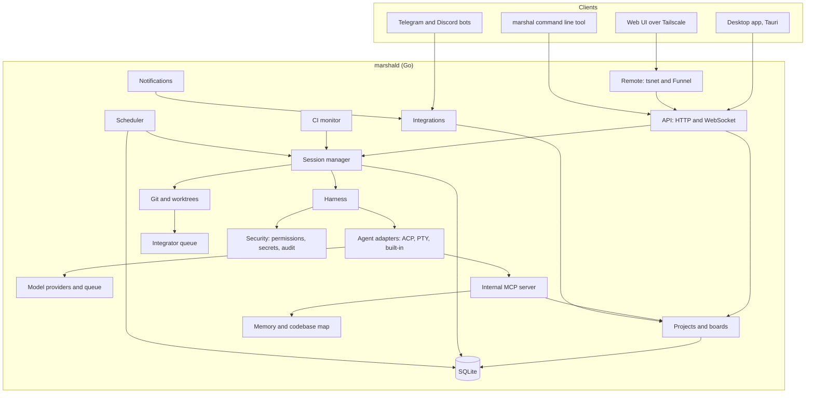
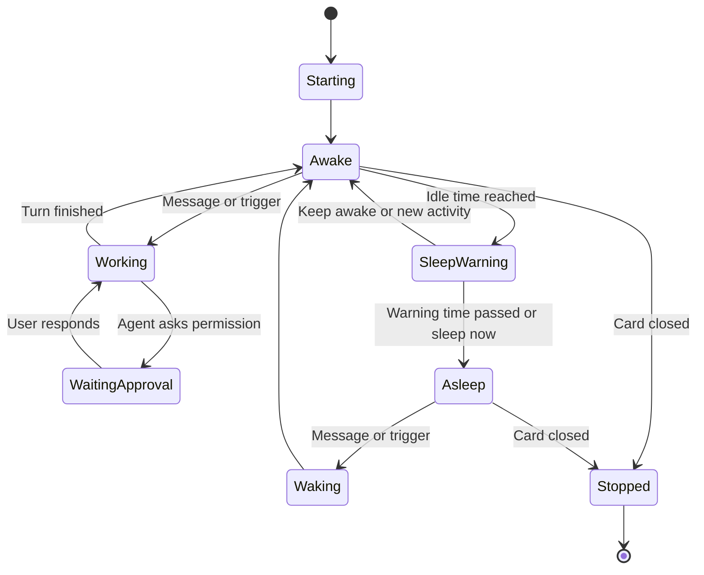
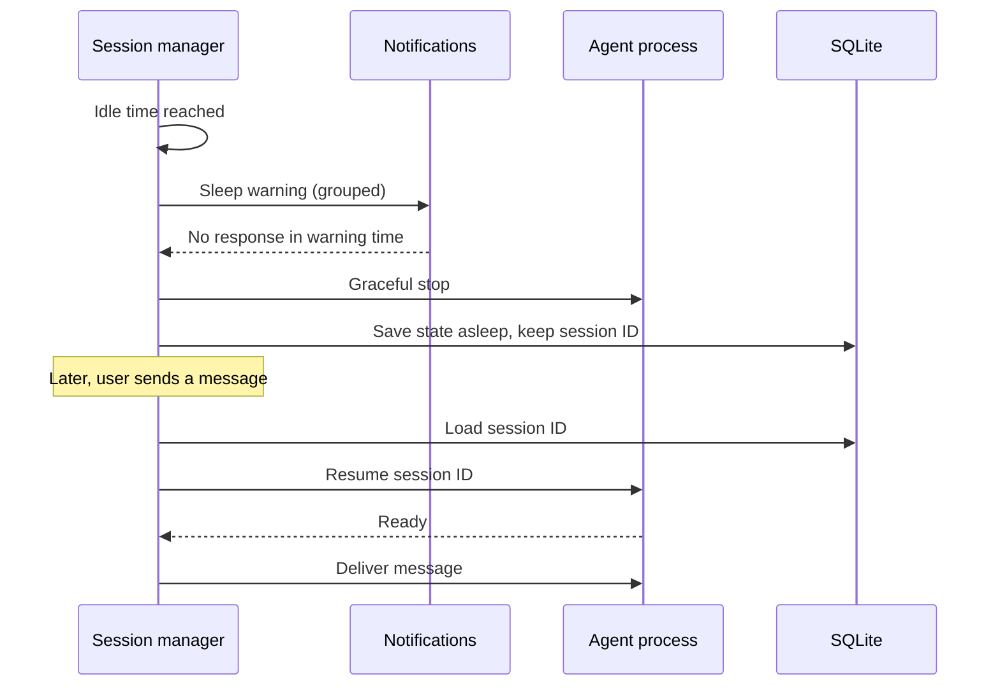
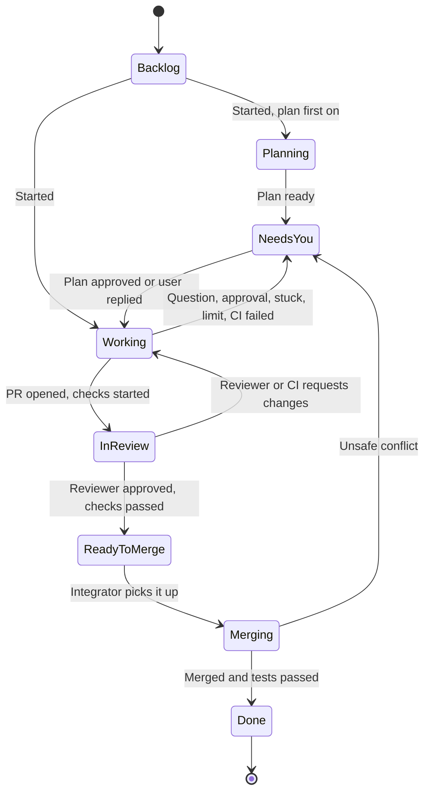
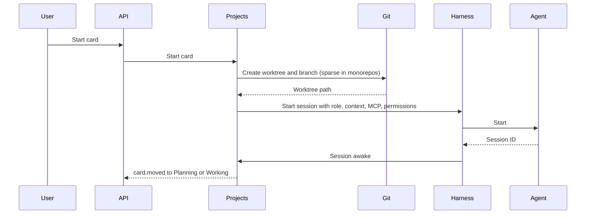
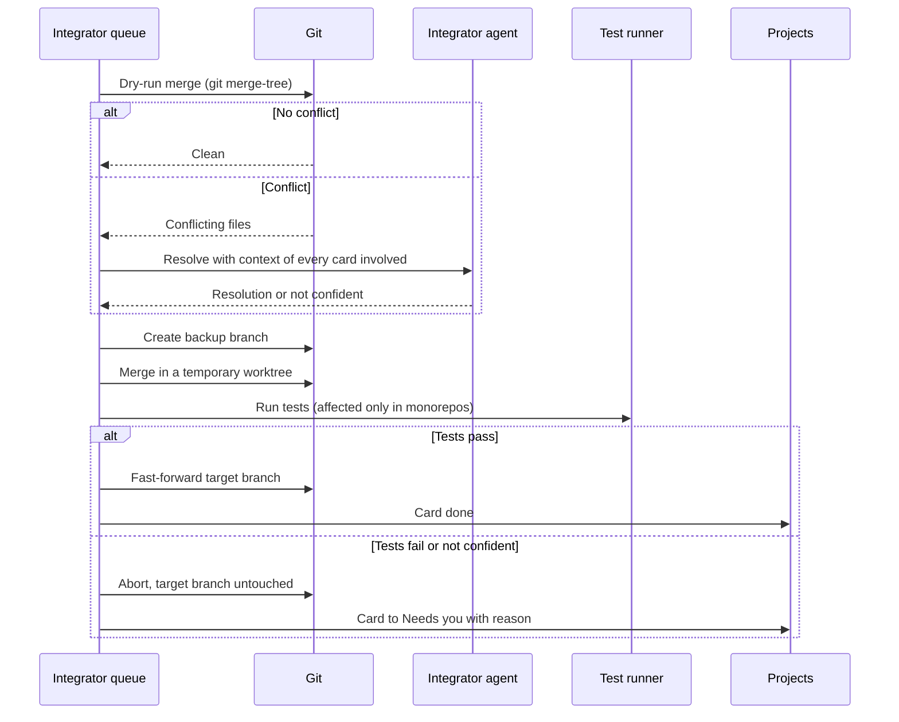
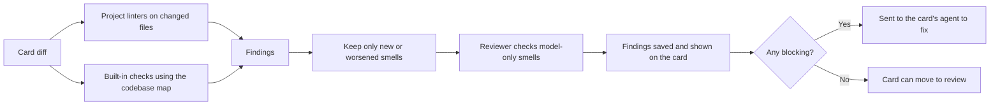

# Architecture

This document explains how Marshal is built: its parts, how they talk, where data lives, and the rules that keep it light and safe. Read it before changing any module.

---

## 1. System at a glance

Marshal has three layers:

1. **Clients** show things and send user actions. They hold no business logic.
2. **The daemon** (`marshald`) owns all state and does all work.
3. **Agents and external services** do the coding and hold outside data.



### Why this shape

- **Agents keep running when the UI is closed**, because the daemon owns them, not the window.
- **One daemon serves every client:** the desktop app, the web UI, the command line tool, and chat bots all use the same API.
- **The UI stays small**, because it only renders state and sends actions.

---

## 2. Processes

| Process | Language | Lifetime | Job |
|---|---|---|---|
| `marshald` | Go | Runs as a user service, starts at login | Owns all state and work |
| Desktop app | Rust shell (Tauri) + SolidJS | Runs while open | Shows the UI |
| `marshal` | Go (same module, separate binary) | Runs per command | Thin client for scripts and terminals |
| CLI agents | Third party | One per awake card | Do the coding |

### Daemon as a user service

The daemon is installed as a per-user service, so it keeps running when the desktop app is closed:

- macOS: a launchd agent
- Linux: a systemd user unit
- Windows: a per-user scheduled task that starts at login

The desktop app checks the daemon on start. If it is not running, it starts it. There is only ever one daemon per user, enforced with a lock file.

---

## 3. Daemon modules

All daemon code lives under `daemon/internal/`. Each module owns its own data and exposes a small Go interface. Modules talk through these interfaces and through the internal event bus, never by reaching into each other's tables.

| Module | Package | Owns |
|---|---|---|
| API | `api` | HTTP routes, WebSocket event stream, auth tokens |
| Event bus | `events` | In-process publish and subscribe between modules |
| Projects and boards | `projects` | Projects (create, rename, edit, remove), boards, cards, columns, filters, swimlanes, saved views, checklists, card members |
| Comments | `comments` | Card comments, attachments, links, mentions, and agent read markers |
| Chats | `chats` | Project chats: create, rename, archive, restore, delete, and their sessions |
| Accounts | `accounts` | User profile, paired devices, onboarding and tutorial progress |
| Dashboard | `dashboard` | Home dashboard summaries, charts, and the activity stream |
| Session manager | `session` | Session life cycle: start, send, sleep, wake, resume, stop |
| Harness | `harness` | Permissions, limits, retries, fallback, stuck detection, activity feed |
| Agent adapters | `agents/acp`, `agents/pty`, `agents/builtin` | Talking to each kind of agent |
| Providers | `providers` | Model API adapters, rate-limit queues, usage and cost |
| Git and worktrees | `gitx` | Worktrees, branches, sparse checkout, checkpoints, cleanup |
| Integrator | `integrator` | The merge queue and merge process |
| CI monitor | `ci` | GitHub Actions state and the CI fix loop |
| Scheduler | `scheduler` | Crons, intervals, one-time jobs, event triggers, loops, briefs |
| Internal MCP server | `mcpserver` | Tools agents use to see the board and talk to each other |
| Memory | `memory` | Knowledge base, lessons, card notes, vault sync, session search |
| Codebase map | `codemap` | Light index of files and symbols |
| Integrations | `integrations/github`, `trello`, `gcal`, `gmail`, `telegram`, `discord` | Outside services |
| Notifications | `notify` | Routing, grouping, and delivery of notices |
| Security | `security/permissions`, `secrets`, `audit`, `keychain` | Permission checks, secret scanning, audit log, stored credentials |
| Remote | `remote` | tsnet node, Funnel routes, pairing |
| Preview | `preview` | Dev servers per card, screenshots |
| Quality | `quality` | Code smell checks on card diffs, smell profiles, findings |
| Store | `store` | SQLite connection, migrations, generated queries |
| Budgets | `budgets` | Self-measurement of RAM, CPU, and disk |

### Event bus

Modules publish events such as `card.moved` or `session.state_changed`. Other modules subscribe. The API module forwards selected events to connected clients over WebSocket.

- The bus is in-process. There is no external queue.
- Events are small structs. Large data (logs, diffs) is referenced by ID, never copied into events.
- `Publish` never blocks and never waits for a subscriber. It gives the event the next sequence number (1, 2, 3, and so on in each epoch, across all topics) and the time from the bus clock, then returns the number. Every subscriber sees events in sequence order.
- A subscriber follows a set of topics, or all of them, and can add and remove topics while subscribed.
- Each subscriber has its own bounded queues and one goroutine. There is no goroutine per event. An ordinary event queue holds 256 events. If it fills, the oldest ordinary event for that subscriber is dropped, the subscription reports `Lagged`, and the subscriber re-syncs from the store.
- Critical events (approvals, state changes) are never dropped. They have a separate queue of 1,024 events per subscriber. If even that overflows, the bus closes the subscription with the reason "closed for resync", and the consumer reloads from the store and subscribes again.
- The bus keeps the newest 2,000 events in a ring. A reconnecting client is replayed the events it missed from the ring, on the topics it follows, or told to reload: `SubscribeSince` subscribes and replays in one step, so no event falls between them. The rules for gaps, epochs, and resync frames are in section 11.5.
- The sizes are settings of the bus, so tests use small ones.

---

## 4. Agents

### 4.1 Adapter interface

Every kind of agent implements the same interface, so the harness treats them the same:

```go
type Agent interface {
    Start(ctx context.Context, spec StartSpec) (SessionHandle, error)
    Resume(ctx context.Context, sessionID string, spec StartSpec) (SessionHandle, error)
    Send(ctx context.Context, h SessionHandle, msg UserMessage) error
    Interrupt(ctx context.Context, h SessionHandle) error
    Events(h SessionHandle) <-chan AgentEvent
    Respond(ctx context.Context, h SessionHandle, r ApprovalResponse) error
    Stop(ctx context.Context, h SessionHandle) error
    Capabilities() Capabilities
}
```

`Capabilities` tells the harness what the agent supports: resume, loading a saved session, structured events, model switching, thinking modes, and MCP. It takes no handle, so it describes the latest session the agent started. Each `SessionHandle` also carries the capabilities its own session found, and which of the requested model, thinking mode, and permission mode the agent really took.

How the interface behaves (the same for every adapter):

- **Lifetime.** The context of `Start` and `Resume` only bounds the start. The session lives until `Stop` or until its process ends, so a request that ends does not kill the agent.
- **One turn at a time.** `Send` returns at once, and the turn ends with a `TurnEnded` event. A second `Send` while a turn runs returns `ErrBusy`, and the session manager queues the message. `Interrupt` stops the running turn and keeps the session, so the stop button in the UI does not lose the conversation. The turn then ends with `TurnEnded` and the reason `cancelled`.
- **Events.** One channel per session, closed after the last event, `Exited`. The reader must keep reading until then. The events are `MessageChunk`, `ThoughtChunk`, `ToolCall`, `ToolCallUpdate`, `PlanUpdate`, `PermissionRequested`, `TurnEnded`, `Failed`, and `Exited`. A turn ends with `TurnEnded`, or with `Exited` if the process ends first. An agent that stops without being asked produces `Failed` and then `Exited`. Tool output in an event is cut to 16 KiB with a `Truncated` flag, and the full text belongs in the session logs.
- **Permissions.** `PermissionRequested` blocks the turn until `Respond`, or until `Interrupt` or `Stop` answers "cancelled".
- **Resume.** `Resume` starts a new process for an old session id. If the agent cannot do that, it returns `ErrCannotResume`, and the session manager follows section 5.3.
- **Choosing an adapter.** A `Registry` maps an agent kind to a factory, so dev mode and tests register the stub agent where a real agent would go.

The ACP adapter (`agents/acp`) starts every process through `internal/proc`, the one helper that starts child processes. The helper passes a short allow-list of environment variables to the child, puts it in its own process group, always collects it, and on stop asks politely before it kills the whole process tree. The adapter tells the agent that the client has no file system and no terminal, so the agent uses its own tools in its own working folder.

### 4.2 The adapters

| Adapter | Used for | How |
|---|---|---|
| **ACP** | Agents that speak the Agent Client Protocol | JSON-RPC over stdio. Structured messages, tool calls, and permission requests. Preferred. |
| **Claude Code** | Claude Code | Claude Code's own streaming JSON mode over stdio (`claude -p --input-format stream-json --output-format stream-json`), driven directly: Claude Code has no ACP support. One process per session, kept alive across turns. |
| **PTY** | Agents without ACP, and the terminal view | Runs the CLI in a virtual terminal. Uses the CLI's own streaming or JSON mode where it has one. |
| **Built-in** | The built-in agent | A loop inside the daemon that calls model providers directly. No extra process. |

The Claude Code adapter (`agents/claude`) starts `claude -p` itself, writes one stream-json line per message to its standard input, and parses its standard output line by line into the same closed set of `AgentEvent` values every adapter produces; the wire format is close enough to plain JSON that it needs no protocol library. **It has no permission-request channel yet**, so every session passes `--permission-prompts=none`: a tool call that would need approval is denied at once instead of waiting for an answer nobody can give, matching the catalog's `Approvals: false` for this agent, and `Respond` always returns `ErrUnknownRequest`. `Interrupt` tries up to three stages to end the turn in flight, each with its own grace period: a `control_request` control message first, then SIGINT (Claude Code's documented way to end a turn without leaving it "unfinished" for a `--resume` to replay, unlike SIGTERM; Windows has no portable equivalent and skips this stage), and only as a last resort stopping the process outright and starting a fresh one with `--resume` on the next `Send`, so the session id and the conversation survive even when the process itself is replaced. See the package's own report for the exact permission-mode mapping and what is and is not confirmed against Claude Code's documentation, including the real cost if the SIGINT stage does not behave as documented.

The PTY adapter (`agents/pty`) runs the CLI in a pseudo-terminal through go-pty: a Unix pseudo-terminal on macOS and Linux, and ConPTY on Windows. It implements the same `Agent` interface, and its capabilities say `StructuredEvents: false`. What is different about it:

- **Events.** A terminal has no turns, tool calls, or permission requests. The only events are `TerminalOutput` and `Exited`, and there is no `TurnEnded`. `TerminalOutput` carries raw bytes, escape sequences included, for a terminal view to draw. Output is joined into one event per 30 ms, or sooner when 16 KiB have piled up, so a chatty program does not flood the event bus and a heavy one is not slowed down. `Send` never returns `ErrBusy`, and `Respond` always returns `ErrUnknownRequest`.
- **Input and size.** `Send` types the text and a line end. `Interrupt` types Ctrl-C. The adapter also has three calls for the terminal view: `WriteRaw` for what the person types, `Resize` for the size of the view (the default is 120 by 32), and `Snapshot`.
- **Late viewers.** The adapter keeps the last 256 KiB of each session's output in a ring of fixed size, so memory stays flat however much a program prints. `Snapshot` returns it, and a viewer that opens late paints it and then follows the events. The full stream goes to the session log through the adapter's `Tee` option.
- **Resume.** A CLI can be resumed only when its config says how (`ResumeArgs`, with `StartArgs` to choose the session id at the start). Without that, `Resume` returns `ErrCannotResume`.
- **Environment.** The program gets the same short allow-list as every child of `internal/proc`, plus `TERM=xterm-256color` and what the config and the session add. A variable such as a token in the daemon's own environment does not reach it.
- **Stop.** Stop asks politely first (SIGTERM to the process group on Unix, closing the pseudo console on Windows), waits a grace period, and then kills the whole process tree (the process group on Unix, `taskkill /T` on Windows). The adapter starts the process through go-pty rather than `internal/proc`, because a pseudo-terminal needs its own start, and it uses the helpers of `internal/proc` for the environment and for ending the tree.

### 4.3 Chat view and terminal view

A CLI's structured mode and its interactive terminal mode are different ways of running it. One process cannot serve both at once. Switching views stops the current process and resumes the **same session ID** in the other mode. This takes one to three seconds and keeps the full context.

The terminal view is the PTY adapter. The app paints `Snapshot` first and then follows the `TerminalOutput` events, sends what the person types with `WriteRaw`, and sends its size with `Resize`. For a CLI whose terminal mode can pick a session up by id, the PTY config's `StartArgs` and `ResumeArgs` carry that id, so switching views keeps the session. A CLI that cannot do that gives `ErrCannotResume`, and the session manager follows section 5.3.

### 4.4 Agent detection

On start, the daemon looks for known CLIs on the user's `PATH`, records their versions, and marks each as:

- **Supported:** a version tested in our CI.
- **Untested:** a newer or older version. It works, with a warning.
- **Missing:** not installed.

---

## 5. Sessions

### 5.1 States



Rules:

- A session in **Working** or **WaitingApproval** never moves to **SleepWarning**.
- A **pinned** card never sleeps.
- The **awake limit** is checked per project and globally. When a new card must wake and the limit is full, the oldest idle awake card gets a sleep warning.

### 5.2 Sleep and wake



### 5.3 Restore after reboot

On daemon start, the session manager reads all sessions that were awake or asleep. Depending on the user's setting, it either resumes the ones that were awake, or marks them asleep and shows a resume button. It never starts a fresh session in place of a lost one without telling the user. If resume fails, the card moves to Needs you with the option to start a new session from the card's handoff summary.

---

## 6. Card life cycle



Columns on the board map to these states. Merging shows inside the Ready to merge column with its own indicator.

**Who moves cards:** only the `projects` module changes a card's state, in response to events from other modules. Manual drags are also sent to `projects` and checked against allowed moves.

---

## 7. Starting a card



The context given at start is built from, in order: role instructions, project memory summary, card task and pinned files, a short board awareness summary, and the list of available internal MCP tools.

---

## 8. Merging



Rules:

- One card at a time per project.
- The target branch only moves forward after tests pass.
- Never force push.
- Requires Git 2.38 or newer for `git merge-tree --write-tree`.

---

## 9. CI failure loop

1. A webhook or poll shows a failed run on a card's branch.
2. The CI monitor reruns the failed jobs once.
3. If they fail again, it fetches only the failed step's log, trims it, and sends it to the card's session as a message.
4. The harness counts rounds against the card's loop limits.
5. When limits are reached, the card moves to Needs you.

Deploy workflows are never rerun or started by agents, except in bypass mode.

---

## 10. Data model

All app state lives in one SQLite database. Large data lives on disk and is referenced by path.

| Table | Purpose | Key fields |
|---|---|---|
| `projects` | Managed repos | id, name, repo_path, default_branch, is_monorepo, settings_json |
| `boards` | One per project | id, project_id (unique), columns_json |
| `saved_views` | Filters and swimlanes | id, board_id, name, filter_json, swimlane_by |
| `cards` | Tasks | id, board_id, title, body, state, role_id, template_id, parent_id, branch, worktree_path, pinned, created_by |
| `card_links` | Dependencies | card_id, depends_on_card_id |
| `checklists` | Named checklists on cards | id, card_id, name, position, required, people_only, hide_checked |
| `checklist_items` | Checklist items | id, checklist_id, text, position, done, done_by_kind (person or agent), done_by_id, evidence_json, done_at |
| `card_members` | People on a card | card_id, user_id, added_at |
| `comments` | Card comments | id, card_id, author_kind (person or agent), author_id, body, mentions_json, agent_read_at, created_at, edited_at |
| `attachments` | Files and images on comments | id, comment_id, file_name, mime_type, size_bytes, path, created_at |
| `card_checks` | Acceptance checks | id, card_id, kind, spec_json, status |
| `smell_profiles` | Smell checks, thresholds, and severity per project | project_id, spec_json |
| `smell_findings` | Code smell findings per card | id, card_id, commit, family, smell, file, line, severity, message, suggestion, status (open, fixed, dismissed), dismiss_reason |
| `sessions` | Agent sessions, for a card or a chat | id, card_id (nullable), chat_id (nullable), agent_kind, agent_session_id, state, model, thinking, permission_mode, last_active_at |
| `chats` | Project chats | id, project_id, title, target_kind (orchestrator, role, or card), target_id, archived_at, created_at, last_active_at |
| `activity` | Home dashboard activity stream | id, project_id, kind, subject_kind, subject_id, summary, created_at |
| `daily_stats` | Pre-computed dashboard numbers | day, project_id, cards_finished, merges, ci_failures, cost_micros |
| `session_events` | Index of activity | id, session_id, kind, summary, log_ref, created_at |
| `checkpoints` | Code restore points | id, card_id, git_ref, label, created_at |
| `roles` | Role templates | id, name, is_starter, spec_json |
| `role_overrides` | Per-project role changes | role_id, project_id, spec_json |
| `templates` | Card templates | id, name, spec_json |
| `file_claims` | Files cards are working on | card_id, path_or_package, claimed_at |
| `notes` | Agent notes | id, project_id, card_id, author, body |
| `usage` | Tokens and cost | id, card_id, role_id, provider, model, input_tokens, output_tokens, cost_micros, created_at |
| `limits` | Cost and awake limits | scope (global or project id), kind, value |
| `schedules` | Jobs | id, project_id, trigger_json, action_json, enabled, missed_policy |
| `schedule_runs` | Job history | id, schedule_id, started_at, result |
| `integrations` | Connected services | id, kind, config_json, keychain_ref, last_test_at, last_test_result_json |
| `external_links` | Card to outside item | card_id, kind, external_id |
| `ci_runs` | Workflow state | id, project_id, branch, workflow, status, url |
| `approvals` | Pending and past approvals | id, session_id, request_json, decision, decided_by |
| `audit_log` | Every agent action | id, session_id, actor, action, target, detail_json, created_at |
| `notices` | Notifications | id, kind, priority, group_key, body, read_at |
| `users` | People. In solo use, one row for the owner. | id, name, email, avatar_path, time_zone, tailnet_identity, created_at, updated_at |
| `devices` | Paired devices | id, user_id, name, kind (web, desktop, mobile, cli, or dev), token_hash, paired_at, last_seen_at, revoked_at |
| `user_progress` | Onboarding and tutorial state | user_id, onboarding_step, onboarding_done_at, tutorial_done_at, tutorial_skipped |
| `memberships` | User roles per project | user_id, project_id, role |
| `mcp_servers` | Configured MCP servers | id, name, transport_json, health, last_checked_at |
| `skills` | Installed skills | id, name, path, source |
| `settings` | Key-value settings | key, value_json |

Session search uses SQLite full-text search over `session_events.summary` and card notes.

Conventions for every table:

- Every id is TEXT (a project id, or an opaque id from section 11.5).
- Every time is INTEGER Unix milliseconds in UTC. Times are converted to the wire `Timestamp` at the edge of a module, never stored as text. Tables are `STRICT`, so SQLite refuses a value of the wrong type. A time that may be missing is NULL.
- A client token is never stored. `devices.token_hash` holds the SHA-256 of the token in lower case hex, and a lookup compares hashes.

The database runs in WAL mode with one writer connection and a small pool of read-only connections, so a reader never waits for a write. A transaction never wraps a model call or any call to the outside.

Migrations live in `daemon/internal/store/migrations` and run on daemon start. Every migration is forward only, and a test fails if a file has a Down section. Migration `0001_init.sql` holds only the four tables of this section that Phase 1 starts with: `settings`, `users`, `devices`, and `user_progress`. Each later module adds its own numbered file for its own tables.

---

## 11. API

### 11.1 HTTP

Versioned under `/v1`. JSON in and out. Examples:

| Method and path | Action |
|---|---|
| `GET /v1/projects` | List projects with badges |
| `POST /v1/projects` | Create a project from a folder or a GitHub clone |
| `PATCH /v1/projects/{id}` | Rename or edit a project |
| `DELETE /v1/projects/{id}` | Remove a project from Marshal. Never deletes the repo. |
| `GET /v1/projects/{id}/chats?archived=` | List chats |
| `POST /v1/projects/{id}/chats` | Create a chat |
| `PATCH /v1/chats/{id}` | Rename a chat |
| `POST /v1/chats/{id}/archive`, `/restore` | Archive or restore a chat |
| `DELETE /v1/chats/{id}` | Delete a chat |
| `POST /v1/chats/{id}/messages` | Send a message in a chat |
| `GET /v1/me`, `PATCH /v1/me` | Read or edit the profile |
| `GET /v1/me/devices`, `DELETE /v1/me/devices/{id}` | List or remove paired devices |
| `PATCH /v1/me/progress` | Save onboarding and tutorial progress |
| `GET /v1/home/dashboard?range=` | Dashboard: needs you, tiles, charts, coming up, awake agents, CI health |
| `GET /v1/home/activity?cursor=` | Activity stream, paged |
| `GET /v1/projects/{id}/board` | Board with cards |
| `POST /v1/projects/{id}/cards` | Create a card |
| `POST /v1/cards/{id}/start` | Start a card |
| `POST /v1/cards/{id}/messages` | Send a message into the card's session |
| `POST /v1/cards/{id}/view` | Switch between chat and terminal view |
| `POST /v1/cards/{id}/sleep`, `/wake`, `/pin` | Session control |
| `POST /v1/cards/{id}/checkpoints/{cp}/restore` | Restore a checkpoint |
| `POST /v1/cards/{id}/fork` | Fork a card |
| `POST /v1/cards/{id}/checklists`, `PATCH` and `DELETE /v1/checklists/{id}` | Create, edit, and delete checklists |
| `POST /v1/checklists/{id}/items`, `PATCH` and `DELETE /v1/checklist-items/{id}` | Add, tick, edit, and delete items |
| `GET` and `POST /v1/cards/{id}/comments`, `PATCH` and `DELETE /v1/comments/{id}` | List, post, edit, and delete comments |
| `POST /v1/comments/{id}/attachments` | Upload a file or image |
| `PUT /v1/cards/{id}/members` | Set the people on a card |
| `POST /v1/approvals/{id}` | Approve or deny |
| `GET /v1/cards/{id}/diff` | Current diff |
| `GET /v1/search?q=` | Search sessions and notes |
| `POST /v1/integrations/{id}/test` | Test an integration: sign-in, permissions, and webhook delivery |
| `POST /v1/providers/{id}/test` | Test a provider API key with a tiny request |
| `POST /v1/mcp-servers/{id}/test` | Test an MCP server connection |
| `POST /hooks/{provider}` | Webhooks (the only routes exposed through Funnel) |

### 11.2 WebSocket

One stream at `/v1/events`. Clients subscribe to topics (a project, a card, the home view). Output is batched every 16 to 50 milliseconds.

Main event types: `project.created`, `project.updated`, `project.removed`, `chat.created`, `chat.updated`, `chat.archived`, `chat.deleted`, `activity.created`, `card.created`, `card.updated`, `card.moved`, `card.members_changed`, `checklist.updated`, `comment.created`, `comment.read_by_agent`, `session.state_changed`, `session.output`, `session.tool_call`, `approval.requested`, `approval.resolved`, `ci.updated`, `quality.checked`, `merge.progress`, `notice.created`, `usage.updated`, `budget.warning`.

Frames, topics, sequence numbers, and re-sync are in section 11.5.

### 11.3 Shared types

API types are defined once in Go and generated into TypeScript for the UI, so the two sides can never drift. The generated package is `packages/protocol`.

### 11.4 Internal MCP server

Served by the daemon to every agent, over stdio for CLI agents and in-process for the built-in agent.

| Tool | Purpose |
|---|---|
| `board_status` | Short summary of other cards: owners, goals, states, claims |
| `claim_files` | Claim files or packages for this card |
| `release_files` | Release claims |
| `post_note` / `read_notes` | Leave and read notes |
| `ask_agent` | Ask another card's agent a question |
| `create_card` | Propose a new card, subject to permissions |
| `search_memory` | Search project memory, lessons, and past sessions |
| `search_codebase` | Query the codebase map |
| `report_progress` | Update the card's "doing now" line |
| `list_checklists` | Read the card's checklists |
| `tick_checklist_item` | Tick or untick an item, with evidence. Refused on people-only checklists. |
| `read_comments` | Read new comments on the card, which marks them as read by the agent |
| `read_attachment` | Read an attached file |
| `post_comment` | Post a comment as the agent |

### 11.5 Protocol conventions

These rules apply to every route and every event. They are written once in `daemon/internal/protocol` and generated into `packages/protocol`. Golden files in `daemon/testdata/golden/` are written by the Go tests and read by the TypeScript tests, so a change on one side fails a test on the other.

**Timestamps**

- Every timestamp is UTC in RFC 3339 with milliseconds: `2026-09-25T10:15:30.123Z`. In Go the type is `Timestamp`. In TypeScript it is a plain `string`.
- A time that was never set does not encode. It is a bug, and it stops the response instead of sending the year 1. A time that may be absent is a pointer in Go and `null` on the wire.
- Every response that lists or shows state carries `serverTime`, the daemon's clock when the response was made. The client shows ages and countdowns from it, so a clock that is a little off never shows a wrong "4 min ago". Go types for such responses end in `Snapshot`, or are `Page`, and a test checks that they have the field.

**IDs**

| Kind | Form | Example |
|---|---|---|
| Project id | Lower case letters, digits, and hyphens. 2 to 24 characters. Starts with a letter. Never changes. | `api`, `web-dashboard` |
| Card number | A whole number that starts at 1 in each project. | `12` |
| Card key | `<projectId>#<number>`. Used for display and references. A hash sign must be escaped in a URL. | `web-dashboard#12` |
| Opaque id | 26 characters of Crockford base32 (a ULID). The first 10 are the time, so ids sort by creation time to the millisecond. | `01M3C107JB041061050R3GG28A` |

- A project id is made from the project name (lower case, other characters become one hyphen, cut to 24 characters). A name with no usable letters gives `project`. A duplicate gets `-2`, `-3`, and so on.
- Chats, sessions, devices, approvals, and cards all have an opaque id. Routes use it: `/v1/cards/{id}`, `/v1/chats/{id}`. Project routes use the project id.
- A card has both its opaque id and its key. Two projects can each have a card 12, so a list that mixes projects always shows the project name with the number.

**Errors**

Every error answer has the same shape and no other body:

```json
{ "error": { "code": "not_found", "message": "Marshal cannot find that card. It may have been removed.", "details": { "id": "01M3C107JB041061050R3GG28A" } } }
```

| Code | HTTP status | Meaning |
|---|---|---|
| `invalid_argument` | 400 | The request was malformed, or a value is not allowed. |
| `unauthorized` | 401 | No valid token. |
| `forbidden` | 403 | A valid token that may not do this. |
| `not_found` | 404 | The thing does not exist. |
| `conflict` | 409 | The request clashes with the current state. |
| `refused` | 422 | A valid request that the rules do not allow, such as an illegal card move. |
| `unsupported` | 501 | Not available on this machine, or not yet. |
| `unavailable` | 503 | Not possible right now. Try again. |
| `internal` | 500 | Something broke inside the daemon. |

- Codes never change once released. The client branches on the code and shows the message.
- A message is a plain sentence that follows the writing rules in `ui-rules.md`: it says what happened and, when there is something to do, what to do next. It has no jargon, no blame, and no apology.
- `details` holds extra facts for the "Details" section, such as the id that was not found. It is optional.
- An error the daemon did not expect becomes `internal` with one generic message. The real reason goes to the daemon log and never to the client.

**Paging**

- A list route takes `cursor` and `limit`. The answer is `{ "items": [...], "nextCursor": "...", "serverTime": "..." }`. An empty `nextCursor` means the end.
- `limit` defaults to 50 and is at most 200. A larger number is cut to 200. A value that is not a whole number of 1 or more is `invalid_argument`.
- A cursor is opaque. The daemon makes it from the position of the next page as small JSON, encoded as URL-safe base64 without padding. Clients send it back exactly as received and never read or build one. A cursor that cannot be read is `invalid_argument`.

**Lists of allowed values**

Each list is defined once in Go. It becomes a TypeScript union type and a readonly array named `<Type>Values`, for example `CardState` and `CardStateValues`, so the app and the daemon cannot disagree. The words shown to people stay in the app.

| Type | Values |
|---|---|
| `CardState` | `backlog`, `planning`, `working`, `needs`, `review`, `ready`, `merging`, `done` |
| `PermissionMode` | `ask`, `auto-edits`, `plan`, `full-auto`, `bypass` |
| `ThinkingMode` | `low`, `medium`, `high`, `extra-high` |
| `AgentKind` | `claude`, `gemini`, `codex`, `builtin` |
| `AgentStatus` | `supported`, `untested`, `missing` |
| `SessionState` | `starting`, `awake`, `working`, `waiting-approval`, `sleep-warning`, `asleep`, `waking`, `stopped` |
| `FeedKind` | `brief`, `merge`, `schedule`, `approval`, `plan`, `ci`, `tool` |
| `NoticeKind` | `sleep`, `ci-main`, `cost`, `plan`, `ci` |
| `ActivityKind` | `file`, `command`, `test`, `tool`, `approval` |
| `CIState` | `queued`, `running`, `passed`, `failed`, `cancelled` |
| `CardViewMode` | `chat`, `terminal` |

`ErrorCode`, `EventType`, `TopicKind`, and `ResyncReason` are lists too. A Go test fails if a const block and its `<Type>Values()` function differ, or if a list is missing from the golden file `enums.json`.

**Events**

The WebSocket carries frames as JSON text.

| Frame | Direction | Fields |
|---|---|---|
| `Hello` | Client to daemon | `subscribe` (topics), `sinceSeq`, `epoch` |
| `EventBatch` | Daemon to client | `epoch`, `events` (one or more) |
| `Resync` | Daemon to client | `epoch`, `reason`, `seq` |

An event is `{ seq, topic, type, at, data }`. `data` is the payload, read by `type`. In TypeScript it is `unknown` until the client has checked `type`.

- **Topics** are `home`, `project:<projectId>`, `card:<cardId>`, and `chat:<chatId>`. Go has one constructor for each and `ParseTopic`, which also checks the shape of the id.
- **Epoch.** The daemon makes a new random id each time it starts.
- **Seq.** Inside an epoch, `seq` grows by one for every event the daemon publishes, on any topic. A client that follows only some topics sees increasing numbers with gaps, and that is normal. Events with a `seq` the client has already applied are ignored, because a replay may repeat them.
- **Frames.** A client tells `EventBatch` from `Resync` by its keys (`events` or `reason`). The generated type `ServerFrame` is the union of the two.
- A client sends `Hello` first. Sending it again replaces the subscription.
- Event types are listed in section 11.2. Phase 1 sends `project.created`, `project.updated`, `project.removed`, `card.created`, `card.updated`, `card.moved`, `session.state_changed`, `session.output`, and `session.tool_call`. The others are reserved names.

**Auth and the WebSocket**

Every HTTP request carries `Authorization: Bearer <token>`. Browsers cannot set headers on a WebSocket, and tokens must not be in URLs, so the client offers two subprotocols: `marshal.v1` and `bearer.<token>`. The daemon checks the token and answers with `marshal.v1` only. It never sends the token back and never logs the offered list.

**Re-sync**

The daemon keeps a ring of the most recent events, 2,000 of them (`ReplayBufferSize`).

1. The client connects and sends `Hello` with the epoch and the last `seq` it applied. On a first connection the epoch is empty and `sinceSeq` is 0.
2. If the epoch matches and `sinceSeq` is inside the ring, the daemon sends the missed events, in order, and then continues with new ones.
3. Otherwise the daemon sends `Resync` and continues with new events from that point. `reason` says why: `epoch-changed` (a first connection, or the daemon restarted), `too-far-behind` (the client's position is older than the ring), or `unknown-position` (newer than anything sent in this epoch). `seq` is the newest number sent so far.
4. On `Resync` the client keeps the new epoch, then reloads its snapshots. An event that arrives during the reload may repeat what the snapshot already shows. Events carry the new state of what changed, not a difference, so applying one twice does no harm.

---

## 12. Files on disk

| Path | Contents |
|---|---|
| `<data>/marshal.db` | SQLite database |
| `<data>/config.toml` | User settings that are easier to edit as a file |
| `<data>/logs/sessions/<session_id>/` | Full agent output, rotated |
| `<data>/logs/daemon/` | Daemon logs, rotated |
| `<data>/worktrees/<project>/<card>/` | Card worktrees |
| `<data>/previews/<card>/` | Screenshots |
| `<data>/skills/` | Installed skills |
| `<data>/tsnet/` | Tailscale node state |
| `<vault>/` | Memory vault, default `<data>/vault`, or a folder the user chooses |

`<data>` is `~/Library/Application Support/Marshal` on macOS, `~/.local/share/marshal` on Linux, and `%APPDATA%\Marshal` on Windows.

Worktrees live outside the user's repo folder, so they never clutter it.

### Vault layout

```
vault/
  <project>/
    memory/          rules, architecture notes, decisions
    lessons/         auto lessons
    cards/           one note per card
  briefs/            daily notes with morning and evening briefs
```

The daemon watches the vault with file system events and re-indexes changed files.

---

## 13. Security

- **Credentials** (API keys, OAuth tokens, bot tokens) are stored in the OS keychain. The database only stores a reference.
- **Binding:** the daemon listens on localhost and on its tailnet address only. Never on all interfaces.
- **Client auth:** every client uses a token. The desktop app gets one on install. Phones and other devices pair once by scanning a code shown in the desktop app.
- **Funnel** exposes only `/hooks/*`. Every webhook is verified with its provider's signature before it is handled.
- **Permissions** are checked by the harness before every tool call, file write, and command. The agent's own claims are never trusted.
- **Secret scanner** runs on every commit an agent makes.
- **Audit log** records every command, file change, approval, and permission decision. It cannot be edited from the UI.
- **Bypass mode** is limited to the card's worktree, shows a banner, and is still fully audited.

---

## 14. Performance budgets

| Metric | Budget | How it is enforced |
|---|---|---|
| Daemon idle RAM | Under 50 MB | Measured in CI on a fixture project |
| Daemon idle CPU | About 0% | Measured in CI over 60 seconds idle |
| UI RAM | Under 150 MB | Measured in CI with a 50-card board open |
| Download size | Under 50 MB | Checked on every release build |
| Click to response | Under 100 ms | UI performance test |
| Web build size | JavaScript under 300 kB gzip, CSS under 40 kB gzip, whole build under 2 MB | `pnpm budgets` after `pnpm build`, on every pull request |
| Card start to agent ready | Under 3 s | Integration test with a stub agent |
| Wake from sleep | 1 to 3 s | Integration test with a stub agent |
| Event to phone notice | Under 5 s | Integration test |

### How each module stays light

- **No polling loops.** Modules react to events. Where polling is unavoidable (integration backup), it uses conditional requests and long intervals.
- **Logs go to disk.** Only a small ring buffer per session stays in memory.
- **Output is batched** before it reaches clients.
- **Only the open card** streams full output to the UI. Other cards stream only state and summaries.
- **The awake limit** caps live CLI processes.
- **The codebase map** updates incrementally, never by full re-scan on each change.

---

## 15. Key decisions

| Decision | Why | Trade-off accepted |
|---|---|---|
| Go for the daemon | Great at many processes and connections, one binary, native tsnet, official MCP SDK, fast to build | More RAM than Rust, still within budget |
| Tauri over Electron | Much smaller RAM and download | System webviews differ by OS, so we test on all three |
| SolidJS for the UI | Small, fast with streaming updates, familiar JSX | Smaller ecosystem than React |
| SQLite | Local, fast, zero setup | Team mode uses one host machine instead of a shared server |
| Git command line, not a Git library | Full support for worktrees, sparse checkout, and merge-tree | Requires Git 2.38 or newer on the machine |
| One board per project | Conflict warnings and merging need to see every card | Focus comes from filters and swimlanes |
| Strong models for review and merge | Weak models break code at merge time | Higher cost, visible in the cost meter |
| Plain markdown memory | Readable, portable, works with Obsidian | No rich database queries on memory, only full-text search |
| Many chats, one board per project | Conversations stay organized by topic, while conflict warnings and merging still see every card | Chats cannot have their own boards |
| One responsive UI for every size | Remote control needs the full product on phones and tablets | Every view needs three layouts and tests at three sizes |

---

## 16. Projects, chats, and accounts

### 16.1 Projects

- **Create** registers a folder or clones a GitHub repo into a folder the user picks, detects monorepo tools, creates the board, and indexes the codebase in the background.
- **Rename** changes the display name only. Folder paths and branch names do not change.
- **Remove** runs in this order: stop all sessions for the project, clean up worktrees (keeping branches with unmerged work if the user asked), delete the project's rows, and optionally remove the project's memory folder from the vault. **It never deletes the repository folder.**

### 16.2 Chats

- A chat has its own lasting session, stored in `sessions` with `chat_id` set. It follows the same sleep, wake, and resume rules as cards, and counts toward the awake limits.
- **Archive** puts the session to sleep and hides the chat from the main list. **Restore** reverses that.
- **Delete** stops the session and removes the chat and its logs. Cards created from the chat stay on the board, with a note that the chat was deleted.
- New chats get a short title from their first message, written by a cheap model. Users can rename at any time.

### 16.3 Dashboard

- Dashboard numbers come from `daily_stats`, which the `dashboard` module updates from events as they happen. It never scans all cards to build a chart.
- The activity stream is written from events into `activity`, and old rows are trimmed after 90 days.

### 16.4 Accounts

- In solo use there is one user, the owner, created during onboarding.
- Onboarding and tutorial progress are saved per user, so they resume where the user left off on any device.


---

## 17. Code smell checks

The `quality` module checks every card's changes for code smells. The full feature is described in `marshal-product-scope.md`, section 15.4.

### 17.1 When checks run

- After each agent turn that changed code, for fast feedback in the card.
- Before a card moves to In review. Blocking findings keep it in Working and go back to the agent.
- On files the Integrator changed while resolving a conflict.

### 17.2 Pipeline



### 17.3 Rules

- **Diff only.** Findings are compared against the target branch, so smells that existed before the card are ignored. A smell the card made worse is kept.
- **Cached per commit.** The same commit is never checked twice.
- **Static first.** Linters and built-in checks run before any model call. The model review gets only the diff and the static findings.
- **Language-aware.** Each language has its own rules and thresholds in the smell profile. Checks that do not fit a language's conventions are off for that language.
- **Budgets.** Checks run in the card's worktree as child processes with a time limit. They never run during daemon idle.

---

## 18. Connection tests

Every integration adapter, provider adapter, and MCP connection implements one method:

```go
Test(ctx context.Context) (TestResult, error)
```

`TestResult` holds a list of checks, each with a name, a result (passed, failed, or warning), a plain message, and a fix hint.

| Connection | What the test checks |
|---|---|
| GitHub | App installed, repos visible, permissions for issues, pull requests, and Actions, and a ping webhook reaching `/hooks/github` |
| Trello | Token valid, linked board readable and writable, webhook registered and reachable |
| Google Calendar | Token valid, calendar list readable |
| Gmail | Token valid, labels readable, the chosen label exists |
| Telegram | Bot token valid, a test message delivered to the linked chat |
| Discord | Bot token valid, bot in the server, a test message delivered to the linked channel |
| Obsidian vault | Folder exists and is writable |
| Tailscale | Node online, tailnet address assigned, Funnel open for `/hooks/*` only |
| Model providers | Key valid, with a tiny request to the cheapest model, and rate-limit headers read |
| MCP servers | Connects, lists tools, and answers within the time limit |

Rules:

- Tests are read-only, except test messages and webhook pings, which are clearly labeled in the UI.
- Each test has a time limit and a cooldown per connection.
- Results are saved in `integrations.last_test_result_json`, and a test runs automatically right after a connection is added.

---

## 19. Checklists, comments, and members

### 19.1 Checklists

- Checklists belong to the `projects` module, next to cards.
- **Agent ticks need evidence.** `tick_checklist_item` requires evidence: a check result, a commit, or a test run ID. The harness verifies the evidence exists before saving the tick.
- **Evidence is watched.** If the evidence stops being true (for example, the linked tests fail on a later commit), the item unticks itself and the activity feed notes why.
- **People-only checklists** refuse agent ticks.
- **Required checklists gate the merge queue.** A card cannot move from In review to Ready to merge until every checklist marked required is complete. When everything else is ready, the card moves to Needs you with the number of items left.

### 19.2 Comments

- Comments live in the `comments` module.
- **Delivery to the agent:** new comments are added to the agent's context at the start of its next turn, through `read_comments`. Reading them sets `agent_read_at`, which the UI shows as "Agent read this".
- **Replies right away:** a comment that mentions @agent, or ends with a question mark, triggers a turn at once, waking the session if needed. It counts toward limits like any other turn.
- **Untrusted content:** attachments are data for the agent, never instructions to Marshal. They are never run.
- **Attachments on disk:** stored in `<data>/attachments/<project>/<card>/`, with a size limit per file from settings. In team mode they live on the host machine.
- **Links:** links become chips in the UI. Marshal does not fetch linked pages by itself.
- Deleting a card deletes its comments and attachments.

### 19.3 Members

- Card members belong to the `projects` module.
- The card's agent is shown as a member, but it comes from the card's session settings, not from `card_members`.
- The `notify` module sends member notices for mentions, replies, needs you, and merges, following each person's settings.

### 19.4 Trello sync

The Trello adapter maps checklists, items, comments, attachments, and members to their Trello equivalents, as described in `marshal-product-scope.md` section 19.2. Who ticked an item and "Agent read this" are kept only in Marshal. The agent maps to a Trello label. On conflicts, the latest change wins and the activity feed notes it.
