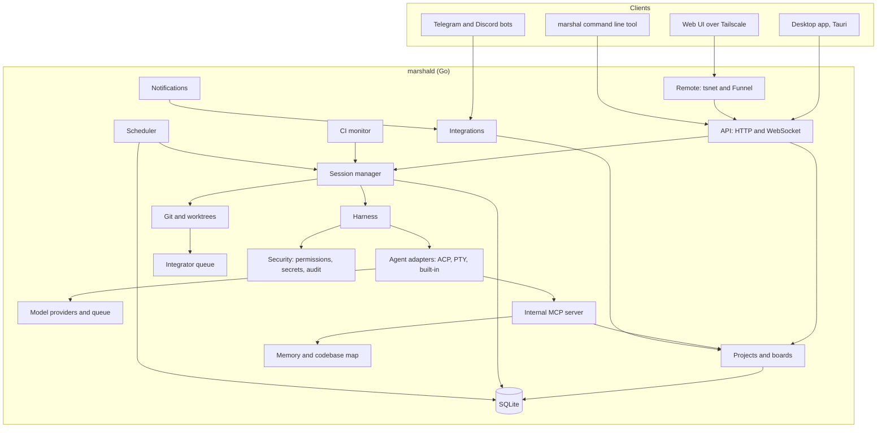
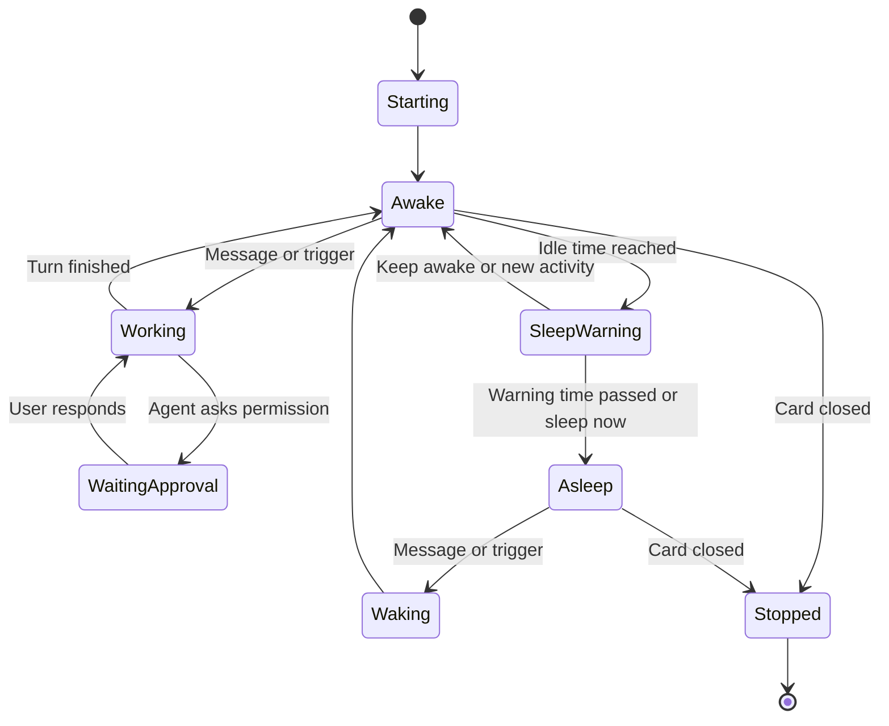
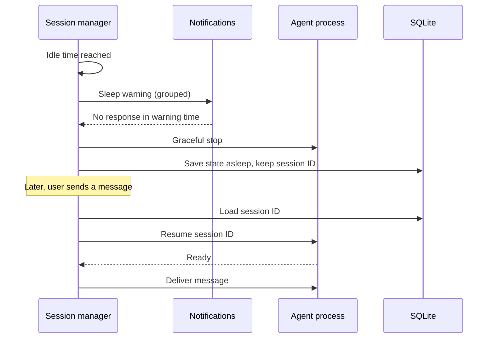
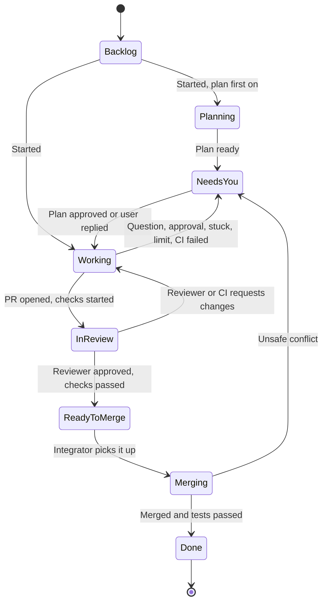
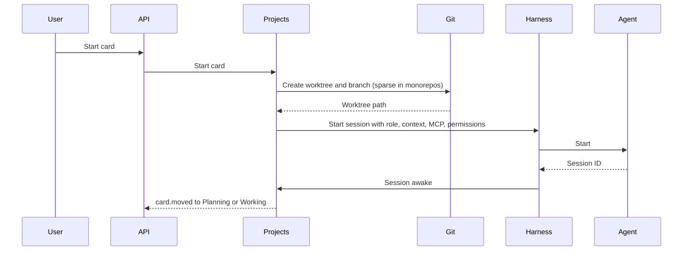
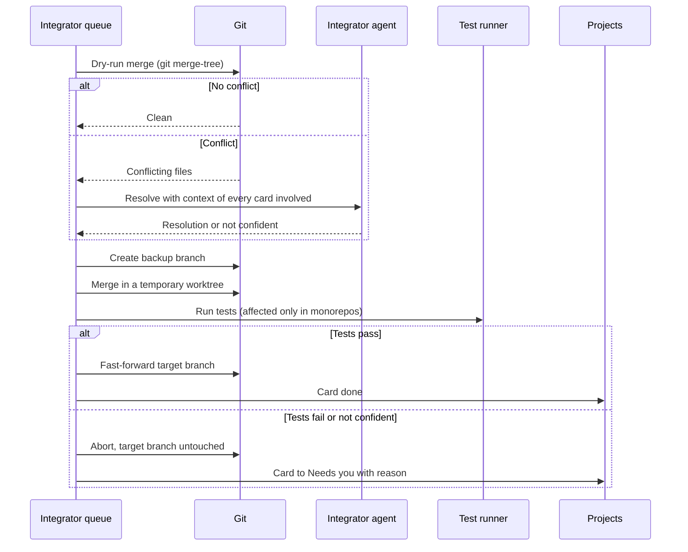
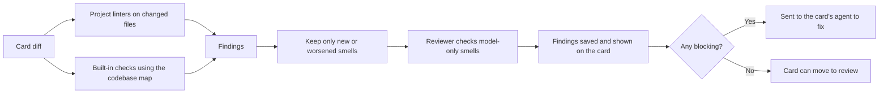

# Architecture

This document explains how Marshal is built: its parts, how they talk, where data lives, and the rules that keep it light and safe. Read it before changing any module.

---

## 1. System at a glance

Marshal has three layers:

1. **Clients** show things and send user actions. They hold no business logic.
2. **The daemon** (`marshald`) owns all state and does all work.
3. **Agents and external services** do the coding and hold outside data.



### Why this shape

- **Agents keep running when the UI is closed**, because the daemon owns them, not the window.
- **One daemon serves every client:** the desktop app, the web UI, the command line tool, and chat bots all use the same API.
- **The UI stays small**, because it only renders state and sends actions.

---

## 2. Processes

| Process | Language | Lifetime | Job |
|---|---|---|---|
| `marshald` | Go | Runs as a user service, starts at login | Owns all state and work |
| Desktop app | Rust shell (Tauri) + SolidJS | Runs while open | Shows the UI |
| `marshal` | Go (same module, separate binary) | Runs per command | Thin client for scripts and terminals |
| CLI agents | Third party | One per awake card | Do the coding |

### Daemon as a user service

The daemon is installed as a per-user service, so it keeps running when the desktop app is closed. `marshal service install` installs `marshald` (`marshal service uninstall` and `marshal service status` remove it and check it); `--dev` installs the dev daemon as its own separate service, so it can run beside a normal install:

- **macOS:** a per-user launchd agent (`~/Library/LaunchAgents/com.marshal.daemon.plist`, `com.marshal.daemon-dev.plist` for `--dev`), installed with `launchctl bootstrap gui/$UID`, falling back to the older `launchctl load -w` when bootstrap is not a recognized subcommand. It restarts on a crash (`KeepAlive`/`SuccessfulExit: false`) but not after a clean exit, so `marshal dev reset` and a deliberate stop are not looped.
- **Linux:** a systemd user unit (`~/.config/systemd/user/marshald.service`, `marshald-dev.service` for `--dev`), installed with `systemctl --user enable --now` after a `daemon-reload`, plus a best-effort `loginctl enable-linger` so it can start at boot without an active login session (a warning, not a failed install, if that one command lacks the privilege). `Restart=on-failure`.
- **Windows:** a per-user scheduled task through `schtasks.exe` (`ONLOGON`, `/RL LIMITED`, no admin elevation), since Windows has no per-user systemd or launchd equivalent.

Every external command these run goes through `internal/platform`'s own short admin-command runner (`os/exec`, bounded by a ten-second timeout, never a shell string) rather than `internal/proc`: these are one-shot management commands, not the long-lived, process-tree-managed children `internal/proc` is built for, and on Linux they need session variables (for example `DBUS_SESSION_BUS_ADDRESS`) that `internal/proc`'s environment allow-list does not pass through.

The desktop app checks the daemon on start. If it is not running, it starts it. There is only ever one daemon per user, enforced with a real, OS-held advisory lock on a file at `<data>/marshald.lock` (`flock` on macOS and Linux, `LockFileEx` on Windows), not a PID-file staleness guess: the operating system releases the lock on its own if the process dies, including a hard kill. The daemon acquires the lock before it opens its database or a listener; when the lock is already held, it exits with a distinct code (`exitAlreadyRunning`) instead of starting a second copy.

---

## 3. Daemon modules

All daemon code lives under `daemon/internal/`. Each module owns its own data and exposes a small Go interface. Modules talk through these interfaces and through the internal event bus, never by reaching into each other's tables.

| Module | Package | Owns |
|---|---|---|
| API | `api` | HTTP routes, WebSocket event stream, auth tokens |
| Event bus | `events` | In-process publish and subscribe between modules |
| Projects and boards | `projects` | Projects (create, rename, edit, remove), boards, cards, columns, filters, swimlanes, saved views, checklists, card members |
| Comments | `comments` | Card comments, attachments, links, mentions, and agent read markers |
| Chats | `chats` | Project chats: create, rename, archive, restore, delete, and their sessions |
| Accounts | `accounts` | User profile, paired devices, onboarding and tutorial progress |
| Dashboard | `dashboard` | Home dashboard summaries, charts, and the activity stream |
| Session manager | `session` | Session life cycle: start, send, sleep, wake, resume, stop |
| Harness | `harness` | Permissions, limits, retries, fallback, stuck detection, activity feed |
| Agent adapters | `agents/acp`, `agents/pty`, `agents/builtin` | Talking to each kind of agent |
| Providers | `providers` | Model API adapters, rate-limit queues, usage and cost |
| Git and worktrees | `gitx` | Worktrees, branches, sparse checkout, checkpoints, cleanup |
| Integrator | `integrator` | The merge queue and merge process |
| CI monitor | `ci` | GitHub Actions state and the CI fix loop |
| Scheduler | `scheduler` | Crons, intervals, one-time jobs, event triggers, loops, briefs |
| Internal MCP server | `mcpserver` | Tools agents use to see the board and talk to each other |
| Memory | `memory` | Knowledge base, lessons, card notes, vault sync, session search |
| Codebase map | `codemap` | Light index of files and symbols |
| Integrations | `integrations/github`, `trello`, `gcal`, `gmail`, `telegram`, `discord` | Outside services |
| Notifications | `notify` | Routing, grouping, and delivery of notices |
| Security | `security/permissions`, `secrets`, `audit`, `keychain` | Permission checks, secret scanning, audit log, stored credentials |
| Remote | `remote` | tsnet node, Funnel routes, pairing |
| Preview | `preview` | Dev servers per card, screenshots |
| Quality | `quality` | Code smell checks on card diffs, smell profiles, findings |
| Store | `store` | SQLite connection, migrations, generated queries |
| Budgets | `budgets` | Self-measurement of RAM, CPU, and disk |

### Event bus

Modules publish events such as `card.moved` or `session.state_changed`. Other modules subscribe. The API module forwards selected events to connected clients over WebSocket.

- The bus is in-process. There is no external queue.
- Events are small structs. Large data (logs, diffs) is referenced by ID, never copied into events.
- `Publish` never blocks and never waits for a subscriber. It gives the event the next sequence number (1, 2, 3, and so on in each epoch, across all topics) and the time from the bus clock, then returns the number. Every subscriber sees events in sequence order.
- A subscriber follows a set of topics, or all of them, and can add and remove topics while subscribed.
- Each subscriber has its own bounded queues and one goroutine. There is no goroutine per event. An ordinary event queue holds 256 events. If it fills, the oldest ordinary event for that subscriber is dropped, the subscription reports `Lagged`, and the subscriber re-syncs from the store.
- Critical events (approvals, state changes) are never dropped. They have a separate queue of 1,024 events per subscriber. If even that overflows, the bus closes the subscription with the reason "closed for resync", and the consumer reloads from the store and subscribes again.
- The bus keeps the newest 2,000 events in a ring. A reconnecting client is replayed the events it missed from the ring, on the topics it follows, or told to reload: `SubscribeSince` subscribes and replays in one step, so no event falls between them. The rules for gaps, epochs, and resync frames are in section 11.5.
- The sizes are settings of the bus, so tests use small ones.

---

## 4. Agents

### 4.1 Adapter interface

Every kind of agent implements the same interface, so the harness treats them the same:

```go
type Agent interface {
    Start(ctx context.Context, spec StartSpec) (SessionHandle, error)
    Resume(ctx context.Context, sessionID string, spec StartSpec) (SessionHandle, error)
    Send(ctx context.Context, h SessionHandle, msg UserMessage) error
    Interrupt(ctx context.Context, h SessionHandle) error
    Events(h SessionHandle) <-chan AgentEvent
    Respond(ctx context.Context, h SessionHandle, r ApprovalResponse) error
    Stop(ctx context.Context, h SessionHandle) error
    Capabilities() Capabilities
}
```

`Capabilities` tells the harness what the agent supports: resume, loading a saved session, structured events, model switching, thinking modes, and MCP. It takes no handle, so it describes the latest session the agent started. Each `SessionHandle` also carries the capabilities its own session found, and which of the requested model, thinking mode, and permission mode the agent really took.

How the interface behaves (the same for every adapter):

- **Lifetime.** The context of `Start` and `Resume` only bounds the start. The session lives until `Stop` or until its process ends, so a request that ends does not kill the agent.
- **One turn at a time.** `Send` returns at once, and the turn ends with a `TurnEnded` event for an agent whose events are structured; a second `Send` while such a turn runs returns `ErrBusy`, and the session manager queues the message, but the PTY adapter (4.2) never sends `TurnEnded` and never returns `ErrBusy`, so the session manager never gates its `Send` on a turn ending. `Interrupt` stops the running turn and keeps the session, so the stop button in the UI does not lose the conversation. The turn then ends with `TurnEnded` and the reason `cancelled`.
- **Events.** One channel per session, closed after the last event, `Exited`. The reader must keep reading until then. The events are `MessageChunk`, `ThoughtChunk`, `ToolCall`, `ToolCallUpdate`, `PlanUpdate`, `PermissionRequested`, `TurnEnded`, `Failed`, and `Exited`. A turn ends with `TurnEnded`, or with `Exited` if the process ends first. An agent that stops without being asked produces `Failed` and then `Exited`. Tool output in an event is cut to 16 KiB with a `Truncated` flag, and the full text belongs in the session logs.
- **Permissions.** `PermissionRequested` blocks the turn until `Respond`, or until `Interrupt` or `Stop` answers "cancelled".
- **Resume.** `Resume` starts a new process for an old session id. If the agent cannot do that, it returns `ErrCannotResume`, and the session manager follows section 5.3.
- **Choosing an adapter.** A `Registry` maps an agent kind to a factory, so dev mode and tests register the stub agent where a real agent would go.

The ACP adapter (`agents/acp`) starts every process through `internal/proc`, the one helper that starts child processes. The helper passes a short allow-list of environment variables to the child, puts it in its own process group, always collects it, and on stop asks politely before it kills the whole process tree. The adapter tells the agent that the client has no file system and no terminal, so the agent uses its own tools in its own working folder.

### 4.2 The adapters

| Adapter | Used for | How |
|---|---|---|
| **ACP** | Agents that speak the Agent Client Protocol | JSON-RPC over stdio. Structured messages, tool calls, and permission requests. Preferred. |
| **Claude Code** | Claude Code | Claude Code's own streaming JSON mode over stdio (`claude -p --input-format stream-json --output-format stream-json`), driven directly: Claude Code has no ACP support. One process per session, kept alive across turns. |
| **PTY** | Agents without ACP, and the terminal view | Runs the CLI in a virtual terminal. Uses the CLI's own streaming or JSON mode where it has one. |
| **Built-in** | The built-in agent | A loop inside the daemon that calls model providers directly. No extra process. |

The Claude Code adapter (`agents/claude`) starts `claude -p` itself, writes one stream-json line per message to its standard input, and parses its standard output line by line into the same closed set of `AgentEvent` values every adapter produces; the wire format is close enough to plain JSON that it needs no protocol library. **It has no permission-request channel yet**, so every session passes `--permission-prompts=none`: a tool call that would need approval is denied at once instead of waiting for an answer nobody can give, matching the catalog's `Approvals: false` for this agent, and `Respond` always returns `ErrUnknownRequest`. `Interrupt` tries up to three stages to end the turn in flight, each with its own grace period: a `control_request` control message first, then SIGINT (Claude Code's documented way to end a turn without leaving it "unfinished" for a `--resume` to replay, unlike SIGTERM; Windows has no portable equivalent and skips this stage), and only as a last resort stopping the process outright and starting a fresh one with `--resume` on the next `Send`, so the session id and the conversation survive even when the process itself is replaced. See `daemon/internal/agents/claude/args.go` (`permissionMode` and `defaultPermissionModes`) for the exact permission-mode mapping, and `daemon/internal/agents/claude/dispatch.go` for how a `Respond` is answered.

The PTY adapter (`agents/pty`) runs the CLI in a pseudo-terminal through go-pty: a Unix pseudo-terminal on macOS and Linux, and ConPTY on Windows. It implements the same `Agent` interface, and its capabilities say `StructuredEvents: false`. What is different about it:

- **Events.** A terminal has no turns, tool calls, or permission requests. The only events are `TerminalOutput` and `Exited`, and there is no `TurnEnded`. `TerminalOutput` carries raw bytes, escape sequences included, for a terminal view to draw. Output is joined into one event per 30 ms, or sooner when 16 KiB have piled up, so a chatty program does not flood the event bus and a heavy one is not slowed down. `Send` never returns `ErrBusy`, and `Respond` always returns `ErrUnknownRequest`.
- **Input and size.** `Send` types the text and a line end. `Interrupt` types Ctrl-C. The adapter also has three calls for the terminal view: `WriteRaw` for what the person types, `Resize` for the size of the view (the default is 120 by 32), and `Snapshot`.
- **Late viewers.** The adapter keeps the last 256 KiB of each session's output in a ring of fixed size, so memory stays flat however much a program prints. `Snapshot` returns it, and a viewer that opens late paints it and then follows the events. The full stream goes to the session log through the adapter's `Tee` option.
- **Resume.** A CLI can be resumed only when its config says how (`ResumeArgs`, with `StartArgs` to choose the session id at the start). Without that, `Resume` returns `ErrCannotResume`.
- **Environment.** The program gets the same short allow-list as every child of `internal/proc`, plus `TERM=xterm-256color` and what the config and the session add. A variable such as a token in the daemon's own environment does not reach it.
- **Stop.** Stop asks politely first (SIGTERM to the process group on Unix, closing the pseudo console on Windows), waits a grace period, and then kills the whole process tree (the process group on Unix, `taskkill /T` on Windows). The adapter starts the process through go-pty rather than `internal/proc`, because a pseudo-terminal needs its own start, and it uses the helpers of `internal/proc` for the environment and for ending the tree.

### 4.3 Chat view and terminal view

A CLI's structured mode and its interactive terminal mode are different ways of running it. One process cannot serve both at once. Switching views stops the current process and resumes the **same session ID** in the other mode. This takes one to three seconds and keeps the full context.

The terminal view is the PTY adapter. The app paints `Snapshot` first and then follows the `TerminalOutput` events, sends what the person types with `WriteRaw`, and sends its size with `Resize`. For a CLI whose terminal mode can pick a session up by id, the PTY config's `StartArgs` and `ResumeArgs` carry that id, so switching views keeps the session. A CLI that cannot do that gives `ErrCannotResume`, and the session manager follows section 5.3.

### 4.4 Agent detection

On start, the daemon looks for known CLIs on the user's `PATH`, records their versions, and marks each as:

- **Supported:** a version tested in our CI.
- **Untested:** a newer or older version. It works, with a warning.
- **Missing:** not installed.

---

## 5. Sessions

### 5.1 States



Rules:

- A session in **Working** or **WaitingApproval** never moves to **SleepWarning**.
- A **pinned** card never sleeps.
- The **awake limit** is checked per project and globally. When a new card must wake and the limit is full, the oldest idle awake card gets a sleep warning.

**What Phase 1 builds (B1.9 to B1.11):** the session manager (`internal/session`) only ever moves a session between **Starting**, **Awake**, **Working**, and **Stopped**, and only ever moves a card between Backlog, Working, and Needs you (section 6). A card gets at most one session for its whole life: chats, which need many sessions per project, are a later phase. **WaitingApproval**, **SleepWarning**, **Asleep**, and **Waking**, section 5.2's sleep and wake, pause, pin, and the awake limit are Phase 3 and Phase 5 (B3.1, B3.4, B5.6); nothing writes those states or runs that flow yet.

**What Phase 2 adds (decided 2026-09-26, slice G of `backend-checklist.md`):** the four controls a person presses. **Sleep** stops the agent process, keeps the session id, and writes **Asleep**. **Wake** resumes that session through its saved id and writes **Waking**, then **Awake**. **Pause** holds a Working card between turns: the turn that is running finishes, the card stays put, and a message sent meanwhile waits until the person resumes. **Pin** keeps a card from sleeping. **Start** on a card whose session is asleep, stopped, or paused resumes the same session, so **Stop** and a move back to Backlog never strand a card. If the agent cannot resume, the card moves to Needs you with a plain sentence, as a failed resume after a restart does. Everything automatic stays in Phase 5: the idle timer, the sleep warning and its notice, the awake limit, keep awake, and sleep all. The rules a person's press must meet, taken from `mock/actions/sessions.ts`: a Working card that is not paused does not sleep ("Working cards don't sleep. Pause the card first."); a card that needs the person stays awake ("This card is waiting on you, so it stays awake."); a card with no awake session cannot sleep ("This card has no awake session."); only a Working card can be paused ("Only working cards can be paused."). The card carries `paused` and `pinned`, and the session state carries asleep and waking.

**The session state is on the wire.** The wire `Card` carries `session`: the state of the card's session as it was last stored (`starting`, `awake`, `working`, `asleep`, `waking`, `stopped`, and the rest of the list in section 11.5), and `null` for a card that has never had a session. It is always sent and never left out, so a client that loads the board after a page reload or a daemon restart knows which cards are asleep or waking. It is read from the stored session rows and not from what the manager holds in memory (`session.StoredStates`; the projects module never reads the sessions table, section 3), and the manager writes each state to the row before it announces it, so the states survive a restart: a card put to sleep reads asleep when the daemon is back, and one that was awake reads awake until the restore of section 5.3 resumes it. Every change to a session's state is announced once on each of two topics: `session.state_changed` on the card's own topic, for an open card, and `card.updated` with the card as it now is on the project topic, which is the only topic the board and Home's awake list follow.

A refused press answers `422` with code `refused`, `details.reason` set to the stable reason below, and the plain message, and it leaves the card and the session exactly as they were, the same shape a refused drag uses (section 6.1). The routes are `POST /v1/cards/{id}/pause`, `/unpause`, `/sleep`, `/wake`, `/pin`, and `/unpin`.

| Rule | `details.reason` | Message |
|---|---|---|
| Pause of a card that is not Working | `pause_not_working` | Only working cards can be paused. |
| Sleep of a Working card that is not paused | `sleep_working` | Working cards don't sleep. Pause the card first. |
| Sleep of a card that is waiting on a person | `sleep_needs_you` | This card is waiting on you, so it stays awake. |
| Sleep of a card with no awake session | `sleep_no_session` | This card has no awake session. |
| Sleep of a paused card whose pause is still holding a message | `sleep_holding_messages` | This card has a message waiting for you to resume it. Resume the card first. |

Three things follow from the same rules. A message sent to a sleeping card wakes it, which is the state diagram's **Asleep → Waking: Message or trigger** and what the card panel's own words say; waking it that way also releases the pause that let it sleep, because the person has just asked the card to work. The Wake call itself leaves the pause where it was, and **Start** (or `/unpause`) is what releases it. And a pause that is still holding a message cannot be slept, because the queue lives in memory with the live session: stopping the process would lose the person's message.

### 5.2 Sleep and wake

The part a person triggers by hand (sleep, wake, pause, pin) runs from Phase 2 and is described at the end of section 5.1. The automatic part shown below (the idle timer, the sleep warning, and the awake limit) is Phase 5 (B5.6): until then there is no idle timer and no sleep warning.



### 5.3 Restore after reboot

On daemon start, the session manager reads every session row that is starting, awake, working, or was left half-woken (waking), and not stopped and not asleep: a row that reads asleep is a person's decision, and only a person wakes it. Depending on the user's resume setting, it either resumes all of them right away (auto, the default), or leaves them exactly as they are and logs how many are waiting (manual); resuming one card at a time by hand is `Manager.Resume`, reachable as `POST /v1/cards/{id}/resume`. It never starts a fresh session in place of a lost one without telling the user. If resume fails, the card moves to Needs you and the session row is marked stopped, since nothing is left running for it; from there `POST /v1/cards/{id}/start` continues the same session through its saved id (section 5.1), and the card panel's Waking state follows the `session.state_changed` event. A chat's session (section 16.2) is never in this list: it starts when the chat's first message is sent and is resumed by the message after that, so a chat nobody speaks to starts nothing at restart. When the daemon stops, the process of every chat that is talking ends and its row is written asleep, which is what it is, because nothing would resume it.

---

## 6. Card life cycle



Columns on the board map to these states. Merging shows inside the Ready to merge column with its own indicator.

**Who moves cards:** only the `projects` module changes a card's state, in response to events from other modules. Manual drags are also sent to `projects` and checked against allowed moves.

### 6.1 Manual moves

A person can drag a card to another column, or use the card's menu. `POST /v1/cards/{id}/move` with the target state carries it out. The daemon decides. The app may pre-check with the same rules to show a drop as refused early, but it never moves a card on its own authority: a refused move answers `422` with code `refused`, `details.reason` set to the stable reason below, and the plain message. The app snaps the card back and shows the message. Moving a card to the column it is already in does nothing and answers `200`. The rules are checked in this order, and the first one that applies wins:

| Order | Rule | `details.reason` | Message |
|---|---|---|---|
| 1 | The card is in Done | `move_from_done` | Done cards are merged. Fork the card to keep working on it. |
| 2 | The target is Done | `move_to_done` | Cards move to Done by themselves after they merge. |
| 3 | The target is Needs you | `move_to_needs` | Cards move to Needs you by themselves when an agent is waiting on you. |
| 4 | The target is In review, and the card has no pull request, or is in Backlog or Planning | `move_needs_pull_request` | In review needs an open pull request. The agent opens one when the work is ready. |
| 5 | The target is Ready to merge, and the card is not in In review | `move_needs_review` | Ready to merge needs an approved review and passing checks. |
| 6 | The target is Ready to merge, and the card's checks have not passed | `move_checks_not_passed` | Checks haven't passed on this card yet, so it can't be ready to merge. |
| 7 | The card is being merged | `move_card_merging` | The Integrator is merging this card. Wait for the merge to finish. |

What an allowed move does:

| From and to | Effect |
|---|---|
| Backlog to Working or Planning | Starts the card's session (the same as `POST /v1/cards/{id}/start`, with the target as the start state). If the card already has a session that is asleep or stopped, it resumes that session instead |
| Any column to Backlog | Puts the card's session to sleep (as Sleep in section 5.1 does) and keeps its worktree and branch. The sleep rules do not refuse it, because the person asked: a running turn is interrupted first, and the pause flag and the "doing now" line are cleared. Moving out of Backlog later resumes it |
| In review to Working | The card's "doing now" line becomes "Addressing review comments" |
| Planning to Working | The card's "doing now" line becomes "Starting without a plan" |
| Any other allowed move | Only the state changes, and `card.moved` is published |

In Phase 2 nothing opens a pull request or runs checks, so a card reaches In review or Ready to merge by hand only when it already carries a pull request link and a CI state, which only the prototype fixture gives it. Every other card is refused by rules 4, 5, or 6. Real pull requests and CI runs arrive in Phases 5 and 6. The rules are written now so that the reason codes, the messages, and the tests are in place before the features that satisfy them.

---

## 7. Starting a card



The context given at start is built from, in order: role instructions, project memory summary, card task and pinned files, a short board awareness summary, and the list of available internal MCP tools.

---

## 8. Merging



Rules:

- One card at a time per project.
- The target branch only moves forward after tests pass.
- Never force push.
- Requires Git 2.38 or newer for `git merge-tree --write-tree`.

---

## 9. CI failure loop

1. A webhook or poll shows a failed run on a card's branch.
2. The CI monitor reruns the failed jobs once.
3. If they fail again, it fetches only the failed step's log, trims it, and sends it to the card's session as a message.
4. The harness counts rounds against the card's loop limits.
5. When limits are reached, the card moves to Needs you.

Deploy workflows are never rerun or started by agents, except in bypass mode.

---

## 10. Data model

All app state lives in one SQLite database. Large data lives on disk and is referenced by path.

| Table | Purpose | Key fields |
|---|---|---|
| `projects` | Managed repos | id, name, repo_path, default_branch, is_monorepo, settings_json |
| `boards` | One per project | id, project_id (unique), columns_json |
| `saved_views` | A project's named filters and swimlane (0010). The name is unique in its project, and a view saved again keeps its id. | id, project_id, name, filters_json, swimlane, created_at, updated_at |
| `cards` | Tasks | id, board_id, title, body, state, role_id, template_id, parent_id, branch, worktree_path, pinned, created_by |
| `card_links` | Dependencies | card_id, depends_on_card_id |
| `checklists` | Named checklists on cards | id, card_id, name, position, required, people_only, hide_checked |
| `checklist_items` | Checklist items | id, checklist_id, text, position, done, done_by_kind (person or agent), done_by_id, evidence_json, done_at |
| `card_members` | People on a card | card_id, user_id, added_at |
| `comments` | Card comments | id, card_id, author_kind (person or agent), author_id, body, mentions_json, agent_read_at, created_at, edited_at |
| `attachments` | Files and images on comments | id, comment_id, file_name, mime_type, size_bytes, path, created_at |
| `card_checks` | Acceptance checks | id, card_id, kind, spec_json, status |
| `smell_profiles` | Smell checks, thresholds, and severity per project | project_id, spec_json |
| `smell_findings` | Code smell findings per card | id, card_id, commit, family, smell, file, line, severity, message, suggestion, status (open, fixed, dismissed), dismiss_reason |
| `sessions` | Agent sessions, for a card or a chat | id, card_id (nullable), chat_id (nullable), agent_kind, agent_session_id, state, model, thinking, permission_mode, last_active_at |
| `chats` | Project chats | id, project_id, title, target_kind (orchestrator, role, or card), target_id, archived_at, created_at, last_active_at |
| `activity` | Home dashboard activity stream | id, project_id, kind, subject_kind, subject_id, summary, created_at |
| `daily_stats` | Pre-computed dashboard numbers | day, project_id, cards_finished, merges, ci_failures, cost_micros |
| `session_events` | Index of activity, and the stored history of a card's chat and of a project chat | id, card_id or chat_id (exactly one is set), session_id, seq, kind, state, summary, detail_json, log_ref, created_at |
| `checkpoints` | Code restore points | id, card_id, git_ref, label, created_at |
| `roles` | Role templates | id, name, is_starter, spec_json |
| `role_overrides` | Per-project role changes | role_id, project_id, spec_json |
| `templates` | Card templates | id, name, spec_json |
| `file_claims` | Files cards are working on | card_id, path_or_package, claimed_at |
| `notes` | Agent notes | id, project_id, card_id, author, body |
| `usage` | Tokens and cost | id, card_id, role_id, provider, model, input_tokens, output_tokens, cost_micros, created_at |
| `limits` | Cost and awake limits | scope (global or project id), kind, value |
| `schedules` | Jobs | id, project_id, trigger_json, action_json, enabled, missed_policy |
| `schedule_runs` | Job history | id, schedule_id, started_at, result |
| `integrations` | Connected services | id, kind, config_json, keychain_ref, last_test_at, last_test_result_json |
| `external_links` | Card to outside item | card_id, kind, external_id |
| `ci_runs` | Workflow state | id, project_id, branch, workflow, status, url |
| `approvals` | Pending and past approvals | id, session_id, request_json, decision, decided_by |
| `audit_log` | Every agent action | id, session_id, actor, action, target, detail_json, created_at |
| `notices` | Notifications | id, kind, priority, group_key, body, read_at |
| `users` | People. In solo use, one row for the owner. `avatar_path` is a file name in `<data>/avatars`, and `avatar_updated_at` (0010) versions its address. | id, name, email, avatar_path, avatar_updated_at, time_zone, tailnet_identity, created_at, updated_at |
| `devices` | Paired devices | id, user_id, name, kind (web, desktop, mobile, cli, or dev), token_hash, paired_at, last_seen_at, revoked_at |
| `user_progress` | Onboarding and tutorial state. A done time with the skipped flag set is a skip. There is no row until the first change, and no row reads as pending at step 0. | user_id, onboarding_step, onboarding_done_at, onboarding_skipped (0010), tutorial_done_at, tutorial_skipped |
| `user_preferences` | The screen preferences that follow a person between devices (decision D2). No row until the first change. | user_id, theme, list_columns_json, sort_json, updated_at |
| `project_preferences` | One project's preferences for one person: the view it opens in, filters, search, swimlane, folded lanes, whether Done shows every card, and the saved view in use. The row goes with its project, and a saved view that is deleted clears the link. | user_id, project_id, last_view, filters_json, query, swimlane, collapsed_lanes_json, show_all_done, saved_view_id, updated_at |
| `memberships` | User roles per project | user_id, project_id, role |
| `mcp_servers` | Configured MCP servers | id, name, transport_json, health, last_checked_at |
| `skills` | Installed skills | id, name, path, source |
| `settings` | Key-value settings | key, value_json |

Session search uses SQLite full-text search over `session_events.summary` and card notes.

Conventions for every table:

- Every id is TEXT (a project id, or an opaque id from section 11.5).
- Every time is INTEGER Unix milliseconds in UTC. Times are converted to the wire `Timestamp` at the edge of a module, never stored as text. Tables are `STRICT`, so SQLite refuses a value of the wrong type. A time that may be missing is NULL.
- A client token is never stored. `devices.token_hash` holds the SHA-256 of the token in lower case hex, and a lookup compares hashes.

The database runs in WAL mode with one writer connection and a small pool of read-only connections, so a reader never waits for a write. A transaction never wraps a model call or any call to the outside.

Migrations live in `daemon/internal/store/migrations` and run on daemon start. Every migration is forward only, and a test fails if a file has a Down section. Migration `0001_init.sql` holds only the four tables of this section that Phase 1 starts with: `settings`, `users`, `devices`, and `user_progress`. Each later module adds its own numbered file for its own tables.

---

## 11. API

### 11.1 HTTP

Versioned under `/v1`. JSON in and out. The table is the whole design; **the routes built today are** the Phase 1 set — `GET /v1/health`, `GET /v1/auth/whoami`, the project routes (`GET`, `POST /v1/projects`, `GET`, `PATCH`, `DELETE /v1/projects/{id}`, `GET /v1/projects/{id}/board`), the card routes (`POST /v1/projects/{id}/cards`, `GET /v1/cards/{id}`, `POST /v1/cards/{id}/start`, `/messages`, `/stop`, `/resume`), `GET /v1/agents`, `POST /v1/agents/refresh`, and the `GET /v1/events` stream — plus, from Phase 2, `POST /v1/cards/{id}/move` (the rules in section 6.1), `PATCH` and `DELETE /v1/cards/{id}` (edit and delete), the four label routes (`GET` and `POST /v1/projects/{id}/labels`, `PATCH` and `DELETE /v1/labels/{id}`), `POST /v1/cards/{id}/fork`, `GET /v1/home/dashboard`, `GET /v1/home/activity` (paged, section 11.2's `activity.created`), the six session hold routes (`POST /v1/cards/{id}/pause`, `/unpause`, `/sleep`, `/wake`, `/pin`, `/unpin`, the rules in section 5.1), the chat/terminal switch (`POST /v1/cards/{id}/view`, section 4.3), the three history routes (`GET /v1/cards/{id}/messages`, `/messages/{messageId}`, `/activity`), the two diff routes (`GET /v1/cards/{id}/diff`, `/diff/{path...}`), the nine chat routes (`GET` and `POST /v1/projects/{id}/chats`, `PATCH /v1/chats/{id}`, `/archive`, `/restore`, `DELETE /v1/chats/{id}`, `POST /v1/chats/{id}/messages`, and the chat's history, `GET /v1/chats/{id}/messages` and `/messages/{messageId}`), `GET /v1/search?q=` (projects, cards, and chats, below the table), the routes of the person (`GET` and `PATCH /v1/me`, `POST` and `DELETE /v1/me/avatar`, `GET /v1/users`, `GET /v1/users/{id}/avatar`, `GET` and `PATCH /v1/me/progress`, `GET` and `PATCH /v1/me/preferences`), the four saved view routes (`GET` and `POST /v1/projects/{id}/saved-views`, `PATCH` and `DELETE /v1/saved-views/{id}`), and, on a dev daemon only, `POST /v1/dev/reset-first-launch`. The rest of this table is planned. The single source of truth for what is registered is `daemon/internal/api/routes.go` (`domainRoutes`), and a test fails when a route is added there without joining the token check.

Examples:

| Method and path | Action |
|---|---|
| `GET /v1/projects` | List projects with badges |
| `POST /v1/projects` | Create a project from a folder, a GitHub clone, or the sample project (`source` is `folder`, `clone`, or `sample`) |
| `GET /v1/projects/{id}` | Read one project |
| `PATCH /v1/projects/{id}` | Rename or edit a project |
| `DELETE /v1/projects/{id}` | Remove a project from Marshal. Never deletes the repo. |
| `GET /v1/projects/{id}/chats?archived=` | List chats |
| `POST /v1/projects/{id}/chats` | Create a chat |
| `PATCH /v1/chats/{id}` | Rename a chat |
| `POST /v1/chats/{id}/archive`, `/restore` | Archive or restore a chat |
| `DELETE /v1/chats/{id}` | Delete a chat |
| `POST /v1/chats/{id}/messages` | Send a message into the chat's own session, with the body of a card's message. The first message starts the session in the project's repository folder, with the settings the chat was made with, and names a chat that is still "New chat" after the first six words of the message; a later message resumes a session that slept or was left by a restart. An archived chat is refused (`422`, reason `chat_archived`), and so is a chat whose earlier conversation the agent can no longer pick up (reason `chat_cannot_resume`): Marshal does not start a new conversation in its place. The answer comes on the event stream, on `chat:<id>`. Like starting a card, it can take a minute or more (Phase 2) |
| `GET /v1/chats/{id}/messages`, `GET /v1/chats/{id}/messages/{messageId}` | A chat's messages, paged newest first, and one message with its tool detail, under the same wire types as a card's (Phase 2) |
| `GET /v1/me`, `PATCH /v1/me` | Read or edit the profile: name (never empty), email, and time zone (an IANA name). A field that is not sent is left alone, and the empty string clears an email or a time zone. The answer is the `Profile`, with `initials` and `avatarUrl` (Phase 2) |
| `GET /v1/me/devices`, `DELETE /v1/me/devices/{id}` | List or remove paired devices |
| `GET /v1/me/progress`, `PATCH /v1/me/progress` | Read or save onboarding and tutorial progress, per user: the screen onboarding is on, and a status of `pending`, `done`, or `skipped` for each. Skipping and finishing both stamp the time, and `pending` replays. A device that opens Marshal resumes where another left off (Phase 2) |
| `GET /v1/home/dashboard?range=` | Dashboard: needs you, tiles, charts, coming up, awake agents, CI health |
| `GET /v1/home/activity?cursor=` | Activity stream, paged |
| `GET /v1/projects/{id}/board` | Board with cards |
| `POST /v1/projects/{id}/cards` | Create a card |
| `GET /v1/cards/{id}` | Read one card |
| `POST /v1/cards/{id}/start` | Start a card |
| `POST /v1/cards/{id}/messages` | Send a message into the card's session. The answer comes on the event stream. |
| `POST /v1/cards/{id}/stop` | Stop the card's agent. Its worktree and branch stay. |
| `POST /v1/cards/{id}/resume` | Start the agent of a card again with the session it had, when a restart left that session waiting (section 5.3) |
| `PATCH /v1/cards/{id}`, `DELETE /v1/cards/{id}` | Edit a card's title, body, agent settings, labels, package, and dates, or delete it (stops the session, removes the worktree, branch, and logs, and warns first about unmerged work) (Phase 2) |
| `POST /v1/cards/{id}/move` | Move a card by hand, checked by the rules in section 6.1 (Phase 2) |
| `GET /v1/cards/{id}/messages`, `GET /v1/cards/{id}/activity` | The card's chat history and activity, paged, with typed items (Phase 2) |
| `GET` and `POST /v1/projects/{id}/labels`, `PATCH` and `DELETE /v1/labels/{id}` | A project's managed labels, each with a name and a color from the fixed set (Phase 2) |
| `GET` and `POST /v1/projects/{id}/saved-views`, `PATCH` and `DELETE /v1/saved-views/{id}` | Saved views: filters and swimlane (Phase 2) |
| `GET /v1/me/preferences`, `PATCH /v1/me/preferences` | Screen preferences that follow the user between devices: theme, List columns, the two tables' sort, and per project the last view, filters, search text, swimlane, folded lanes, whether Done shows every card, and the saved view in use. A change merges: List columns by key, sorts by table, projects by id and by field, so a device that changes one thing never resets another. Layout stays on the device (decision D2). A project or a saved view that does not exist is not found, and a saved view of another project is refused (Phase 2) |
| `POST /v1/me/avatar`, `DELETE /v1/me/avatar` | Avatar upload and removal. The upload body is the image itself, not JSON: its `Content-Type` must be `image/png`, `image/jpeg`, or `image/webp`, the bytes must be that kind of image (the daemon checks them, and never decodes or resizes), and it is at most 2 MiB. The route is registered without the JSON body rules, and still needs the token. Both answer with the new `Profile`; removing an avatar that is not there is not an error (Phase 2) |
| `GET /v1/users`, `GET /v1/users/{id}/avatar` | The users list for member pickers (solo use lists the owner only, decision D10), and one user's avatar image, served with its own type, `X-Content-Type-Options: nosniff`, and a version in `?v=` that lets a client keep it for a year. It needs the token like every other route, so a client fetches it with the `Authorization` header and shows the bytes; a bare `` cannot. A user with no avatar is not found (Phase 2) |
| `POST /v1/dev/reset-first-launch` | Dev mode only: onboarding goes back to its first screen and the tour to pending, as on a first launch. On a normal daemon the address does not exist (Phase 2) |
| `POST /v1/cards/{id}/view` | Switch a card's agent between the chat view and the terminal view: it stops the current process and resumes the same session id in the other mode (section 4.3). The refusals keep the daemon's sentences with stable reasons (`view_no_agent`, `view_turn_running`, `view_holding_messages`, `view_no_terminal`, `view_switching`, `view_terminal_active`, `view_cannot_resume`), and asking for the view the card is already in changes nothing (Phase 2) |
| `POST /v1/cards/{id}/pause`, `/unpause`, `/sleep`, `/wake`, `/pin`, `/unpin` | Session hold: the four controls a person presses and the two calls that undo a pause and a pin, with the refusals in section 5.1 (Phase 2) |
| `POST /v1/cards/{id}/checkpoints/{cp}/restore` | Restore a checkpoint |
| `POST /v1/cards/{id}/fork` | Fork a card |
| `POST /v1/cards/{id}/checklists`, `PATCH` and `DELETE /v1/checklists/{id}` | Create, edit, and delete checklists |
| `POST /v1/checklists/{id}/items`, `PATCH` and `DELETE /v1/checklist-items/{id}` | Add, tick, edit, and delete items |
| `GET` and `POST /v1/cards/{id}/comments`, `PATCH` and `DELETE /v1/comments/{id}` | List, post, edit, and delete comments |
| `POST /v1/comments/{id}/attachments` | Upload a file or image |
| `PUT /v1/cards/{id}/members` | Set the people on a card |
| `POST /v1/approvals/{id}` | Approve or deny |
| `GET /v1/cards/{id}/diff` | The changed files with counts, without hunks. One file's hunks load when it is opened, and a large file stays collapsed until asked (Phase 2) |
| `GET /v1/agents` | List the agents this machine can start, from the answer the daemon keeps |
| `POST /v1/agents/refresh` | Look for the installed agents again |
| `GET /v1/search?q=` | Search projects, cards, and chats, grouped by kind (Phase 2), and past sessions and notes (Phase 7) |
| `POST /v1/integrations/{id}/test` | Test an integration: sign-in, permissions, and webhook delivery |
| `POST /v1/providers/{id}/test` | Test a provider API key with a tiny request |
| `POST /v1/mcp-servers/{id}/test` | Test an MCP server connection |
| `POST /hooks/{provider}` | Webhooks (the only routes exposed through Funnel) |

Starting a card and resuming one can take a minute or more, because the daemon makes a worktree and then starts the agent, which has its own start time limit. Waking a card and sending a chat its first message start an agent too, without a worktree. Those four routes get up to three minutes to answer, and a client should wait at least that long. If the client goes away first, the daemon undoes what it made, so no worktree is left behind.

**Search** (`daemon/internal/search`, `GET /v1/search?q=`). One request answers every kind: `{query, projects, cards, chats, totals, serverTime}`, each list best match first and cut to 8 (`SearchHitsPerKind`), each `totals` count the number that matched before the cut, and no list ever `null`. A project hit carries its id, name, folder, and language; a card hit its id, key (`api#41`), number, title, column, and its project's id and name; a chat hit its id, title, last-active time, and its project's id and name, so the palette can show a row and open it from the hit alone. The query is trimmed and each run of spaces made one (the answer's `query` is that form, so a client that types ahead can drop an answer that is not its latest); an empty query matches nothing and is answered `200` with three empty lists; a query over 200 characters (`MaxSearchQueryChars`) or that is not valid text is refused `400 invalid_argument` with a sentence. Matching ignores case and finds a word anywhere in a field. A thing matches when every word of the query matches one of its fields: a project by name, id, or folder; a card by title, description, or key; a chat by title (archived chats are not searched, as they stay behind the Archived toggle). Ranking puts the field first (a title over a description), then how the word sits in it (the whole text, its start, the start of a word, inside a word), and ties go to the most recently changed. A word that reads as a card number is matched against the number first: `#41` finds card 41 of every project ahead of anything else and, while it is typed, the cards whose number starts with 41; `api#41` names one card; bare digits find that number ahead of titles that hold them. The search keeps no index and owns no table: it reads through the projects and chats services on every request (the projects, then each project's cards and live chats), so it is never behind, and it takes about 3 ms over 3 projects with 100 cards and 15 chats (measured through HTTP by `TestSearchIsQuickOnABigBoard`), so no index is kept. The query is never written to the log.

**The sample project** (`daemon/internal/sample`, `POST /v1/projects` with `{"source":"sample"}`). The sample is a small todo service in TypeScript with a README that says it is safe to try things on and a short two-commit history, embedded in the daemon, so it needs no network and no checkout of Marshal. The first request writes it to `<data>/sample/marshal-sample` on branch `main` and adds that folder like any other, so a card on it starts with the stub agent as on any project; the project's id and name are `marshal-sample` unless the request names it. The commits are made with a fixed identity (`Marshal <sample@marshal.invalid>`), fixed dates, and none of the person's Git settings, so the sample needs no Git identity on the machine, records nobody's, and is the same repository commit for commit everywhere; nothing is written into its Git configuration, so the person's own commits there carry their own name. There is one sample folder. While its project is in Marshal a second request is refused `409 conflict` with the sentence "The sample project is already in Marshal." and the project's id in `details.projectId`, so the app can open the one there is. Removing the project never deletes the folder, so asking again adds the same folder back with whatever was done in it. A folder in that place that is not a repository is left alone and the request is refused `409` with a sentence that names the folder, never its path.

### 11.2 WebSocket

One stream at `/v1/events`. Clients subscribe to topics (a project, a card, the home view). Output is batched every 16 to 50 milliseconds (25 by default, `defaultFlushInterval` in `internal/api/limits.go`).

Main event types. **The ones the daemon publishes today are** `project.created`, `project.updated`, `project.removed`, `card.created`, `card.updated`, `card.moved`, `session.state_changed`, `session.output`, and `session.tool_call`. The rest are defined and reserved: `chat.created`, `chat.updated`, `chat.archived`, `chat.deleted`, `activity.created`, `card.members_changed`, `checklist.updated`, `comment.created`, `comment.read_by_agent`, `approval.requested`, `approval.resolved`, `ci.updated`, `quality.checked`, `merge.progress`, `notice.created`, `usage.updated`, `budget.warning`. Phase 2 publishes the reserved `chat.*` and `activity.created` events and adds `card.deleted`, `label.updated`, `session.terminal_output`, `me.updated`, and `saved_view.updated`, and a new topic `me` beside `home`, `project:<id>`, `card:<id>`, and `chat:<id>`, so that preferences and the profile follow the user between devices. Terminal output is not part of the replayed history (the replay ring is shared by every topic and would push card events out); a client that reconnects asks for the terminal's snapshot instead. The full list, with the type each one carries, is `daemon/internal/protocol/event_types.go`.

**The terminal channel** (section 4.3). A card whose agent runs in the terminal view publishes what it prints as `session.terminal_output` on `card:<id>`: base64 raw bytes, escape sequences included, joined into pieces of at most 16 KiB. These events are **live only**: they take a sequence number like any event but are never kept in the replay ring, because output that is replayed late or twice draws the wrong screen, and because a chatty program's bytes would push card events out of the shared ring. An app that opens the terminal view, reconnects, or gets a resync frame asks for the recent screen with the client message `terminal.snapshot`, and the daemon answers a `terminal.screen` frame: the last part of the output (up to 256 KiB), the view's size, and `throughSeq`, the number of the newest output event the screen includes. The app paints that, then applies only output events whose number is higher. The app types with `terminal.input` (text, or a named key the phone's keyboard lacks: `enter`, `esc`, `tab`, `shift-tab`, `backspace`, `delete`, the four arrows, `home`, `end`, `page-up`, `page-down`, and `ctrl-c`, `ctrl-d`, `ctrl-l`, `ctrl-z`), and sends the view's size with `terminal.resize` (1 to 500 columns, 1 to 200 rows). One `terminal.input` carries at most 8 KiB. The three messages are accepted only for a card whose topic the connection follows: one for a card it does not follow is an error that ends the connection, and one for a card that is not in the terminal view is answered with a `terminal.refused` frame that leaves the connection open (reason `terminal_not_active`); input the program is not reading is dropped with reason `terminal_busy`.

Frames, topics, sequence numbers, and re-sync are in section 11.5.

**State today (2026-09-26).** All sixteen Phase 2 sections are switched in `apps/web/src/data/sections.ts` (S9, the terminal view, is last: the client renders the daemon's output as decoded, escape-stripped plain text rather than a real terminal emulator, a bundle-budget decision made without a build; see `phase-02-report.md`), and their events now actually publish: `card.deleted` (`internal/projects/remove_card.go`), `label.updated` (`internal/projects/labels.go`), `chat.created`, `chat.updated`, `chat.archived` (used for both archive and restore — the payload's `archivedAt` tells them apart), and `chat.deleted` (`internal/chats/service.go`), and `activity.created` on the `home` topic (`internal/dashboard/subscriber.go`). A card in the terminal view publishes `session.terminal_output` live only on `card:<id>` from `internal/session`, never into the replay ring (the terminal rule above), and the three terminal client messages are served by the stream (`internal/api/stream_terminal.go`). `me.updated` and `saved_view.updated` publish from slice E (`internal/accounts`, `internal/projects/saved_views.go`). `me.updated` is on the new `me` topic, which has no id and takes no `me:<id>`, and carries the profile, the preferences, and the progress as they now are, whichever of them changed, so applying it twice changes nothing; it is published after a change to the profile, the avatar, the preferences, or the progress, and after the dev reset, and never for a change that changed nothing. `saved_view.updated` is on the project's topic and carries the project's saved views as they now are, after a save, a change, or a delete. A saved view that is deleted while a person has it in use clears that person's `savedViewId` in the database without a `me.updated`, so a client that holds a saved view id that is missing from a list it is sent drops it. Both are critical events, and both use the replay ring like every other topic. `card.moved`, published by a manual move as well as by a session change, now carries the new card fields. The session hold routes (section 5.1) add no event type of their own: a pause writes the card's own `paused` field and publishes `card.updated`, a pin does the same for `pinned`, a sleep publishes `session.state_changed` with `asleep`, and a wake publishes it with `waking` and then `awake`. Every session state change, from these routes or from a turn starting, a turn ending, a start, or an exit, also publishes `card.updated` on the project topic with the card's new `session` field (section 5.1), so Home's awake list and the board hear it; that event is critical, like the state change it follows, and is sent once for each change. **A project chat's session** (slice C, `internal/session/chat.go`) publishes the same three events, `session.state_changed`, `session.output`, and `session.tool_call`, with the same payloads on the topic `chat:<id>`, each carrying `chatId`. `cardId` stays in the payload as an empty string, so its type is the same for both kinds of session. A chat has no card, so nothing about a chat's session is published on a project topic except the chats module's own `chat.updated`, which the first message sends when it names the chat, and every message sends when it moves the chat to the top of the list.

### 11.3 Shared types

API types are defined once in Go and generated into TypeScript for the UI, so the two sides can never drift. The generated package is `packages/protocol`.

### 11.4 Internal MCP server

Served by the daemon to every agent, over stdio for CLI agents and in-process for the built-in agent.

| Tool | Purpose |
|---|---|
| `board_status` | Short summary of other cards: owners, goals, states, claims |
| `claim_files` | Claim files or packages for this card |
| `release_files` | Release claims |
| `post_note` / `read_notes` | Leave and read notes |
| `ask_agent` | Ask another card's agent a question |
| `create_card` | Propose a new card, subject to permissions |
| `search_memory` | Search project memory, lessons, and past sessions |
| `search_codebase` | Query the codebase map |
| `report_progress` | Update the card's "doing now" line |
| `list_checklists` | Read the card's checklists |
| `tick_checklist_item` | Tick or untick an item, with evidence. Refused on people-only checklists. |
| `read_comments` | Read new comments on the card, which marks them as read by the agent |
| `read_attachment` | Read an attached file |
| `post_comment` | Post a comment as the agent |

### 11.5 Protocol conventions

These rules apply to every route and every event. They are written once in `daemon/internal/protocol` and generated into `packages/protocol`. Golden files in `daemon/testdata/golden/` are written by the Go tests and read by the TypeScript tests, so a change on one side fails a test on the other.

**Timestamps**

- Every timestamp is UTC in RFC 3339 with milliseconds: `2026-09-25T10:15:30.123Z`. In Go the type is `Timestamp`. In TypeScript it is a plain `string`.
- A time that was never set does not encode. It is a bug, and it stops the response instead of sending the year 1. A time that may be absent is a pointer in Go and `null` on the wire.
- Every response that lists or shows state carries `serverTime`, the daemon's clock when the response was made. The client shows ages and countdowns from it, so a clock that is a little off never shows a wrong "4 min ago". Go types for such responses end in `Snapshot`, or are `Page`, and a test checks that they have the field.

**IDs**

| Kind | Form | Example |
|---|---|---|
| Project id | Lower case letters, digits, and hyphens. 2 to 24 characters. Starts with a letter. Never changes. | `api`, `web-dashboard` |
| Card number | A whole number that starts at 1 in each project. | `12` |
| Card key | `<projectId>#<number>`. Used for display and references. A hash sign must be escaped in a URL. | `web-dashboard#12` |
| Opaque id | 26 characters of Crockford base32 (a ULID). The first 10 are the time, so ids sort by creation time to the millisecond. | `01M3C107JB041061050R3GG28A` |

- A project id is made from the project name (lower case, other characters become one hyphen, cut to 24 characters). A name with no usable letters gives `project`. A duplicate gets `-2`, `-3`, and so on.
- Chats, sessions, devices, approvals, and cards all have an opaque id. Routes use it: `/v1/cards/{id}`, `/v1/chats/{id}`. Project routes use the project id.
- A card has both its opaque id and its key. Two projects can each have a card 12, so a list that mixes projects always shows the project name with the number.

**Errors**

Every error answer has the same shape and no other body:

```json
{ "error": { "code": "not_found", "message": "Marshal cannot find that card. It may have been removed.", "details": { "id": "01M3C107JB041061050R3GG28A" } } }
```

| Code | HTTP status | Meaning |
|---|---|---|
| `invalid_argument` | 400 | The request was malformed, or a value is not allowed. |
| `unauthorized` | 401 | No valid token. |
| `forbidden` | 403 | A valid token that may not do this. |
| `not_found` | 404 | The thing does not exist. |
| `conflict` | 409 | The request clashes with the current state. |
| `refused` | 422 | A valid request that the rules do not allow, such as an illegal card move. |
| `unsupported` | 501 | Not available on this machine, or not yet. |
| `unavailable` | 503 | Not possible right now. Try again. |
| `internal` | 500 | Something broke inside the daemon. |

- Codes never change once released. The client branches on the code and shows the message.
- A message is a plain sentence that follows the writing rules in `ui-rules.md`: it says what happened and, when there is something to do, what to do next. It has no jargon, no blame, and no apology.
- `details` holds extra facts for the "Details" section, such as the id that was not found. It is optional.
- An error the daemon did not expect becomes `internal` with one generic message. The real reason goes to the daemon log and never to the client.

**Paging**

- A list route takes `cursor` and `limit`. The answer is `{ "items": [...], "nextCursor": "...", "serverTime": "..." }`. An empty `nextCursor` means the end.
- `limit` defaults to 50 and is at most 200. A larger number is cut to 200. A value that is not a whole number of 1 or more is `invalid_argument`.
- A cursor is opaque. The daemon makes it from the position of the next page as small JSON, encoded as URL-safe base64 without padding. Clients send it back exactly as received and never read or build one. A cursor that cannot be read is `invalid_argument`.

**Lists of allowed values**

Each list is defined once in Go. It becomes a TypeScript union type and a readonly array named `<Type>Values`, for example `CardState` and `CardStateValues`, so the app and the daemon cannot disagree. The words shown to people stay in the app.

| Type | Values |
|---|---|
| `CardState` | `backlog`, `planning`, `working`, `needs`, `review`, `ready`, `merging`, `done` |
| `PermissionMode` | `ask`, `auto-edits`, `plan`, `full-auto`, `bypass` |
| `ThinkingMode` | `low`, `medium`, `high`, `extra-high` |
| `AgentKind` | `claude`, `gemini`, `codex`, `builtin` |
| `AgentStatus` | `supported`, `untested`, `missing` |
| `SessionState` | `starting`, `awake`, `working`, `waiting-approval`, `sleep-warning`, `asleep`, `waking`, `stopped` |
| `FeedKind` | `brief`, `merge`, `schedule`, `approval`, `plan`, `ci`, `tool` |
| `NoticeKind` | `sleep`, `ci-main`, `cost`, `plan`, `ci` |
| `ActivityKind` | `file`, `command`, `test`, `tool`, `approval` |
| `CIState` | `queued`, `running`, `passed`, `failed`, `cancelled` |
| `CardViewMode` | `chat`, `terminal` |
| `Theme` | `light`, `dark`, `system` |
| `ProjectView` | `chat`, `agents`, `board`, `list`, `timeline`, `calendar` |
| `Swimlane` | `none`, `role`, `agent`, `package`, `label` |
| `FilterKey` | `status`, `role`, `agent`, `model`, `label`, `package` |
| `SortDirection` | `asc`, `desc` |
| `ProgressStatus` | `pending`, `done`, `skipped` |

`ErrorCode`, `EventType`, `TopicKind`, and `ResyncReason` are lists too. A Go test fails if a const block and its `<Type>Values()` function differ, or if a list is missing from the golden file `enums.json`.

**Events**

The WebSocket carries frames as JSON text.

| Frame | Direction | Fields |
|---|---|---|
| `Hello` | Client to daemon | `subscribe` (topics), `sinceSeq`, `epoch` |
| `EventBatch` | Daemon to client | `epoch`, `events` (one or more) |
| `Resync` | Daemon to client | `epoch`, `reason`, `seq` |

An event is `{ seq, topic, type, at, data }`. `data` is the payload, read by `type`. In TypeScript it is `unknown` until the client has checked `type`.

- **Topics** are `home`, `me`, `project:<projectId>`, `card:<cardId>`, and `chat:<chatId>`. `home` and `me` have no id. Go has one constructor for each and `ParseTopic`, which also checks the shape of the id.
- **Epoch.** The daemon makes a new random id each time it starts.
- **Seq.** Inside an epoch, `seq` grows by one for every event the daemon publishes, on any topic. A client that follows only some topics sees increasing numbers with gaps, and that is normal. Events with a `seq` the client has already applied are ignored, because a replay may repeat them.
- **Frames.** A client tells `EventBatch` from `Resync` by its keys (`events` or `reason`). The generated type `ServerFrame` is the union of the two.
- A client sends `Hello` first. Sending it again replaces the subscription.
- Event types are listed in section 11.2. Phase 1 sends `project.created`, `project.updated`, `project.removed`, `card.created`, `card.updated`, `card.moved`, `session.state_changed`, `session.output`, and `session.tool_call`. The others are reserved names.

**Auth and the WebSocket**

Every HTTP request carries `Authorization: Bearer <token>`. Browsers cannot set headers on a WebSocket, and tokens must not be in URLs, so the client offers two subprotocols: `marshal.v1` and `bearer.<token>`. The daemon checks the token and answers with `marshal.v1` only. It never sends the token back and never logs the offered list.

**Re-sync**

The daemon keeps a ring of the most recent events, 2,000 of them (`ReplayBufferSize`).

1. The client connects and sends `Hello` with the epoch and the last `seq` it applied. On a first connection the epoch is empty and `sinceSeq` is 0.
2. If the epoch matches and `sinceSeq` is inside the ring, the daemon sends the missed events, in order, and then continues with new ones.
3. Otherwise the daemon sends `Resync` and continues with new events from that point. `reason` says why: `epoch-changed` (a first connection, or the daemon restarted), `too-far-behind` (the client's position is older than the ring), or `unknown-position` (newer than anything sent in this epoch). `seq` is the newest number sent so far.
4. On `Resync` the client keeps the new epoch, then reloads its snapshots. An event that arrives during the reload may repeat what the snapshot already shows. Events carry the new state of what changed, not a difference, so applying one twice does no harm.

### 11.6 Client data layer

The app talks to the daemon through the modules in `apps/web/src/data`. No screen calls `fetch` or opens a WebSocket on its own. `createData` builds them all from what it is given (the address, storage, `fetch`, `WebSocket`, and timers), so a test builds one with fakes, and no module keeps state of its own.

| Module | What it is for |
|---|---|
| `api-client.ts`, `api-error.ts` | One typed method for each route in section 11.1. It sends the token in `Authorization`, no cookies, and no cache. A call times out after 30 seconds, and starting or resuming a card after 3 minutes. Every failure is an `ApiError` with a `code`, a `status`, `details`, and `retryable`. The codes are the daemon's, plus `unreachable` (no answer), `timeout`, `aborted`, and `bad_response`. The message is always a sentence a person can read. |
| `event-stream.ts` | The one WebSocket. It offers the subprotocols `marshal.v1` and `bearer.<token>`, sends `Hello` with the epoch and the last `seq` it applied, and hands on only events it has not seen. A gap in `seq` is never a loss. A new epoch on an events frame is treated as a `Resync`. When the connection drops it tries again after 500 ms, doubling up to 10 seconds, each moved by up to 20 percent. |
| `connection.ts`, `connection-machine.ts` | The state of the link: `starting`, `online`, `reconnecting`, `unreachable`, or `unauthorized`. It checks the daemon (`health`, then `whoami`), waits 1 second and then longer, up to 10, while the daemon does not answer, and stops retrying on a 401 until the token changes. It checks again when the page comes back to the front or the network returns, and tells its owner each time it comes back online so the snapshots are reloaded. |
| `token.ts` | The token, kept in `localStorage` under `marshal-token`. In the dev build only, with no stored token, it asks the dev server for the dev daemon's token and keeps it in memory. |
| `daemon-clock.ts` | The daemon's clock, from the fastest answer of the last minute, so "4 min ago" is right when the two clocks differ. |
| `optimistic.ts` | Changes the screen at once, asks the daemon, and rolls back with one plain message when it says no. |
| `sections.ts` | The switch for each section of the cutover register in `backend-checklist.md` section 2.2. A test fails when the code and the register differ. |
| `mappers/` | Pure functions from the generated types to the shapes the screens use. Their tests read the golden files that the Go tests write. |

**Card keys in the app.** The app names a card by its key, `<projectId>#<number>` (`api#41`), in every map, message, notice, feed item, route, and DOM attribute (`data-card`). `apps/web/src/mock/card-key.ts` holds the helpers and follows the daemon's rules for a key. The visible label stays `#41` (`cardLabel`). A list that can show cards of more than one project shows the project name beside the number (`cardLabelIn`, or two separate elements when the component can lay them out). A list that shows one project's cards, such as a board, the Agents view, the timeline, the calendar, and a project's chats, keeps the bare number. New cards are numbered per project, one more than the highest number there.

**Switching a section and where the mirror lives.** `data/sections.ts` says which sections read the daemon (S1, S3, and S4 do; the register in `backend-checklist.md` 2.2 says the same). The mirror lives in `apps/web/src/sync/`, outside `mock/`, which is deleted in Phase 13. Each daemon-backed section is a small `Syncer` (`sync/syncer.ts`): what it loads, how it applies a snapshot, and which events it reads. `startSync` (`sync/index.ts`, started by `createMarshal` whenever the store has a `data` connection) starts the connection, copies its state into `S.connection`, and loads every active section's snapshot when the app first comes online, after each return to online, and after each `Resync`. It applies them together in one batch, so the app never draws half of them, and only the newest answer counts when two loads overlap. It subscribes to the `home` topic and hands each event to the sections. `S.ready` means the app frame can draw: the first snapshots are in, or the connection is in a state whose full screen (`ConnectionLost`, `SignIn`) has to draw instead. Every mirror function is idempotent and updates a project in place, so an answer and its event, or the same event twice, change nothing and redraw nothing. A section that arrives later is another `Syncer` in the list; it needs no other change, and S4 (agents and models) was added that way.

The actions of a daemon-backed section (`sync/project-actions.ts`) change the screen through `optimistic`, ask the daemon, and put the screen back with the daemon's plain sentence when it says no. The remove request always carries both choices, because a request with no body means "keep nothing". Creating a project has no optimistic step, since nothing is known about it before the daemon has read the repository.

**Agents and models (S4).** `sync/agents.ts` loads `GET /v1/agents` on connect and on every return and `Resync` (the daemon caches the catalog for five minutes, and there is no event for it), and `applyAgentCatalog` copies the agents into `S.agents` as the wire sends them, replacing the list only when it differs. Everything the screens need is read from that list in `mock/agents.ts`, through the mappers in `data/mappers/agents.ts`: `M.agentOptions()` for the pickers (every agent, a missing one marked), `M.AGENTS` (by name, with model ids, an icon, and a version, as the prototype's table was), `M.thinkSupported(model)` (the model has a thinking setting and its agent lets Marshal set it; a model no agent lists has none), `M.NO_THINK` (the listed models that cannot think), and the first model of an agent when a card or role switches to it. The one thing the app adds is the built-in agent (`BUILT_IN_AGENT` in `sync/agents.ts`), appended after the daemon's list, because the daemon does not list it until Phase 4 and mock cards and roles still name it. An agent that is not installed stays in every picker, disabled and marked "(not installed)", with the daemon's install sentence under the picker; an untested agent works and its warning shows while it is chosen. A card or role that names an agent or model the catalog does not know still draws: the picker shows what is set, the model list is empty, and thinking is off.

**Mixed mode.** Cards, chats, notices, and feed items are still mock. `sync/reservoir.ts` keeps the mock records of any project the daemon does not have out of `M.S`, and brings them back only when a project with that id arrives, so nothing mock shows for a project that does not exist and a real project with no mock cards shows an empty board. A project that has no CI or cost data (everything from the daemon until Phase 6) shows no CI state and no made-up number: Home's CI health says GitHub is not connected. Per-project screen state (filters, saved views, limits) is made once for every project that arrives, from whichever device or the fixture made it.

**Tests.** Unit tests build the store the way the app does (`testing/test-store.ts`) and fill it through the same functions the daemon's snapshots go through, with the prototype's three projects (`testing/projects.ts`, made from the golden project) and its three agents (`testing/agents.ts`, made from the golden agent, with the prototype's names, versions, and models). A test of the missing and untested states puts the golden catalog in with `useCatalog`. A test that needs a daemon uses `testing/fake-daemon.ts`, which answers the real client and event stream from memory. End-to-end tests run against the built dev daemon (`scripts/e2e-daemon.mjs`), with a fixture of the same three projects, on a port and data folder of their own.

The dev server gives the dev token only to requests from this machine (`apps/web/vite/dev-token.ts`, see `development.md`). It is not part of a production build.

---

## 12. Files on disk

| Path | Contents |
|---|---|
| `<data>/marshal.db` | SQLite database |
| `<data>/config.toml` | User settings that are easier to edit as a file |
| `<data>/logs/sessions/<session_id>/` | Full agent output, rotated |
| `<data>/logs/daemon/` | Daemon logs, rotated |
| `<data>/worktrees/<project>/<card>/` | Card worktrees |
| `<data>/previews/<card>/` | Screenshots |
| `<data>/skills/` | Installed skills |
| `<data>/tsnet/` | Tailscale node state |
| `<vault>/` | Memory vault, default `<data>/vault`, or a folder the user chooses |

`<data>` is `~/Library/Application Support/Marshal` on macOS, `~/.local/share/marshal` on Linux, and `%APPDATA%\Marshal` on Windows.

Worktrees live outside the user's repo folder, so they never clutter it.

### Vault layout

```
vault/
  <project>/
    memory/          rules, architecture notes, decisions
    lessons/         auto lessons
    cards/           one note per card
  briefs/            daily notes with morning and evening briefs
```

The daemon watches the vault with file system events and re-indexes changed files.

---

## 13. Security

- **Credentials** (API keys, OAuth tokens, bot tokens) are stored in the OS keychain. The database only stores a reference.
- **Binding:** the daemon listens on localhost and on its tailnet address only. Never on all interfaces.
- **Client auth:** every client uses a token. The desktop app gets one on install. Phones and other devices pair once by scanning a code shown in the desktop app.
- **Funnel** exposes only `/hooks/*`. Every webhook is verified with its provider's signature before it is handled.
- **Permissions** are checked by the harness before every tool call, file write, and command. The agent's own claims are never trusted.
- **Secret scanner** runs on every commit an agent makes.
- **Audit log** records every command, file change, approval, and permission decision. It cannot be edited from the UI.
- **Bypass mode** is limited to the card's worktree, shows a banner, and is still fully audited.

---

## 14. Performance budgets

| Metric | Budget | How it is enforced |
|---|---|---|
| Daemon idle RAM | Under 50 MB | Measured in CI on a fixture project |
| Daemon idle CPU | About 0% | Measured in CI over 60 seconds idle |
| UI RAM | Under 150 MB | Measured in CI with a 50-card board open |
| Download size | Under 50 MB | Checked on every release build |
| Click to response | Under 100 ms | UI performance test |
| Web build size | JavaScript under 300 kB gzip, CSS under 40 kB gzip, whole build under 2 MB | `pnpm budgets` after `pnpm build`, on every pull request |
| Card start to agent ready | Under 3 s | Integration test with a stub agent |
| Wake from sleep | 1 to 3 s | Integration test with a stub agent |
| Event to phone notice | Under 5 s | Integration test |

### How each module stays light

- **No polling loops.** Modules react to events. Where polling is unavoidable (integration backup), it uses conditional requests and long intervals.
- **Logs go to disk.** Only a small ring buffer per session stays in memory.
- **Output is batched** before it reaches clients.
- **Only the open card** streams full output to the UI. Other cards stream only state and summaries.
- **The awake limit** caps live CLI processes.
- **The codebase map** updates incrementally, never by full re-scan on each change.

---

## 15. Key decisions

| Decision | Why | Trade-off accepted |
|---|---|---|
| Go for the daemon | Great at many processes and connections, one binary, native tsnet, official MCP SDK, fast to build | More RAM than Rust, still within budget |
| Tauri over Electron | Much smaller RAM and download | System webviews differ by OS, so we test on all three |
| SolidJS for the UI | Small, fast with streaming updates, familiar JSX | Smaller ecosystem than React |
| SQLite | Local, fast, zero setup | Team mode uses one host machine instead of a shared server |
| Git command line, not a Git library | Full support for worktrees, sparse checkout, and merge-tree | Requires Git 2.38 or newer on the machine |
| One board per project | Conflict warnings and merging need to see every card | Focus comes from filters and swimlanes |
| Strong models for review and merge | Weak models break code at merge time | Higher cost, visible in the cost meter |
| Plain markdown memory | Readable, portable, works with Obsidian | No rich database queries on memory, only full-text search |
| Many chats, one board per project | Conversations stay organized by topic, while conflict warnings and merging still see every card | Chats cannot have their own boards |
| One responsive UI for every size | Remote control needs the full product on phones and tablets | Every view needs three layouts and tests at three sizes |

---

## 16. Projects, chats, and accounts

### 16.1 Projects

- **Create** registers a folder or clones a GitHub repo into a folder the user picks, detects monorepo tools, creates the board, and indexes the codebase in the background.
- **Rename** changes the display name only. Folder paths and branch names do not change.
- **Remove** runs in this order: stop all sessions for the project, clean up worktrees (keeping branches with unmerged work if the user asked), delete the project's rows, and optionally remove the project's memory folder from the vault. **It never deletes the repository folder.**

### 16.2 Chats

- A chat has its own lasting session, stored in `sessions` with `chat_id` set. It follows the same sleep, wake, and resume rules as cards, and counts toward the awake limits (Phase 5, B5.6; the awake count of the sidebar badge is about cards).
- The chat and its session row are made together, in state `starting`, with no agent behind it. **Nothing runs until the first message is sent.** That message starts the agent in the project's own repository folder (a chat has no worktree and no branch), with the agent, model, thinking mode, and permission mode the chat was made with, and every later message goes into the same process. A message sent while a turn is running is queued, like a card's, up to the same limit. A chat that was put to sleep, or that the daemon's stopping left without a process, is resumed by its next message through the agent's saved session id, announced as `waking` and then `awake`. If the agent cannot resume, the message is refused with `chat_cannot_resume` and the row reads `stopped`: a new conversation is never started in its place without telling the person, and the sentence says to start a new chat. An agent that exits on its own leaves the row `stopped` and says so on the chat's topic; there is no card to move to Needs you.
- The chat's messages (the person's, the agent's, its tool calls) are stored in `session_events` with `chat_id` set, numbered from 1 in each chat, and are read back paged through `GET /v1/chats/{id}/messages`, with the same message kinds as a card's chat. Deleting a chat deletes them.
- Sending to a chat that is archived is refused with `chat_archived`; restoring it lets its next message wake the session.
- **Archive** puts the session to sleep (the process ends, the agent's session id is kept, the row reads `asleep`) and hides the chat from the main list. **Restore** reverses that; the session stays asleep until the next message.
- **Delete** stops the session and removes the chat and its logs. Cards created from the chat stay on the board, with a note that the chat was deleted.
- New chats get a short title from their first message, written by a cheap model. Users can rename at any time. Until a model provider exists (Phase 4, B4.7), the daemon names a chat that is still called "New chat" after the first six words of its first message, the way the app's own chat did: the punctuation that ends a sentence is taken off the end, and the first letter is a capital. A chat that already has another name, whether a person gave it at creation or renamed it before the first message, keeps it.

### 16.3 Dashboard

- Dashboard numbers come from `daily_stats`, which the `dashboard` module updates from events as they happen. It never scans all cards to build a chart.
- The activity stream is written from events into `activity`, and old rows are trimmed after 90 days.

### 16.4 Accounts

- In solo use there is one user, the owner, created during onboarding.
- Onboarding and tutorial progress are saved per user, so they resume where the user left off on any device.
- The profile (name, email, time zone), the avatar, and the screen preferences of decision D2 belong to the user as well, and follow them between devices through the `me` topic. The avatar is a file in `<data>/avatars`, under a new name for every upload.
- Saved views are a project's, not a person's, like its labels. Which saved view a person has in use, and the filters they left on a board, are theirs.


---

## 17. Code smell checks

The `quality` module checks every card's changes for code smells. The full feature is described in `marshal-product-scope.md`, section 15.4.

### 17.1 When checks run

- After each agent turn that changed code, for fast feedback in the card.
- Before a card moves to In review. Blocking findings keep it in Working and go back to the agent.
- On files the Integrator changed while resolving a conflict.

### 17.2 Pipeline



### 17.3 Rules

- **Diff only.** Findings are compared against the target branch, so smells that existed before the card are ignored. A smell the card made worse is kept.
- **Cached per commit.** The same commit is never checked twice.
- **Static first.** Linters and built-in checks run before any model call. The model review gets only the diff and the static findings.
- **Language-aware.** Each language has its own rules and thresholds in the smell profile. Checks that do not fit a language's conventions are off for that language.
- **Budgets.** Checks run in the card's worktree as child processes with a time limit. They never run during daemon idle.

---

## 18. Connection tests

Every integration adapter, provider adapter, and MCP connection implements one method:

```go
Test(ctx context.Context) (TestResult, error)
```

`TestResult` holds a list of checks, each with a name, a result (passed, failed, or warning), a plain message, and a fix hint.

| Connection | What the test checks |
|---|---|
| GitHub | App installed, repos visible, permissions for issues, pull requests, and Actions, and a ping webhook reaching `/hooks/github` |
| Trello | Token valid, linked board readable and writable, webhook registered and reachable |
| Google Calendar | Token valid, calendar list readable |
| Gmail | Token valid, labels readable, the chosen label exists |
| Telegram | Bot token valid, a test message delivered to the linked chat |
| Discord | Bot token valid, bot in the server, a test message delivered to the linked channel |
| Obsidian vault | Folder exists and is writable |
| Tailscale | Node online, tailnet address assigned, Funnel open for `/hooks/*` only |
| Model providers | Key valid, with a tiny request to the cheapest model, and rate-limit headers read |
| MCP servers | Connects, lists tools, and answers within the time limit |

Rules:

- Tests are read-only, except test messages and webhook pings, which are clearly labeled in the UI.
- Each test has a time limit and a cooldown per connection.
- Results are saved in `integrations.last_test_result_json`, and a test runs automatically right after a connection is added.

---

## 19. Checklists, comments, and members

### 19.1 Checklists

- Checklists belong to the `projects` module, next to cards.
- **Agent ticks need evidence.** `tick_checklist_item` requires evidence: a check result, a commit, or a test run ID. The harness verifies the evidence exists before saving the tick.
- **Evidence is watched.** If the evidence stops being true (for example, the linked tests fail on a later commit), the item unticks itself and the activity feed notes why.
- **People-only checklists** refuse agent ticks.
- **Required checklists gate the merge queue.** A card cannot move from In review to Ready to merge until every checklist marked required is complete. When everything else is ready, the card moves to Needs you with the number of items left.

### 19.2 Comments

- Comments live in the `comments` module.
- **Delivery to the agent:** new comments are added to the agent's context at the start of its next turn, through `read_comments`. Reading them sets `agent_read_at`, which the UI shows as "Agent read this".
- **Replies right away:** a comment that mentions @agent, or ends with a question mark, triggers a turn at once, waking the session if needed. It counts toward limits like any other turn.
- **Untrusted content:** attachments are data for the agent, never instructions to Marshal. They are never run.
- **Attachments on disk:** stored in `<data>/attachments/<project>/<card>/`, with a size limit per file from settings. In team mode they live on the host machine.
- **Links:** links become chips in the UI. Marshal does not fetch linked pages by itself.
- Deleting a card deletes its comments and attachments.

### 19.3 Members

- Card members belong to the `projects` module.
- The card's agent is shown as a member, but it comes from the card's session settings, not from `card_members`.
- The `notify` module sends member notices for mentions, replies, needs you, and merges, following each person's settings.

### 19.4 Trello sync

The Trello adapter maps checklists, items, comments, attachments, and members to their Trello equivalents, as described in `marshal-product-scope.md` section 19.2. Who ticked an item and "Agent read this" are kept only in Marshal. The agent maps to a Trello label. On conflicts, the latest change wins and the activity feed notes it.
