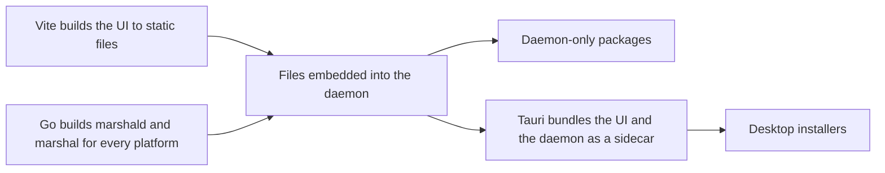

# Development

This document explains how to set up Marshal on your machine, run it while developing, test it, and build it for release. It applies to people and AI agents.

We use **pnpm** as the package manager and as the one place where every command lives. Even Go and Rust tasks are started through pnpm scripts, so there is one way to do everything.

---

## 1. What you need installed

| Tool | Version | Why |
|---|---|---|
| Go | 1.27.1 (the `go` line in `daemon/go.mod`) | Daemon and command line tool |
| Node.js | Pinned in `package.json` `engines` (24 or newer) | UI build tools |
| pnpm | Pinned in `package.json` `packageManager` (11.4.0), enabled with Corepack | Package manager and script runner |
| Git | 2.38 or newer | Worktrees, sparse checkout, merge-tree |

Rust and the Tauri system packages are not needed yet: the desktop shell is deferred until after Phase 2, and `apps/desktop/` does not exist. To do desktop work later, follow the Tauri prerequisites for your OS and pin Rust in `apps/desktop/src-tauri/rust-toolchain.toml` when that folder is created.

Go tools are installed by one script, so everyone uses the same versions:

```sh
pnpm setup:tools
```

This installs `air` (reloads the daemon when Go files change), `sqlc`, `tygo`, and `golangci-lint` into a local `.tools/` folder that is ignored by Git, at the versions pinned in `scripts/setup-tools.mjs` and `library-docs.md`. They are built without cgo, so they need no C compiler. The race detector used by `pnpm test:daemon` does need one, which is already there on macOS, Linux, and the Windows CI runners.

### First-time setup

```sh
corepack enable
pnpm install
pnpm setup:tools
pnpm gen
```

`pnpm gen` runs every code generator: SQL queries, Go to TypeScript types, and design tokens. Run it again after changing SQL, API types, or tokens.

---

## 2. How the workspace is set up

The repo is a pnpm workspace. `pnpm-workspace.yaml` lists these packages:

| Package | Folder | What its scripts do |
|---|---|---|
| `daemon` | `daemon/` | Wraps Go commands: run, test, lint, build. It has a `package.json` with scripts only, no Node code. |
| `web` | `apps/web/` | The SolidJS app |
| `@marshal/ui` | `packages/ui/` | Component library |
| `@marshal/tokens` | `packages/tokens/` | Design tokens |
| `@marshal/protocol` | `packages/protocol/` | Generated API types |
| `stub-agent` | `tools/stub-agent/` | Fake agent for tests and development |
| `hooks-replay` | `tools/hooks-replay/` | Replays a recorded webhook through the daemon |
| `budgets` | `tools/budgets/` | Measures the built daemon's idle RAM and CPU |

`apps/*` and `tools/*` are globs, so a new folder under either is a workspace member with no other change. `apps/desktop/` (the Tauri shell) is planned and does not exist yet.

---

## 3. Running Marshal while developing

### 3.1 The everyday command

```sh
pnpm dev
```

This builds the stub agent first, then starts two things in parallel, with their output labeled in one terminal:

1. **The daemon** in dev mode, through `air`, so it restarts when you save a Go file. It starts with `--dev --fixture prototype`, so the three prototype projects are there.
2. **The Vite dev server** for the UI, which reloads the page as you edit.

Then open the printed local address in your browser. Most UI work happens here, in a normal browser, because it is the fastest loop.

Under the hood, `pnpm dev` runs:

```sh
pnpm --filter stub-agent build && pnpm --parallel --filter daemon --filter web dev
```

The stub agent is built first because the daemon looks for it in its own folder (`dist/bin/stub-agent`, next to `dist/bin/marshald`) and uses it as the default agent. `pnpm build` builds it too; `MARSHAL_STUB_AGENT` overrides the path.

### 3.2 With the desktop window

Not built yet. `pnpm dev:desktop` and the Tauri shell arrive after Phase 2 (the desktop shell and signed releases are deferred until the daemon replaces the mock). Until then, all UI work happens in a browser tab.

### 3.3 Only one part

| Command | Starts |
|---|---|
| `pnpm dev:daemon` | Only the daemon, with reload |
| `pnpm dev:web` | Only the Vite dev server, pointing at a daemon you started yourself |

There is no `pnpm dev:stub`: the stub agent is a program, not a server. Build it with `pnpm --filter stub-agent build` and run `dist/bin/stub-agent` yourself when you want it on its own.

### 3.4 Dev mode

The daemon's `--dev` flag keeps development fully separate from a real Marshal install on the same machine.

| | Dev mode | Normal install |
|---|---|---|
| Data folder | `<data>-dev` | `<data>` |
| Port | 47801 | 47800 |
| Default agent | Stub agent | Real agents |
| Keychain entries | Stored under `marshal-dev` | Stored under `marshal` |
| Tailscale | Not built yet (Phase 9) | Not built yet (Phase 9) |
| Client auth | A dev token, accepted on localhost only | Paired tokens |
| Budget warnings | Shown in the daemon log | Shown in the app |

The Vite dev server forwards API and WebSocket requests to the dev daemon's port, so the browser talks to one address and there are no cross-origin issues.

The browser gets the dev token from the Vite dev server, so there is nothing to paste. In the dev build only, the app asks `GET /__marshal/dev-token`, and the dev server answers with the contents of `dev-token` in the dev daemon's data folder (the same folder as in the table above, or `MARSHAL_DATA_DIR`). It reads the file on every request, because `pnpm dev` starts Vite and the daemon at the same time, and it answers 404 until the daemon has made the file. It answers only requests from this machine, even when Vite runs with `--host`, and it does not exist in a production build or in `vite preview`. The app keeps the token in memory and never stores it.

### 3.5 Settings through environment variables

| Variable | Default in dev | Purpose |
|---|---|---|
| `MARSHAL_DATA_DIR` | `<data>-dev` | Use another data folder |
| `MARSHAL_PORT` | 47801 | Use another port |
| `MARSHAL_AGENT` | `stub` | Set to `real` to use installed CLI agents |
| `MARSHAL_LOG_LEVEL` | `debug` | `debug`, `info`, `warn`, or `error` |
| `MARSHAL_FIXTURE` | none | Load a fixture on start (or pass `--fixture`). The only one is `prototype`: the three projects the prototype shows, `api-gateway`, `web-dashboard`, and `mobile-app`, as real Git repositories under `<data>/fixtures`. It is safe on every start, and it loads in dev mode only (a normal install ignores it). `pnpm dev` passes it. See below |

With `MARSHAL_FIXTURE=prototype` the daemon makes the repositories from `daemon/testdata/repos` (`small-repo` twice, `monorepo` once), gives each one a single commit with a fixed author and date, and adds them as the projects `api`, `web`, and `mobile`. It also writes the prototype's 29 cards (11 in `api`, 9 in `web`, 9 in `mobile`) with their numbers, states, labels, dates, pull requests, CI states, and needs-you reasons, and a session row for each of the 20 cards that has started, so the screens look as they do in the prototype. **Those sessions have no agent process behind them, and a daemon with a fixture loaded does not restore sessions on start**, so nothing runs until a person starts a card themselves. A project that already exists is left alone. The fixture finds `daemon/testdata/repos` from the checkout the daemon was built from, so run a daemon built from a checkout (`pnpm dev` does). If it cannot load, the daemon logs a warning and starts without it. The project language and packages are what detection finds in those repositories (for example `JavaScript` for the two small ones), not the hand-picked labels of the mock data.

### 3.6 Using real agents and models

The stub agent is the default so development costs nothing and works offline. To test with real agents:

```sh
MARSHAL_AGENT=real pnpm dev
```

API keys are not stored yet: the keychain entries and the `marshal keys` command are deferred (the library check comes first), so today the onboarding and settings fields collect keys into the draft only. Real-agent runs that need a signed-in CLI use that CLI's own sign-in. Until the keychain work lands, do not put a key in a file or in the environment.

### 3.7 Webhooks in development

You have two options:

- **Replay recorded webhooks.** Fastest and needs no internet setup.

  ```sh
  pnpm hooks:replay github ci-failed
  pnpm hooks:replay trello card-moved
  ```

  Recorded webhook bodies live in `daemon/testdata/hooks/`. Add new ones when you add new event types.

- **Real webhooks through Funnel.** Not built yet: the daemon has no `--tailnet` flag, so Funnel and `marshal-dev` on your tailnet are Phase 9 work. Replay recorded webhooks until then.

### 3.8 Testing on phones and tablets

- **In the browser:** use the browser's device mode for quick checks at phone and tablet sizes.
- **On a real device:** not possible yet. The daemon has no `--tailnet` flag and no pairing flow (both are Phase 9), so it listens on `127.0.0.1` only and nothing else on the network can reach it. Use the browser's device mode until then. Note that `pnpm dev -- --tailnet` does not work: the flags of the compound `dev` script would not reach the daemon.
- **In tests:** `pnpm test:e2e` runs every view at phone (390 by 844), tablet (820 by 1180), and desktop (1440 by 900) sizes, in both themes, against the built dev daemon. Run `pnpm build` first: Playwright starts `dist/bin/marshald` (through `scripts/e2e-daemon.mjs`, on port 47811 with a throwaway data folder under `apps/web/test-results`, and the `prototype` fixture) and a Vite server beside it. It never uses the dev daemon on port 47801 or your dev data folder.

### 3.9 Resetting dev data

```sh
pnpm dev:reset
```

This runs `marshal dev reset`. It refuses to run while the dev daemon is up (stop it first), asks you to confirm, and then deletes the dev data folder, including dev worktrees. It only ever deletes a folder whose name ends in `-dev` and that sits well below the home folder, so it can never touch the normal install. Pass `--yes` after `--` to skip the question.

### 3.10 Installing as a login service

For everyday use outside this dev loop, `marshald` runs as a per-user service that starts at login (architecture.md section 2, "Daemon as a user service"), managed with:

```sh
marshal service install     # installs marshald next to marshal's own program
marshal service status      # reports whether it is installed and running
marshal service uninstall   # stops and removes it
```

Add `--dev` to any of these to manage the dev daemon's own, separate service instead, so it can run beside a normal install. `install` finds `marshald` next to wherever `marshal` itself is running from, so both programs need to sit together, as they do in a built release. These commands register a real login item on your account (a launchd agent, a systemd user unit, or a Windows scheduled task), so they are not run by any automated test; only their argument and file generation and their status parsing are.

---

## 4. Everyday commands

| Command | What it does |
|---|---|
| `pnpm dev` | Build the stub agent, then daemon and web UI with reload (dev daemon, prototype fixture) |
| `pnpm dev:daemon` | Only the daemon, with reload |
| `pnpm dev:web` | Only the Vite dev server |
| `pnpm gen` | Run all code generators (tokens, the UI index, the sqlc queries, the protocol types) |
| `pnpm lint` | Lint Go and TypeScript (no Rust yet: the Tauri shell comes after Phase 2) |
| `pnpm format` | Format all code |
| `pnpm format:check` | Check formatting without changing anything |
| `pnpm typecheck` | Type check every workspace that has a `typecheck` script |
| `pnpm test` | All unit and integration tests, one workspace at a time |
| `pnpm test:daemon` | Go tests with the race detector, for the daemon (`pnpm test` also runs the Go tools' tests) |
| `pnpm test:web` | UI unit and component tests |
| `pnpm test:e2e` | End-to-end tests in the browser against the built dev daemon (run `pnpm build` first) |
| `pnpm budgets` | Measure the web build size, then the built daemon's idle RAM and CPU (run `pnpm build` first). `MARSHAL_BUDGET_IDLE` sets how long the daemon idles: 10 seconds by default, 60 in CI. |
| `pnpm smells` | Code smell checks on changed code (see `code-standards.md` section 12) |
| `pnpm smells:all` | Code smell checks on the whole repo |
| `pnpm check` | The heavy full gate; CI runs it on every pull request, so run it locally only when you decide to. Everything CI's non-browser jobs run, in order: `gen`, format check, lint (including Go), type check, code smells, token contrast, all unit tests (Go with `-race`), the build (daemon, stub agent, web), and the budgets |
| `pnpm build` | Build for your OS: the daemon and the command line tool into `dist/bin/`, the stub agent, and the web UI |
| `pnpm hooks:replay <provider> <case>` | Replay a recorded webhook through the daemon |

**CI runs these checks on every pull request, so you do not have to run `pnpm check` first.** It is heavy: it uses every core for several minutes. Run it on your own machine only when you want the answer before you push. **AI agents never run it on the owner's machine unless the owner asks, and they start no process to check work by hand (no daemon, no smoke script, no dev server, no browser). They verify with the fast checks only: the typecheck of the workspace they changed, `biome check` on the files they changed, `golangci-lint` on the packages they changed, and the fast unit tests of the files they changed (`go test -race -run <TestName> ./internal/<pkg>/`, vitest with file filters and `--maxWorkers=4`).

**Where the full gate runs.** `pnpm check` and CI (`.github/workflows/ci.yml`) run the same steps, split differently:

| | `pnpm check` (your machine, on request) | GitHub CI |
|---|---|---|
| Light steps (generated files, format, lint, type check, code smells, token contrast) | First, one after another, on your OS | First, in the `lint` job on Linux only, so a small mistake stops the run before the slow jobs |
| Generated files | Runs `pnpm gen` a second time and fails if it changes anything (works on an uncommitted tree) | Runs `pnpm gen`, then fails if the generated files differ from what Git holds |
| Tests, coverage floors, build, budgets | After the light steps, on your OS. The budgets watch the idle daemon for 10 seconds. | In the `check` job on macOS, Linux, and Windows, once `lint` passes. The budgets watch for 60 seconds. |
| Browser suite (`pnpm test:e2e`) | Not part of `pnpm check` | The `e2e` job on Linux after `check`; then `e2e-macos.yml` on macOS after `ci` passes on `main` (never on a pull request) |
| Real agent smoke test | Not part of `pnpm check` | `nightly-agent-smoke.yml`, off until you turn it on (see its header) |

Two commands this section used to list do not exist yet: `pnpm test:agents` (a real-agent smoke test; no real agent is started by any automated test) and `pnpm marshal <command>` (run the built CLI directly, as `dist/bin/marshal status --dev`).

---

## 5. Testing notes

- **Integration tests use the stub agent and fixture repos.** They never call real model APIs.
- **The stub agent can be scripted** to act out cases: ask for approval, fail a test, get stuck in a loop, resume after a restart. Scripts live in `tools/stub-agent/scenarios/`.
- **Fixture repos** live in `daemon/testdata/repos/`: a small repo and a monorepo. Tests copy them into a temp folder, so fixtures are never changed.
- **Real agent tests are manual.** No automated test starts a real agent: that would spend the owner's paid account credits. The adapters are tested against fake programs and the stub agent, and a real Claude Code session on a card is a deliberate manual check (see the note at the end of this section).
- **The real-mode catalog check is safe and manual.** `dist/bin/marshald --dev --agent real --data-dir "$(mktemp -d)" --port <free port>` asks each installed CLI for its `--version` and nothing else. `GET /v1/agents` with that daemon's dev token shows what it found. Never create or start a card in real mode.

### The one real-agent check, done by hand

The only way to prove the Claude Code adapter end to end is to run one real session, and that spends the owner's credits, so it is never automated and never run by an agent. When the owner is ready:

1. Build: `pnpm build`.
2. Start a throwaway daemon with real agents, a data folder of its own, and a free port that is not 47801:
   `dist/bin/marshald --dev --agent real --data-dir "$(mktemp -d)" --port 47899`
3. Read the token from `<data-dir>/dev-token` (do not print it) and call `POST /v1/projects` for a throwaway repository, then create a card, start it, and send one short message.
4. The expected answer is a normal reply from Claude Code, the card moving to working and then to needs or done, a worktree under `<data-dir>/worktrees/`, and an entry in `<data-dir>/logs/sessions/<session id>/`.
5. Undo: stop the daemon (SIGTERM), then delete the throwaway data folder. Nothing of the owner's dev daemon (port 47801, `Marshal-dev`) is touched, because the flag gave this daemon its own folder and port.

---

## 6. Building for production

Production builds happen in CI on every release. You can also build for your own OS locally to test an installer.

### 6.1 What gets built



1. **The UI** is built by Vite into static files.
2. **The daemon and command line tool** are built by Go for every target, with the UI files embedded, so the daemon can serve the web UI to phones even when no desktop app is open.
3. **The desktop app** is built by Tauri, with the UI and the daemon included as a sidecar binary.

### 6.2 Targets

| Platform | Daemon builds | Desktop installers |
|---|---|---|
| macOS (Apple Silicon and Intel) | `marshald`, `marshal` | `.dmg` |
| Windows (x64) | `marshald.exe`, `marshal.exe` | `.msi` and `.exe` |
| Linux (x64 and ARM64) | `marshald`, `marshal` | `.AppImage`, `.deb`, `.rpm` |

- **Go builds cross-compile from one machine**, since the daemon uses no cgo.
- **Tauri builds run on each OS**, so CI uses a macOS, a Windows, and a Linux runner.

### 6.3 Local production builds

| Command | Builds |
|---|---|
| `pnpm build` | The UI, the daemon and the command line tool (into `dist/bin/`), and the stub agent, for your OS |

The per-target commands this section used to list (`pnpm build:daemon`, `pnpm build:daemon:all`, `pnpm build:desktop`) do not exist yet: they arrive with the release pipeline. Build for another platform by calling Go directly, through the tool runner, for example
`node scripts/go-tool.mjs go build -o dist/bin/ ./cmd/...` from `daemon/` with `GOOS` and `GOARCH` set (the daemon uses no cgo, so it cross-compiles).

Output goes to `dist/`, which is ignored by Git.

### 6.4 Signing

Unsigned apps show "unknown developer" warnings, so every release is signed:

- **macOS:** signed with a Developer ID certificate and notarized with Apple.
- **Windows:** signed with a code signing certificate.
- **Linux:** packages are signed, and checksums are published.

Signing keys live only in CI secrets. They are never on developer machines or in the repo.

### 6.5 Versions and release channels

- One version number for everything: the desktop app, daemon, and command line tool always ship together with the same version.
- Semantic versioning: `major.minor.patch`.
- Two channels: **stable** and **beta**. Users pick one in settings.
- The Tauri updater updates the app and its daemon together. The daemon finishes active turns and saves sessions before it restarts for an update.

### 6.6 Daemon-only packages

For remote machines and servers that have no screen:

- Homebrew formula for macOS and Linux
- `.deb` and `.rpm` packages
- Plain archives with the binaries, for any other setup

These are managed from the web UI on another device, over Tailscale.

### 6.7 Release steps in CI

1. Run `pnpm check` on all three platforms.
2. Build the UI.
3. Build the daemon and command line tool for every target, with the UI embedded.
4. Build and sign desktop installers on each OS runner.
5. Check the download size budget.
6. Publish installers, daemon packages, checksums, and updater files.
7. Publish release notes.

---

## 7. Troubleshooting

| Problem | Fix |
|---|---|
| Port 47801 is already in use | Another dev daemon is running. Stop it, or set `MARSHAL_PORT`. |
| "Git 2.38 or newer is needed" | Update Git. Worktree and merge features need it. |
| The desktop window is blank on Linux | Install the webview packages from the Tauri prerequisites for your distribution. |
| The UI shows "Can't reach the daemon" | Check that the daemon is running in dev mode, and that `pnpm dev:web` points at the same port. |
| Types in the UI don't match the API | Run `pnpm gen`. |
| Dev data looks broken | Run `pnpm dev:reset`. |
| A real agent is not found | Check it is on your `PATH`, and that you set `MARSHAL_AGENT=real`. |
