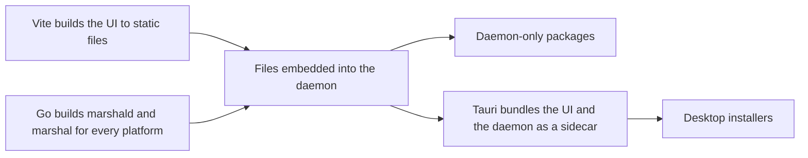

# Development

This document explains how to set up Marshal on your machine, run it while developing, test it, and build it for release. It applies to people and AI agents.

We use **pnpm** as the package manager and as the one place where every command lives. Even Go and Rust tasks are started through pnpm scripts, so there is one way to do everything.

---

## 1. What you need installed

| Tool | Version | Why |
|---|---|---|
| Go | Pinned in `daemon/go.mod` (toolchain line) | Daemon and command line tool |
| Node.js | Current LTS, pinned in `package.json` `engines` | UI build tools |
| pnpm | Pinned in `package.json` `packageManager`, enabled with Corepack | Package manager and script runner |
| Rust | Pinned in `apps/desktop/src-tauri/rust-toolchain.toml` | Tauri desktop shell |
| Git | 2.38 or newer | Worktrees, sparse checkout, merge-tree |
| Tauri system packages | See the Tauri prerequisites for your OS | Webview and build tools, needed only for desktop work |

Go tools are installed by one script, so everyone uses the same versions:

```sh
pnpm setup:tools
```

This installs `air` (reloads the daemon when Go files change), `sqlc`, `tygo`, and `golangci-lint` into a local `.tools/` folder that is ignored by Git.

### First-time setup

```sh
corepack enable
pnpm install
pnpm setup:tools
pnpm gen
```

`pnpm gen` runs every code generator: SQL queries, Go to TypeScript types, and design tokens. Run it again after changing SQL, API types, or tokens.

---

## 2. How the workspace is set up

The repo is a pnpm workspace. `pnpm-workspace.yaml` lists these packages:

| Package | Folder | What its scripts do |
|---|---|---|
| `daemon` | `daemon/` | Wraps Go commands: run, test, lint, build. It has a `package.json` with scripts only, no Node code. |
| `web` | `apps/web/` | The SolidJS app |
| `desktop` | `apps/desktop/` | The Tauri shell |
| `@marshal/ui` | `packages/ui/` | Component library |
| `@marshal/tokens` | `packages/tokens/` | Design tokens |
| `@marshal/protocol` | `packages/protocol/` | Generated API types |
| `stub-agent` | `tools/stub-agent/` | Fake agent for tests and development |

---

## 3. Running Marshal while developing

### 3.1 The everyday command

```sh
pnpm dev
```

This starts two things in parallel, with their output labeled in one terminal:

1. **The daemon** in dev mode, through `air`, so it restarts when you save a Go file.
2. **The Vite dev server** for the UI, which reloads the page as you edit.

Then open the printed local address in your browser. Most UI work happens here, in a normal browser, because it is the fastest loop.

Under the hood, `pnpm dev` runs:

```sh
pnpm --parallel --filter daemon --filter web dev
```

### 3.2 With the desktop window

```sh
pnpm dev:desktop
```

This starts the daemon and the Tauri window. Tauri starts the Vite dev server by itself and loads it in the window. Use this only for desktop-specific work: notifications, the window, deep links, tray, and the updater.

### 3.3 Only one part

| Command | Starts |
|---|---|
| `pnpm dev:daemon` | Only the daemon, with reload |
| `pnpm dev:web` | Only the Vite dev server, pointing at a daemon you started yourself |
| `pnpm dev:stub` | Only the stub agent, for testing it on its own |

### 3.4 Dev mode

The daemon's `--dev` flag keeps development fully separate from a real Marshal install on the same machine.

| | Dev mode | Normal install |
|---|---|---|
| Data folder | `<data>-dev` | `<data>` |
| Port | 47801 | 47800 |
| Default agent | Stub agent | Real agents |
| Keychain entries | Stored under `marshal-dev` | Stored under `marshal` |
| Tailscale | Off, unless `--tailnet` is passed | On, if set up |
| Tailnet name | `marshal-dev` | `marshal` |
| Client auth | A dev token, accepted on localhost only | Paired tokens |
| Budget warnings | Shown in the daemon log | Shown in the app |

The Vite dev server forwards API and WebSocket requests to the dev daemon's port, so the browser talks to one address and there are no cross-origin issues.

### 3.5 Settings through environment variables

| Variable | Default in dev | Purpose |
|---|---|---|
| `MARSHAL_DATA_DIR` | `<data>-dev` | Use another data folder |
| `MARSHAL_PORT` | 47801 | Use another port |
| `MARSHAL_AGENT` | `stub` | Set to `real` to use installed CLI agents |
| `MARSHAL_LOG_LEVEL` | `debug` | `debug`, `info`, `warn`, or `error` |
| `MARSHAL_FIXTURE` | none | Load a fixture project on start, for example `small-repo` or `monorepo` |

### 3.6 Using real agents and models

The stub agent is the default so development costs nothing and works offline. To test with real agents:

```sh
MARSHAL_AGENT=real pnpm dev
```

API keys are never put in files. Add them to the dev keychain once:

```sh
pnpm marshal keys set anthropic
pnpm marshal keys set openrouter
```

In dev mode, these commands write to the `marshal-dev` keychain entries only.

### 3.7 Webhooks in development

You have two options:

- **Replay recorded webhooks.** Fastest and needs no internet setup.

  ```sh
  pnpm hooks:replay github ci-failed
  pnpm hooks:replay trello card-moved
  ```

  Recorded webhook bodies live in `daemon/testdata/hooks/`. Add new ones when you add new event types.

- **Real webhooks through Funnel.** Start with `--tailnet`, which joins your tailnet as `marshal-dev` and opens Funnel for `/hooks/*` only. Point a test GitHub App or Trello webhook at that address.

### 3.8 Testing on phones and tablets

- **In the browser:** use the browser's device mode for quick checks at phone and tablet sizes.
- **On a real device:** start with `pnpm dev -- --tailnet`. The dev daemon joins your tailnet as `marshal-dev` and serves the UI there. Open that address on your phone or tablet, and pair it with the dev pairing code.
- **In tests:** `pnpm test:e2e` runs every view at phone (390 by 844), tablet (820 by 1180), and desktop (1440 by 900) sizes, in both themes.

### 3.9 Resetting dev data

```sh
pnpm dev:reset
```

This stops the dev daemon and deletes the dev data folder, including dev worktrees. It never touches the normal install. You are asked to confirm first.

---

## 4. Everyday commands

| Command | What it does |
|---|---|
| `pnpm dev` | Daemon and web UI with reload |
| `pnpm dev:desktop` | Daemon and desktop window |
| `pnpm gen` | Run all code generators |
| `pnpm lint` | Lint Go, TypeScript, and Rust |
| `pnpm format` | Format all code |
| `pnpm test` | All unit and integration tests |
| `pnpm test:daemon` | Go tests with the race detector |
| `pnpm test:web` | UI unit and component tests |
| `pnpm test:e2e` | End-to-end tests in the desktop shell |
| `pnpm test:agents` | Smoke tests with real CLI agents. Needs `MARSHAL_AGENT=real` and keys. |
| `pnpm budgets` | Measure RAM, CPU, and size budgets locally |
| `pnpm smells` | Code smell checks on changed code (see `code-standards.md` section 12) |
| `pnpm smells:all` | Code smell checks on the whole repo |
| `pnpm check` | Everything CI runs: format check, lint, code smells, tests, budgets |
| `pnpm marshal <command>` | Run the `marshal` command line tool against the dev daemon |

**Run `pnpm check` before opening a pull request.** It runs the same checks as CI.

---

## 5. Testing notes

- **Integration tests use the stub agent and fixture repos.** They never call real model APIs.
- **The stub agent can be scripted** to act out cases: ask for approval, fail a test, get stuck in a loop, resume after a restart. Scripts live in `tools/stub-agent/scenarios/`.
- **Fixture repos** live in `daemon/testdata/repos/`: a small repo and a monorepo. Tests copy them into a temp folder, so fixtures are never changed.
- **Real agent tests** run nightly in CI, against the pinned CLI versions. Run them locally only when working on an agent adapter.

---

## 6. Building for production

Production builds happen in CI on every release. You can also build for your own OS locally to test an installer.

### 6.1 What gets built



1. **The UI** is built by Vite into static files.
2. **The daemon and command line tool** are built by Go for every target, with the UI files embedded, so the daemon can serve the web UI to phones even when no desktop app is open.
3. **The desktop app** is built by Tauri, with the UI and the daemon included as a sidecar binary.

### 6.2 Targets

| Platform | Daemon builds | Desktop installers |
|---|---|---|
| macOS (Apple Silicon and Intel) | `marshald`, `marshal` | `.dmg` |
| Windows (x64) | `marshald.exe`, `marshal.exe` | `.msi` and `.exe` |
| Linux (x64 and ARM64) | `marshald`, `marshal` | `.AppImage`, `.deb`, `.rpm` |

- **Go builds cross-compile from one machine**, since the daemon uses no cgo.
- **Tauri builds run on each OS**, so CI uses a macOS, a Windows, and a Linux runner.

### 6.3 Local production builds

| Command | Builds |
|---|---|
| `pnpm build` | UI, daemon, and command line tool for your OS |
| `pnpm build:daemon` | Daemon and command line tool for your OS, with the UI embedded |
| `pnpm build:daemon:all` | Daemon and command line tool for every platform |
| `pnpm build:desktop` | Desktop installer for your OS |

Output goes to `dist/`, which is ignored by Git.

### 6.4 Signing

Unsigned apps show "unknown developer" warnings, so every release is signed:

- **macOS:** signed with a Developer ID certificate and notarized with Apple.
- **Windows:** signed with a code signing certificate.
- **Linux:** packages are signed, and checksums are published.

Signing keys live only in CI secrets. They are never on developer machines or in the repo.

### 6.5 Versions and release channels

- One version number for everything: the desktop app, daemon, and command line tool always ship together with the same version.
- Semantic versioning: `major.minor.patch`.
- Two channels: **stable** and **beta**. Users pick one in settings.
- The Tauri updater updates the app and its daemon together. The daemon finishes active turns and saves sessions before it restarts for an update.

### 6.6 Daemon-only packages

For remote machines and servers that have no screen:

- Homebrew formula for macOS and Linux
- `.deb` and `.rpm` packages
- Plain archives with the binaries, for any other setup

These are managed from the web UI on another device, over Tailscale.

### 6.7 Release steps in CI

1. Run `pnpm check` on all three platforms.
2. Build the UI.
3. Build the daemon and command line tool for every target, with the UI embedded.
4. Build and sign desktop installers on each OS runner.
5. Check the download size budget.
6. Publish installers, daemon packages, checksums, and updater files.
7. Publish release notes.

---

## 7. Troubleshooting

| Problem | Fix |
|---|---|
| Port 47801 is already in use | Another dev daemon is running. Stop it, or set `MARSHAL_PORT`. |
| "Git 2.38 or newer is needed" | Update Git. Worktree and merge features need it. |
| The desktop window is blank on Linux | Install the webview packages from the Tauri prerequisites for your distribution. |
| The UI shows "Can't reach the daemon" | Check that the daemon is running in dev mode, and that `pnpm dev:web` points at the same port. |
| Types in the UI don't match the API | Run `pnpm gen`. |
| Dev data looks broken | Run `pnpm dev:reset`. |
| A real agent is not found | Check it is on your `PATH`, and that you set `MARSHAL_AGENT=real`. |
