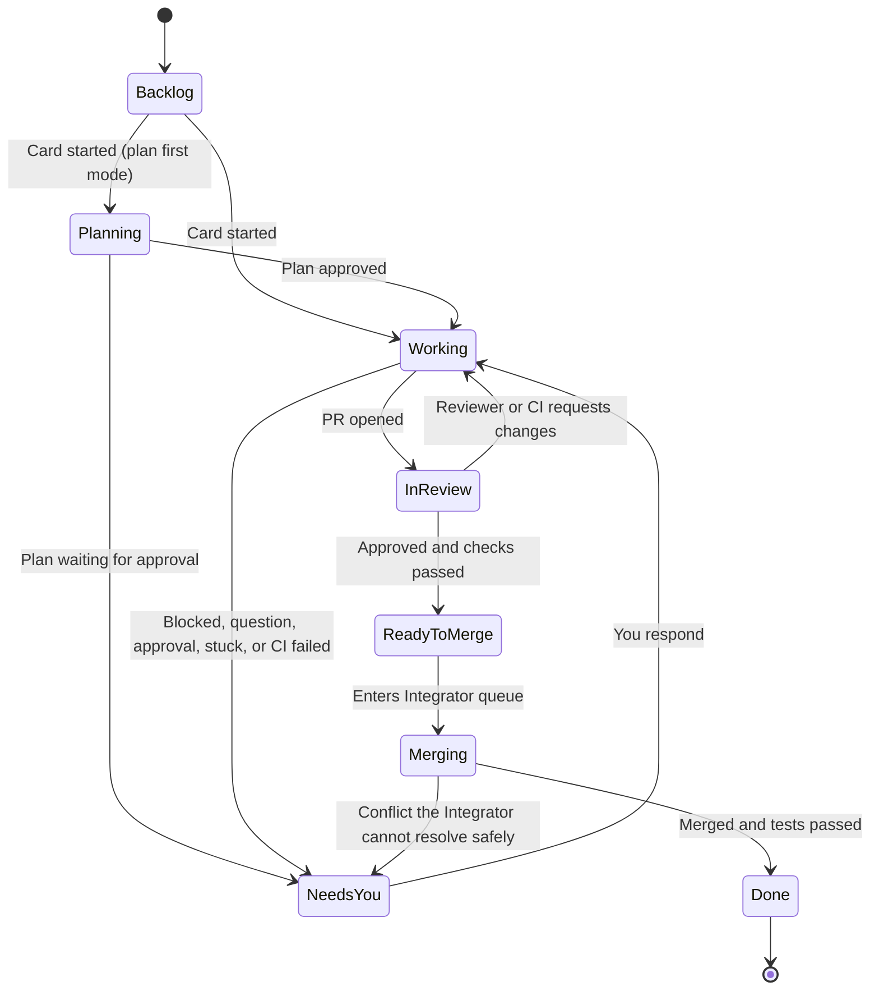
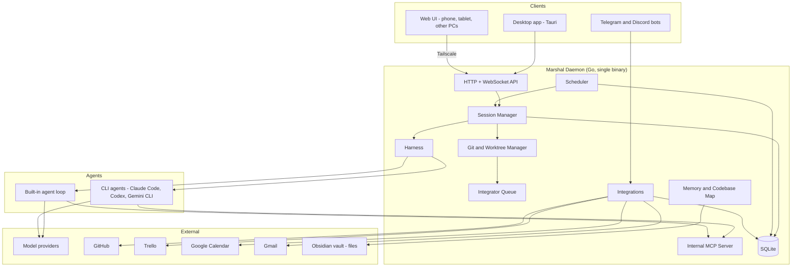

# Marshal

**Product Scope and Design Guide**

| | |
|---|---|
| **Product** | Marshal |
| **Document type** | Product scope, feature guide, and technical direction |
| **Status** | Draft v1 |
| **Date** | September 2026 |

---

## Table of Contents

1. [Overview](#1-overview)
2. [Design Principles](#2-design-principles)
3. [Core Concepts](#3-core-concepts)
4. [Architecture](#4-architecture)
5. [Technology Stack](#5-technology-stack)
6. [Lightweight and Performance Budgets](#6-lightweight-and-performance-budgets)
7. [Agents and Models](#7-agents-and-models)
8. [Sessions](#8-sessions)
9. [Cards and Tasks](#9-cards-and-tasks)
10. [Roles and Orchestration](#10-roles-and-orchestration)
11. [Harness, Context Sharing, and Awareness](#11-harness-context-sharing-and-awareness)
12. [Context and Memory (with Obsidian)](#12-context-and-memory-with-obsidian)
13. [Worktrees, Merging, and Visibility](#13-worktrees-merging-and-visibility)
14. [Safety and Permissions](#14-safety-and-permissions)
15. [Testing and Preview](#15-testing-and-preview)
16. [CI/CD Monitoring](#16-cicd-monitoring)
17. [Scheduler, Crons, and Loops](#17-scheduler-crons-and-loops)
18. [Morning and Evening Briefs](#18-morning-and-evening-briefs)
19. [Integrations](#19-integrations)
20. [Remote Access and Mobile](#20-remote-access-and-mobile)
21. [Notifications](#21-notifications)
22. [Skills, MCP, and Plugins](#22-skills-mcp-and-plugins)
23. [UI and Views](#23-ui-and-views)
24. [Performance and Operations](#24-performance-and-operations)
25. [Team](#25-team)
26. [Out of Scope for v1](#26-out-of-scope-for-v1)
27. [Roadmap](#27-roadmap)
28. [Risks and Open Questions](#28-risks-and-open-questions)
29. [Appendix A: Benchmark Projects](#appendix-a-benchmark-projects)
30. [Appendix B: Glossary](#appendix-b-glossary)

---

## 1. Overview

### 1.1 What Marshal is

Marshal is a lightweight desktop app and background service (the **daemon**) for running AI coding agents on a kanban board.

Each **card** on the board is one task. Each card has **one agent session** that lives as long as the card does, even across app restarts and PC reboots. Agents work in isolated Git worktrees, so many tasks can run at the same time without breaking each other.

Marshal works with:

- **CLI coding agents** you already use, such as Claude Code, Codex, and Gemini CLI.
- **Your own API keys**, through a built-in agent, with providers such as Anthropic, OpenAI, Gemini, DeepSeek, and OpenRouter.
- **External tools**: GitHub, Trello, Telegram, Discord, Gmail, Google Calendar, and Obsidian.

### 1.2 The problem

Running one coding agent is easy. Running many is hard. Today, a developer using several agents deals with:

- **Many terminals** and no single view of what is happening.
- **Lost context** when a CLI session is closed or restarted.
- **Hidden work** inside background worktrees, with no clear picture of what each agent did.
- **Painful merges** when several agents change the same code.
- **No awareness** between agents. Each works alone and can repeat or undo another's work.
- **Manual follow-up** on CI failures, reviews, and task trackers.
- **Heavy tools** that use a lot of memory and CPU.

### 1.3 The solution

Marshal gives every task a card, a session, a workspace, and a feedback loop. The daemon watches everything and moves cards by itself based on real state (agent activity, PRs, CI, reviews). Specialized agent roles plan, build, review, and merge the work. You stay in control through permission modes, approvals, and clear views. You can reach it from anywhere through Tailscale, Telegram, and Discord.

### 1.4 Who it is for

- **Solo developers** who want several agents working in parallel on their projects.
- **Small teams** who want a shared board where people and agents work side by side.
- **Power users** who want to automate recurring work with schedules, loops, and briefs.

---

## 2. Design Principles

These principles guide every feature decision. When two options conflict, these decide.

1. **Lightweight first.** The daemon and UI must stay small and fast. Every feature must fit inside the performance budgets in [Section 6](#6-lightweight-and-performance-budgets).
2. **One card, one lasting session.** A card never loses its context because of a restart. Sessions are resumed, not replaced.
3. **Visible, not hidden.** Everything an agent does is shown: activity, diffs, commands, costs.
4. **Safe by default, powerful when asked.** Safe permission modes are the default. Powerful modes (such as bypass) exist, but must be turned on clearly.
5. **Strong models where mistakes are costly.** Merging and reviewing use strong models by default.
6. **Nothing hard coded that users may want to change.** Roles, templates, schedules, and views are editable.
7. **Local first.** Data lives on your machine in SQLite and plain files. No cloud is required.
8. **Bring your own tools.** Marshal works with the agents, models, and services you already use.

---

## 3. Core Concepts

| Concept | Meaning |
|---|---|
| **Project** | A repository (or monorepo) that Marshal manages. |
| **Card** | One task. It has a title, description, role, agent, session, worktree, branch, checks, and status. |
| **Session** | The single, lasting conversation between a card and its agent. |
| **Role** | An editable template that defines how an agent behaves: instructions, model, thinking mode, permissions, skills, MCP, and limits. |
| **Agent** | The engine doing the work: a CLI agent (such as Claude Code) or Marshal's built-in agent. |
| **Worktree** | An isolated copy of the repo's working files, on its own branch, for one card. |
| **Daemon** | The background service that runs agents, Git, schedules, integrations, and the internal MCP server. |
| **Board** | The kanban view of all cards in a project. Each project has exactly one board. |
| **Brief** | A scheduled summary (morning or evening) of your work, calendar, and tasks. |
| **Memory** | Project knowledge stored as markdown files (Obsidian compatible). |

### 3.1 Card lifecycle

Cards move by themselves based on real facts, not manual dragging. You can still drag cards when you want to.

### 3.2 Projects and boards

**One board per project.** Each project has exactly one kanban board. The board, its cards, the Orchestrator, project memory, role overrides, the CI panel, and project cost limits all belong to that project.

- **Why:** each project stays clean and easy to understand. Everything that affects a project's code lives in one place.

**No multiple boards inside one project.** Instead of extra boards, a project's board uses:

- **Filters:** by role, agent, model, status, label, or package.
- **Swimlanes:** horizontal rows that group cards, for example by role, agent, or package.
- **Saved views:** named filter and swimlane setups you can switch to in one click.

- **Why:** splitting one project's cards across boards would break the features that need to see every card together: cards that move by themselves, file claims, early conflict warnings, and the Integrator merge queue. Filters and swimlanes give the same focus without that cost.

**Monorepos are still one project with one board.** Swimlanes or filters by package show each part of the repo separately. The Integrator and conflict warnings still see all cards in the repo together (see [Section 13.2](#132-monorepo-support)).

**Project switcher.** A sidebar and the command palette let you jump between projects. Each project shows small badges:

- Cards in Needs you
- CI health of the main branch
- Awake agents

**Home view.** One extra view that sits above all projects. It is not a board. It shows:

- Everything that needs you, across all projects
- Total cost today and this month
- All awake agents
- A CI health summary per project

- **Why:** with several projects, you need one place to start your day without opening each project.

**Managing projects.** Projects can be created (from a folder or a GitHub clone), renamed, edited, and removed. Removing a project takes it out of Marshal only, and never deletes the repository on disk.

**Many chats, one board.** A project can have many chats, each about a different topic, but all cards they create go onto the project's one board.

**Two levels of limits.** Cost limits and the awake card limit work at both levels:

- **Per project**, to stop one project from using everything.
- **Global**, because RAM and money are shared across all projects on the machine.

**Trello mapping.** One Marshal project links to one Trello board. This keeps two-way sync simple and predictable.

**Briefs cover all projects.** Morning and evening briefs group their content by project, so one brief covers everything (see [Section 18](#18-morning-and-evening-briefs)).

---

## 4. Architecture

### 4.1 High-level view

### 4.2 Components

**Desktop app (Tauri).** A thin shell that shows the UI. It holds no business logic. Closing it does not stop any agent.

**Web UI.** The same UI, served by the daemon over HTTP and WebSocket. Used from a phone, tablet, or another computer through Tailscale.

**Daemon.** The heart of Marshal. It runs in the background and owns all state and work:

- **Session Manager:** starts, keeps, sleeps, wakes, and resumes agent sessions.
- **Harness:** the control loop around every agent (permissions, limits, stuck detection, retries).
- **Git and Worktree Manager:** creates, updates, and cleans up worktrees and branches.
- **Integrator Queue:** merges finished cards one at a time.
- **Scheduler:** runs crons, intervals, one-time jobs, event triggers, loops, and briefs.
- **Internal MCP Server:** lets agents read board state, claim files, and talk to each other.
- **Integrations:** GitHub, Trello, Calendar, Gmail, Telegram, Discord.
- **Memory and Codebase Map:** project knowledge and a light code index.
- **SQLite:** all app state.

### 4.3 Why this shape

All three benchmark projects (see [Appendix A](#appendix-a-benchmark-projects)) share one pattern: **a local daemon does the heavy work, and the UI only shows it.** This has three benefits:

1. Agents keep running when the UI is closed.
2. The same daemon can serve the desktop app, the web UI, and chat bots.
3. The UI stays small, because it does almost nothing except render.

---

## 5. Technology Stack

| Layer | Choice | Why |
|---|---|---|
| **Daemon** | Go | Very good at running and watching many processes at once (goroutines). Builds to one small binary for macOS, Windows, and Linux. Has an official MCP SDK. Faster to build features in than Rust, and lighter than a Node.js daemon. |
| **Desktop shell** | Tauri | Uses the system webview instead of shipping a full browser, so it uses far less RAM and disk than Electron. The daemon runs terminals, so the shell does not need Node.js. |
| **UI** | TypeScript + Vite + SolidJS | Small bundles and fast updates, which fits the lightweight goal. Fine-grained updates suit streaming chat and terminal output. |
| **Styling** | Tailwind CSS | Small output, fast to build UIs, easy theming. |
| **Terminal** | xterm.js | The standard web terminal. Used only in the terminal view of an open card. |
| **Drag and drop** | A light drag-and-drop library | For the kanban board and timeline. |
| **Database** | SQLite (WAL mode) | Fast, local, zero setup, one file. WAL mode allows reads while writing. |
| **Remote access** | Tailscale (tsnet) + Funnel | tsnet lets the daemon join your tailnet directly, with no separate install. Funnel gives a public URL for webhooks. |
| **Secrets** | OS keychain | API keys and tokens never sit in the database or config files. |
| **Memory files** | Plain markdown | Human readable, Git friendly, and works directly as an Obsidian vault. |

### 5.1 What we avoid, and why

- **No Redis, no message queue server, no Docker by default.** Everything runs in-process in the daemon. Fewer moving parts means less RAM, fewer failures, and easier installs.
- **No Electron.** It ships a full browser per app and uses much more memory.
- **No cloud backend required.** Marshal works fully on one machine. Team features use Tailscale between machines instead of a hosted server.

---

## 6. Lightweight and Performance Budgets

Lightweight is a hard rule, not a wish. These budgets are **targets**, measured and enforced in CI. A change that breaks a budget fails the build.

| Metric | Budget |
|---|---|
| Daemon idle RAM | Under 50 MB |
| Daemon idle CPU | About 0% |
| UI RAM | Under 150 MB |
| Download size (app + daemon) | Under 50 MB |
| UI response to a click or card move | Under 100 ms |
| Agent start after a card is started | Under 3 seconds |
| Wake a sleeping card | 1 to 3 seconds |
| Notification to phone after an event | Under 5 seconds |

### 6.1 How we stay light

- **Event-driven, not polling.** The daemon reacts to events (process output, file changes, webhooks). It does not loop and check things all the time.
- **Logs on disk.** Agent output is written to disk. Only a small buffer is kept in memory.
- **Batched output.** Terminal and chat output is sent to the UI in small batches (every 16 to 50 ms), not byte by byte.
- **Only render what you see.** Only the open card renders a terminal. Long lists and logs are virtualized.
- **Awake card limit.** Only a set number of cards (for example 5) keep a live agent process. The rest sleep (see [Section 8](#8-sessions)).
- **Built-in agent.** The built-in agent runs inside the daemon, with no extra process per card.

### 6.2 An honest limit

Third-party CLI agents (Claude Code, Codex, and others) are separate programs. Each one can use a few hundred MB of RAM. Marshal cannot make them smaller. It controls their cost through sleep and wake, the awake card limit, and by offering the lighter built-in agent for simple cards.

### 6.3 Main performance risks

| Risk | Mitigation |
|---|---|
| Many live CLI processes | Sleep and wake, awake card limit |
| Heavy terminal output | Batching, render only the open card |
| Disk use from worktrees | Sparse worktrees in monorepos, auto cleanup after merge |
| Provider rate limits | Per-provider queue with retry and fallback models |
| Integration syncing | Webhooks through Funnel, cheap conditional polling as backup |

---

## 7. Agents and Models

### 7.1 Two kinds of agents

**CLI agents.** Marshal runs existing coding CLIs such as Claude Code, Codex, and Gemini CLI.

- **How it works:** Marshal connects through ACP (Agent Client Protocol) where the agent supports it, or through a PTY (a virtual terminal) otherwise. ACP gives clean, structured events (messages, tool calls, approvals). PTY gives the raw terminal.
- **Why:** users keep the agents they already trust and pay for, with their native strengths.

**Built-in agent.** Marshal's own agent loop, powered by your API keys.

- **How it works:** the loop runs inside the daemon. It reads and edits files, runs commands, and calls tools, all under the same permission system as CLI agents.
- **Why:** it is the lightest option, since no extra process is spawned. It also lets users work with any model, even without a CLI installed.

### 7.2 Model providers

Supported providers:

- Anthropic (Claude)
- OpenAI
- Google Gemini
- DeepSeek
- OpenRouter
- Any OpenAI-compatible API
- Local models through Ollama and LM Studio

**How it works:** most providers use the OpenAI API format, so one adapter covers them. Anthropic and Gemini get native adapters to support their own features, such as thinking settings.

### 7.3 Model switching

- **What:** change the model for a card, a role, or mid-session.
- **How it works:** for the built-in agent, the next request simply uses the new model. For CLI agents, Marshal uses the CLI's own model command or flag, and resumes the same session if a restart is needed.
- **Why:** different parts of a task need different strength. You might plan with a strong model and do simple edits with a cheaper one.

### 7.4 Thinking modes

- **What:** choose how much the model "thinks" before answering: **low, medium, high, extra high**.
- **How it works:** Marshal maps each level to the provider's own setting, such as a reasoning effort level or a thinking token budget. If a model does not support thinking, the setting is hidden.
- **Why:** more thinking gives better results on hard problems but costs more and takes longer. Users should choose, per card or per role.

### 7.5 Model fallback

- **What:** if a provider is down or rate-limited, Marshal switches to a backup model automatically.
- **How it works:** each role and card can list a backup model. When a request fails with an outage or rate-limit error, the harness retries with the backup and notifies you. It switches back when the main provider recovers.
- **Why:** work should not stop because one provider has a bad hour.

### 7.6 Per-provider queue

- **What:** requests to each provider go through a queue with retry.
- **How it works:** the daemon tracks rate limits per API key. When many cards run at once, requests wait their turn instead of failing.
- **Why:** ten parallel agents on one API key will hit limits quickly without a queue.

---

## 8. Sessions

### 8.1 One lasting session per card

- **What:** each card keeps one agent session for its whole life. Marshal never starts a new CLI for each message.
- **How it works:**
  - While a card is awake, its agent process stays alive, and new messages are sent into the same process (through ACP or the CLI's streaming input mode).
  - The session ID is stored in SQLite.
  - The daemon runs in the background, so **closing the UI does not stop any session**.
- **Why:** starting a new CLI for every call is slow and loses context. One lasting session keeps full context and gives fast replies.

### 8.2 Restore after restart

- **What:** after a PC restart, cards pick up where they left off.
- **How it works:** CLI agents save their conversations to disk. Marshal reopens each session with the CLI's resume command using the stored session ID. You choose, in settings, between **auto-restore on startup** or a **manual "Resume" button** per card.
- **Why:** a card can be used for days or weeks. A reboot must not reset it.

> **Build note:** resume support differs between CLIs and versions. Each supported agent must be tested for reliable resume before it is marked as fully supported.

### 8.3 Sleep and wake

- **What:** idle cards go to sleep to save RAM, then wake when needed.
- **How it works:**
  - A card with no activity for a set time (default 15 minutes) goes to sleep. The agent process stops, but the session ID is kept.
  - When you send a message or a schedule triggers the card, the daemon resumes the session. This takes 1 to 3 seconds.
  - To you, it is still the same session with the same context.
- **Why:** many live CLI processes use gigabytes of RAM. Sleep keeps Marshal lightweight without losing anything.

### 8.4 Sleep reminders

- **What:** Marshal warns you before a card sleeps.
- **How it works:**
  1. When a card reaches the idle time, you get a notice: *"Card 'Fix login bug' is idle. Sleeping in 2 minutes."*
  2. You can choose **Keep awake** (reset the timer), **Sleep now** (free RAM right away), or **Pin** (never sleep this card).
  3. If you do nothing, the card sleeps.
- **Rules:**
  - Notices are **grouped**. Five idle cards give one notice, not five.
  - A card that is **working** or **waiting for your approval never sleeps**. For those, the notice becomes "Card X needs you".
  - Notices are **in-app by default**, since sleeping loses nothing. Phone, Telegram, and Discord reminders are optional.
- **Settings:** idle time, warning time, notice channels, pinned cards, and the maximum number of awake cards, set per project and globally (see [Section 3.2](#32-projects-and-boards)). When a limit is reached, the oldest idle card gets the warning first.
- **Why:** you stay in control of which sessions stay live, without being spammed.

### 8.5 Session status

- Each card shows an **awake or asleep icon**.
- Each card shows a **context meter**. Before the conversation reaches the model's context limit, Marshal warns you that auto-compaction (summarizing older parts) is coming. Important facts are protected by card notes and project memory (see [Section 12](#12-context-and-memory-with-obsidian)).

---

## 9. Cards and Tasks

The card is the main unit of work in Marshal.

### 9.1 The board

- **What:** a kanban board with columns: **Backlog, Planning, Working, Needs you, In review, Ready to merge, Done**.
- **How it works:** the daemon moves cards by itself based on facts: agent activity, approvals, PR state, CI results, and reviews. You can also drag cards by hand.
- **Why:** the board is always true. You see what is moving, what is blocked, and where you are needed, without checking each agent.

### 9.2 Card templates

- **What:** saved card setups for common work, such as "Bug fix", "New endpoint", or "Refactor".
- **How it works:** a template stores the role, agent, model, thinking mode, permission mode, skills, MCP servers, acceptance checks, and a starting prompt. New cards can start from any template. Templates are editable, and can be exported and imported.
- **Why:** repeat work should take one click, and should be done the same way each time.

### 9.3 Card dependencies

- **What:** card B can wait for card A.
- **How it works:** you link cards. A dependent card stays in Backlog until the cards it depends on are merged, then starts by itself. The timeline view shows these links as lines.
- **Why:** some work must happen in order. Dependencies remove the need to watch and start things by hand.

### 9.4 Sub-cards

- **What:** a big card can be split into smaller cards.
- **How it works:** you or the Orchestrator split a card. The parent shows combined progress, and finishes when all sub-cards are done.
- **Why:** small, focused tasks give better agent results and cleaner merges.

### 9.5 Acceptance checks

- **What:** a "done means" list for each card, such as "tests pass", "lint clean", "screenshot matches", or a custom check.
- **How it works:** checks can be commands (tests, lint, build), screenshot comparisons, or reviewer approval. The agent cannot mark a card done until every check passes. Failed checks are sent back into the card's session.
- **Why:** agents often say "done" too early. Checks make "done" mean something real.

### 9.6 Card from anywhere

- **What:** create cards from many places.
- **Sources:** GitHub issues, Trello cards, emails, Telegram and Discord messages, voice notes, the chat view, and `TODO(agent): ...` comments in code.
- **How it works:** each source is mapped to a new card with its content attached (issue text, email body, voice transcript). Code comments are found when the daemon scans the repo.
- **Why:** work arrives from many places. Capturing it in one step keeps nothing lost.

### 9.7 Duplicate detection

- **What:** a warning when a new card looks like an existing one.
- **How it works:** a cheap model compares the new card's text with open cards and shows likely matches before creation.
- **Why:** duplicate cards waste agent time and cause conflicts.

### 9.8 Cost meter

- **What:** tokens used and money spent, shown on each card.
- **How it works:** the harness records usage from every model call and tool call, per card, per role, and per model.
- **Why:** you should know what each task costs, and spot expensive cards early.

### 9.9 Checkpoints (time travel)

- **What:** roll a card's code back to any earlier point.
- **How it works:** the daemon saves a light Git checkpoint (a commit on a hidden ref) at key moments: before each agent turn, before big edits, and before merges. The card's timeline lists checkpoints. You pick one to restore the worktree and, if you want, rewind the conversation to match.
- **Why:** agent mistakes should be easy to undo. Git refs cost almost no disk space.

### 9.10 Fork a card

- **What:** copy a card and try a different approach.
- **How it works:** the fork gets a new worktree from the chosen checkpoint and a copy of the session context. Both cards then run on their own.
- **Why:** sometimes the best way forward is to try two ideas and keep the better one.

### 9.11 Race mode

- **What:** give one card to two or three agents or models at the same time.
- **How it works:** Marshal makes one fork per contestant. When all finish, it shows a side-by-side comparison: diffs, test results, cost, and time. You pick the winner. The others are archived.
- **Why:** for important tasks, comparing results is cheaper than fixing a weak one. Results also feed the agent scorecard.

### 9.12 Add a card

- **What:** an "Add a card" action at the bottom of the Backlog, Planning, and Working columns, with a small button beside it to start from a template.
- **How it works:**
  - **Backlog:** adds the card and leaves it waiting.
  - **Planning:** adds the card and starts the agent in plan first mode.
  - **Working:** adds the card and starts the agent right away.
  - When swimlanes are on, the new card takes that lane's role, agent, or package.
- **Not in the other columns.** Cards reach Needs you, In review, Ready to merge, and Done by themselves, based on real events. Adding a card straight into those columns would make the board say something that is not true.
- **Why:** starting work should take one step, from the place on the board where it belongs.

### 9.13 Checklists

- **What:** each card holds any number of named checklists, such as Sub-tasks, Definition of done, and Acceptance criteria. The card's tab for these is called **Checklists**.
- **How it works:**
  - Each checklist has a progress bar, "Add an item", "Hide checked items", and Delete.
  - Each done item shows who completed it: a person, or the agent.
  - **The agent can tick items** when it has evidence, such as a passing test run or a commit. The evidence is linked from the item. For example, the agent ticks "Run the race detector" by itself once the race tests pass. If that evidence later stops being true (the tests fail again), the item unticks itself with a note.
  - **"Only people can tick"** is an option per checklist, for items that need human judgment.
  - People can tick or untick any item.
  - Marshal's automatic acceptance checks (see [Section 9.5](#95-acceptance-checks)) sit below the checklists, labeled as run by Marshal.
- **Required to finish:** each checklist has a "Required to finish" switch. It is on by default for Definition of done and Acceptance criteria, and off for Sub-tasks. A card cannot enter the merge queue until every required checklist is complete. If everything else is ready, the card moves to Needs you with the reason, for example "Definition of done: 2 items left".
- **Templates:** card templates can include checklists.
- **Board cards** show checklist progress, for example "4/7".
- **Why:** some parts of "done" can be checked by tools, and some need a person. Checklists hold both, and make clear who did what.

### 9.14 Comments

- **What:** a Comments tab on every card, for people to discuss the card and talk to its agent.
- **How it works:**
  - Comments can include **files and images**, which preview in the comment, and **links**. Links pasted into the text also become link chips.
  - **The agent reads new comments** at the start of its next turn. Once it has, the comment shows "Agent read this".
  - **Mentioning @agent, or ending a comment with a question**, gets a reply from the agent right away. This wakes the card if it is asleep.
  - Images are passed to the agent when its model supports images. Other files can be read by the agent through the internal MCP server.
  - The agent can also post comments, such as a summary when it finishes. Its comments are marked as the agent's.
  - Link chips show the site and the link text. Marshal does not fetch linked pages by itself, to stay private and light. The agent opens a link only if its permissions allow network use.
  - Attachments are stored on the machine that hosts the project, with a size limit per file set in settings.
  - Board cards show a comment count and an attachment count.
- **Why:** chat is for steering the agent in real time. Comments are for notes, files, and discussion that belong to the card and stay with it.

### 9.15 Members

- **What:** a Members row in the card header, with the people on the card and the card's agent.
- **How it works:**
  - The **+** button adds or removes people.
  - The agent follows the card's Agent setting. It cannot be removed from members, only changed through that setting.
  - Board cards show member avatars: **people as circles with initials, the agent as a rounded square with a bot icon**. They are told apart by shape, not color.
  - In solo use, the owner is added to every card they create.
- **Notices for members:** members get notices when they are mentioned, when someone (or the agent) replies to their comment, when their card needs them, and when their card is merged. People who are not members only get notices when mentioned. Each person can turn any of these off.
- **Why:** on a shared board, people need to know which cards are theirs, and cards need to reach the right people.

---

## 10. Roles and Orchestration

### 10.1 Roles are editable templates

Roles are **not hard coded**. Marshal ships with **starter templates**, and every part of every role can be edited.

**Starter templates:**

| Role | Purpose | Default model strength |
|---|---|---|
| **Orchestrator** | Plans work and splits goals into cards | Strong or medium |
| **Worker** | Does the coding on a card | Your choice |
| **Reviewer** | Reviews every PR before you do | Strong |
| **Integrator** | Merges finished work into the target branch | Strong |
| **Tester** | Writes and runs tests | Medium |
| **Docs writer** | Writes and updates documentation | Medium |
| **Security checker** | Looks for security problems in changes | Strong |
| **UI checker** | Checks UI changes using previews and screenshots | Medium |

**Editable fields in every role:**

- Name and description
- Instructions (the role's system prompt)
- Agent (a CLI agent or the built-in agent)
- Model and backup model
- Thinking mode
- Permission mode and permission profile
- Skills
- MCP servers
- Limits: time, cost, and rounds

**Role management:**

- **Create, duplicate, delete** roles, or **reset** a starter template to its default.
- **Per-project overrides:** the same role can behave differently in each project.
- **Export and import** roles to share them or move them between machines.
- **Soft warnings, not blocks:** if you set a weak model on the Integrator or Reviewer, Marshal warns you that weak models can break code at merge and review time, but lets you decide.

**Why:** every team and project works differently. Good defaults help people start fast, while full editing lets them fit Marshal to their own process.

### 10.2 The Orchestrator

- **What:** a persistent planning agent at the project level.
- **How it works:** you describe a goal in the chat view. The Orchestrator explores the codebase and memory, proposes a plan, and after your approval creates cards with the right roles, dependencies, and context. It follows progress and creates follow-up cards when needed.
- **Why:** large goals need someone to split them cleanly, so workers don't collide.

### 10.3 Plan first mode

- **What:** the agent writes a plan, you approve it, then it codes.
- **How it works:** the card enters the Planning column. The agent posts a **short plan in the chat**: steps, files it expects to touch, risks, and checks. You **approve, edit, or reject** it. Only after approval does it start coding.
- **No plan document.** The plan lives in the chat only. A separate document is created only when you ask for one.
- **Why:** a wrong plan wastes a whole run. Reviewing a few lines up front is the cheapest way to prevent that.

### 10.4 Reviewer

- **What:** a second agent reviews every PR before you see it.
- **How it works:** when a PR opens, the Reviewer reads the diff, the card's task, and its acceptance checks. It leaves review comments. The worker must address them before the card can move to Ready to merge. Only then is it shown to you as ready.
- **Code smells:** the Reviewer also receives the card's code smell findings (see [Section 15.4](#154-code-smell-checks)) and checks the ones only a model can judge, such as misleading names, outdated comments, and code in the wrong place.
- **Why:** it catches bugs and missed requirements before they reach your review or the Integrator.

### 10.5 Handoff between agents

- **What:** move a card from one agent to another, for example from Codex to Claude Code.
- **How it works:** the current agent (or a helper model) writes a clean handoff summary: the goal, what was done, what is left, key decisions, and open problems. The new agent starts a session in the same worktree with this summary and the card's notes.
- **Why:** sometimes another agent is better for the rest of the task. Switching should not mean starting over.

### 10.6 Stuck detector

- **What:** detects when an agent is going in circles, and stops it early.
- **Signals:**
  - The same error three times in a row
  - The same file edited back and forth
  - No real progress (no new passing checks, no meaningful diff) for a set time
- **How it works:** the harness watches the activity feed for these patterns. When one is found, it pauses the agent, moves the card to Needs you, and explains what it saw.
- **Why:** stuck agents burn time and money. Stopping early saves both.

### 10.7 Agent scorecard

- **What:** stats on how well each agent, model, and role performs in your own projects.
- **Measures:** success rate (cards merged without rework), cost, time to done, review rounds, CI failures, and code smells introduced.
- **How it works:** the daemon records outcomes for every card, including race mode results.
- **Why:** it helps you choose the right agent and model for each kind of work, based on your own data.

---

## 11. Harness, Context Sharing, and Awareness

### 11.1 The harness

- **What:** the control loop the daemon wraps around every agent.
- **Responsibilities:**
  - Start, stop, sleep, wake, and resume sessions
  - Give each agent its role, context, skills, and MCP servers
  - Enforce the permission mode and profile
  - Enforce limits (time, cost, rounds)
  - Retry failed model calls and apply fallback
  - Run stuck detection
  - Record everything to the activity feed and audit log
- **Why:** agents should not be trusted to police themselves. The harness gives the same rules and safety to every agent, CLI or built-in.

### 11.2 Internal MCP server

- **What:** the daemon runs its own MCP server, and every agent connects to it.
- **Tools it offers:**

| Tool | Purpose |
|---|---|
| `board_status` | See other cards, their owners, and their state |
| `claim_files` | Declare which files or packages this card is working on |
| `post_note` | Leave a note for other agents or for the project |
| `read_notes` | Read notes left by others |
| `ask_agent` | Ask another card's agent a question |
| `create_card` | Propose a new card (subject to permissions) |
| `search_memory` | Search project memory and past sessions |
| `search_codebase` | Query the codebase map |

- **Why:** MCP is supported by the major agents, so one server gives every agent the same way to see and talk to the rest of the system.

### 11.3 Awareness

- **What:** each agent knows what the other agents are doing.
- **How it works:** at the start of each turn, the harness adds a **short summary** to the agent's context: active cards, their goals, and the files or packages they have claimed. Details are pulled only when the agent asks, through MCP.
- **Why:** agents that know about each other avoid duplicate work and conflicting edits.

> **Token cost:** awareness uses tokens. Marshal shares short summaries, never full transcripts, and lets agents pull details only when needed.

### 11.4 File claims

- **What:** agents declare the files or packages they are changing.
- **How it works:** claims are stored in the daemon and shown on cards. When a second card tries to claim the same file, both cards get a warning, and the Orchestrator is told. Claims are released when a card is merged or closed.
- **Why:** this is the first line of defense against merge conflicts.

---

## 12. Context and Memory (with Obsidian)

### 12.1 Memory layers

Marshal gives agents context in three layers:

| Layer | Contents | Shared with |
|---|---|---|
| **Project memory** | Rules, architecture notes, decisions, lessons | All agents in the project |
| **Card context** | Task, plan, handoff notes, card notes | The card's agent |
| **Live board state** | Who is doing what right now | All agents, as short summaries |

### 12.2 Project knowledge base

- **What:** a growing store of project knowledge: coding rules, architecture, decisions, and "we tried X and it failed" notes.
- **How it works:** stored as markdown files. Agents read relevant parts before starting a card and can suggest additions. You can edit it directly.
- **Why:** agents should not rediscover the same facts on every card.

### 12.3 Auto lessons

- **What:** when a card fails and is later fixed, Marshal saves the lesson.
- **How it works:** after a failure-then-fix pattern (a CI failure, a review rejection, a stuck loop), a helper model writes a short lesson: what went wrong and what fixed it. Lessons are added to project memory, and you can edit or delete them.
- **Why:** mistakes should be made once, not on every card.

### 12.4 Codebase map

- **What:** a light index of the repository: files, main functions and types, and which parts call which.
- **How it works:** the daemon builds the map in the background and updates it when files change. Agents query it through MCP instead of reading many files.
- **Why:** it saves tokens and time on every card, and helps agents find the right place to change.

### 12.5 Context budget view

- **What:** shows how full each card's context window is.
- **How it works:** a meter on each card, with a warning before auto-compaction.
- **Why:** you can act (add notes, hand off, or fork) before important detail is summarized away.

### 12.6 Pin files

- **What:** always include chosen files in a card's context.
- **Why:** some files (a spec, a key interface) should never be forgotten by the agent.

### 12.7 Search all sessions

- **What:** search across every card's history. For example: *"Which card changed the payment code last week?"*
- **How it works:** session events and summaries are indexed in SQLite full-text search.
- **Why:** past work is useful knowledge, and it should be easy to find.

### 12.8 Per-package memory

- **What:** in monorepos, each package can have its own rules and notes (for example, its own `AGENTS.md`), on top of project memory.
- **Why:** different packages often follow different rules.

### 12.9 Obsidian integration

- **What:** Marshal's memory is stored as plain markdown in a folder that works as an Obsidian vault.
- **How it works:**
  - Project memory, decisions, lessons, and card notes are markdown files.
  - Files link to each other with `[[wiki links]]`, so Obsidian's graph view shows how cards, decisions, and lessons connect.
  - Each card can have its own note: summary, plan, outcome, and links.
  - Morning and evening briefs are saved as **daily notes**.
  - Agents read and write the vault through Marshal. The daemon watches the folder, so your own edits in Obsidian are picked up right away.
  - **No Obsidian plugin is required**, because it is all plain files.
- **Why:** you get a powerful, familiar tool to browse and edit what your agents know, with no lock-in.

---

## 13. Worktrees, Merging, and Visibility

### 13.1 One worktree per card

- **What:** each card works in its own Git worktree and branch.
- **How it works:** the daemon creates the worktree when the card starts and removes it after merge or close.
- **Why:** parallel agents cannot break each other's work, and every change is a clean, reviewable branch.

### 13.2 Monorepo support

Monorepos need a different approach, because full worktrees of a large repo are heavy and one change can affect many packages.

- **Tool detection:** Marshal detects pnpm, npm, and yarn workspaces, Nx, Turborepo, Go workspaces, Cargo workspaces, and Bazel. Each tool describes which packages depend on which: the **package graph**.
- **One board for the whole monorepo:** the monorepo is one project with one board. Swimlanes and filters by package show each part separately.
- **Cards scoped to packages:** a card can say "works in `packages/auth`" instead of the whole repo.
- **Sparse worktrees:** using Git sparse checkout, a worktree contains only the card's packages, their dependencies from the package graph, and root config files. This saves disk space and setup time.
- **Auto-widening:** if a build fails because a file is missing from the sparse checkout, the daemon widens the checkout automatically instead of asking you.
- **Conflict warnings by package:** cards in different packages are safe. Cards in the same package, or in a shared package others depend on, get a warning.
- **Affected tests only:** the Integrator uses the package graph to run tests for changed packages and the packages that depend on them.
- **Why:** it keeps monorepo work fast, light, and safe.

### 13.3 Live activity feed

- **What:** a live feed per card of everything the agent does.
- **Contents:** files changed, commands run, test results, tool calls, approvals, and a one-line "doing now" status.
- **Why:** worktrees work in the background. Without a feed, you only see code appear, with no idea how or why.

### 13.4 Live diff view

- **What:** see the card's changes as they happen, file by file.
- **Why:** you can spot a wrong direction early, before the agent finishes.

### 13.5 Early conflict warnings

- **What:** warnings when two cards touch the same files (or packages, in monorepos).
- **How it works:** the daemon compares file claims and actual changed files across worktrees every few minutes, and when claims change.
- **Why:** finding a conflict early is much cheaper than finding it at merge time.

### 13.6 The Integrator merge queue

- **What:** a strong-model agent that merges finished cards into the target branch.
- **How it works:**
  1. A card reaches Ready to merge and enters the queue.
  2. The Integrator takes **one card at a time**.
  3. It runs a **dry-run merge** with `git merge-tree`, which tests the merge without touching any files.
  4. **No conflict:** it merges, runs tests (affected tests in monorepos), and lands the change.
  5. **Conflict:** it reads the context of every card involved (task, plan, handoff notes, and diffs) and resolves based on intent, not only text.
  6. **Not confident:** it stops, explains the conflict, and moves the card to Needs you.
- **Why:** merging many parallel branches is where things break. A careful, context-aware, one-at-a-time process keeps the main branch healthy.

### 13.7 Safe merge rules

- A **backup branch** is made before every merge. It is only a Git pointer, so it uses almost no disk space.
- **Never force push.**
- On any failure, **abort cleanly** and return to the last good state.
- The merged result is **tested before it lands**.

### 13.8 Auto cleanup

- Worktrees are removed after merge or close.
- Backup branches expire after a set time (default 14 days).
- `git gc` runs on a schedule.
- **Why:** worktrees are what really use disk space. Branches and checkpoints cost almost nothing, but still should not pile up forever.

---

## 14. Safety and Permissions

### 14.1 Permission modes

Permission modes control how much an agent may do without asking. They can be set per card, per role, or per project, similar to Claude Code.

| Mode | What the agent can do without asking | Best for |
|---|---|---|
| **Ask** | Nothing. Asks before every edit and command. | New projects, sensitive code |
| **Auto-accept edits** | Edit files. Commands still need approval. | Everyday coding |
| **Plan only** | Read only. No edits, no commands. | Exploring, planning, reviews |
| **Full auto** | Edits and commands, within the permission profile. Guards still apply. | Trusted, well-tested work |
| **Bypass permissions** | Everything. All permission checks are skipped. | Throwaway experiments, trusted sandboxes |

**How approvals work:** when an agent needs approval, the card moves to Needs you. You approve or deny in the app, the web UI, or with Telegram and Discord buttons.

### 14.2 Bypass permissions mode

Bypass is powerful, so it has its own rules:

- **Off by default.** Turning it on needs a clear confirmation step.
- **A red banner** shows on every card and session using bypass.
- **Worktree only.** Bypass works only inside the card's own worktree, never directly on your main branch.
- **Always audited.** The audit log still records every command and change.
- **Lockable.** It can be turned off per project, and limited by user role in teams.
- **Secret scanner stays on by default**, because it is a commit check, not a permission ask. You can turn it off in settings if you choose.
- **Why:** some users want agents to run with no interruptions. Marshal allows it, but makes the risk clear and limits the damage.

### 14.3 Permission profiles

- **What:** fine-grained lists of what an agent may do.
- **Controls:** read files, edit files, run commands, push branches, install packages, use the network, and use specific MCP servers.
- **How it works:** a profile is attached to a role or card and enforced by the harness in every mode except bypass.
- **Why:** modes say *how often* to ask. Profiles say *what is allowed at all*.

### 14.4 Command blocklist (recommended for v1)

- **What:** a list of commands that are always blocked or always need approval, such as `rm -rf` on wide paths, force push, dropping databases, and commands that use production credentials.
- **Why:** it is cheap to build and prevents the worst mistakes. It matters more now that bypass mode exists. By default it applies in every mode except bypass, and can optionally apply there too.

### 14.5 User permission roles

For people (not agents), especially in teams:

| Role | Can do |
|---|---|
| **Owner** | Everything, including billing limits and bypass policy |
| **Admin** | Manage projects, roles, integrations, and approve merges |
| **Member** | Create and run cards, approve their own cards |
| **Viewer** | See boards and cards only |

These roles also decide who can use bypass, change settings, approve merges, and spend money.

### 14.6 Secret scanner

- **What:** blocks commits that contain API keys, tokens, or passwords.
- **How it works:** every commit made by an agent is scanned before it is created. A match blocks the commit and moves the card to Needs you.
- **Why:** agents often copy secrets from config or logs into code. One leak can be very costly.

### 14.7 Audit log

- **What:** a record of every command, file change, approval, and permission decision made by every agent.
- **How it works:** stored in SQLite, searchable, and exportable.
- **Why:** you can always answer "who did this, and when?"

### 14.8 Deploy approval

Workflows marked as deploys always need your approval, in every mode except bypass. Agents never run a deploy on their own by default.

---

## 15. Testing and Preview

### 15.1 Live preview per card

- **What:** run the app from a card's worktree and view it in a built-in browser.
- **How it works:** the daemon starts the project's dev command in the worktree on its own free port. Each card gets its own isolated browser profile, so parallel UI tasks don't share cookies or state.
- **Why:** you see what the agent built, not just the code.

### 15.2 Screenshot checks

- **What:** before and after screenshots of UI changes.
- **How it works:** for UI cards, the agent (or UI checker role) captures screenshots of the affected pages before and after its change, and attaches them to the card and PR. Screenshots can also be used as acceptance checks.
- **Why:** reviewing a UI change should not require running it yourself.

### 15.3 Local CI

- **What:** run the same checks as GitHub Actions on your machine, before pushing.
- **How it works:** Marshal reads the project's workflow files and runs the matching test, lint, and build steps locally in the worktree. Steps that cannot run locally (such as deploys or secret-based steps) are skipped and marked.
- **Why:** it catches failures sooner and saves CI minutes.

### 15.4 Code smell checks

- **What:** every card's changes are checked for code smells: signs of code that works today but will be hard to read, change, or test later. Examples are functions that are far too long, duplicated code, misleading names, deep nesting, and one small change spread across many modules.
- **Why:** agents write code quickly, and smells pile up quietly. Fixing a smell while the card's agent still has full context is far cheaper than cleaning it up months later. It also keeps parallel agents from making the codebase harder for each other.

**What is checked.** Smells are grouped into nine families, following the catalog by Jerzyk and Madeyski (2023) at codesmells.org, which builds on the original list by Fowler and Beck:

| Family | What it means | Examples |
|---|---|---|
| Bloaters | Code that has grown too large | Long functions, large files or types, long parameter lists, data clumps, primitive obsession |
| Change preventers | One change forces edits in many places | Shotgun surgery, divergent change, deeply nested callbacks |
| Couplers | Too much dependence between parts | Feature envy, reaching into another module's internals, long message chains |
| Data dealers | Data passed around more than needed | Middle men, data passed through functions that never use it, global mutable data |
| Dispensables | Code that could be removed | Dead code, duplicated code, speculative generality, lazy types |
| Functional abusers | Hidden changes in state | Unexpected mutation, side effects a name does not suggest |
| Lexical abusers | Names and comments that mislead | Magic numbers, mysterious names, misleading function names, outdated comments |
| Obfuscators | Code harder to follow than it needs to be | Complex boolean expressions, clever code, related code placed far apart |
| Object-oriented abusers | Poor use of types and inheritance | Repeated switches on the same value, similar types with different method names, unused inherited methods |

**Language-aware.** Checks follow each language's own conventions. For example, plain loops are normal in Go and are not flagged, and type switches in Go are idiomatic. Inheritance smells only apply to languages with inheritance.

**How it works, in three layers:**

1. **The project's own linters**, if it has them. Marshal runs them on changed files and respects their config.
2. **Built-in checks** that work across languages, using the codebase map: function and file length, parameter count, nesting depth, cognitive complexity, duplication against the rest of the repo, magic numbers, unused code, and change spread (one small change touching many modules).
3. **A model review** for smells only a model can judge: misleading or unclear names, outdated comments, feature envy, middle men, and speculative generality. This is done by the Reviewer, using the findings from the first two layers.

**Only new problems.** Checks look at the card's diff only. A smell that already existed before the card is not blamed on the card. A smell the card made worse is flagged. This keeps findings short and fair.

**Severity.** Each finding is **blocking**, a **warning**, or **info**:
- **Blocking** findings go back to the card's agent to fix before review. Fix rounds count toward the card's loop limits.
- **Warnings** are shown to the Reviewer and to you, but do not stop the card.
- **Info** is shown only in the card's checks.

By default, only a few clear cases block (for example, a new function far over the length limit, or large duplicated blocks). Everything else warns.

**Smell profile per project.** Each project has a smell profile: which checks run, their thresholds, and their severity. It starts from Marshal's defaults and can be edited in project settings. Code smell checks can also be added to card templates as an acceptance check.

**Findings on the card.** Each finding shows the file and line, the family and name, why it matters in one sentence, and a suggested refactoring. You can **ask the agent to fix it**, or **dismiss it with a reason**. Dismissed findings with reasons feed auto lessons, so the same kind of finding is judged better next time.

**Lightweight.** Static checks run first, only on changed files, and results are cached per commit. The model review sees only the diff and the findings, not the whole codebase.

**After merges.** When the Integrator resolves a conflict, the resolved files are checked again, since a merge can create new smells.

---

## 16. CI/CD Monitoring

### 16.1 Connection

- **What:** monitor GitHub Actions workflows for every project.
- **How it works:**
  - Marshal connects through a **GitHub App**, which gives tight permissions, built-in webhooks, and higher rate limits than a personal token.
  - **Webhooks** (workflow and job events) reach the daemon through Tailscale Funnel.
  - **Backup polling** uses conditional requests (ETags). When nothing has changed, GitHub replies "304 Not Modified", which is cheap and does not count against the rate limit.
- **Why:** you get fast, reliable CI updates without a heavy, always-polling daemon.

### 16.2 CI linked to cards

- Each card has its own branch, so CI runs are matched to cards by branch.
- Each card shows a **CI badge**: running, passed, or failed.

### 16.3 CI failure loop

1. **Rerun once**, because many failures are flaky tests.
2. If it fails again, fetch **only the failed step's log**, trimmed, and send it into the card's session.
3. The agent fixes the problem and pushes. CI runs again.
4. This repeats within loop limits (rounds, time, cost).
5. If it still fails, the card moves to Needs you.

**Why:** most CI failures are simple to fix, and the card's agent already has the full context.

### 16.4 Project CI panel

- Main branch health
- Latest runs per workflow
- In monorepos, CI status per package (workflows are mapped to packages through their path filters)
- A failing main branch is a **high-priority notification**

---

## 17. Scheduler, Crons, and Loops

### 17.1 The scheduler

- **What:** one scheduler inside the daemon, with jobs stored in SQLite.
- **Why:** one timer in an existing process adds almost no weight, and keeps all automation in one place.

### 17.2 Triggers

| Trigger | Example |
|---|---|
| **Cron** | Every weekday at 9:00 |
| **Interval** | Every 30 minutes |
| **One-time** | On 1 October at 14:00 |
| **Event** | CI failed, new PR comment, new Trello card, email with a label |

### 17.3 Actions

- **Create a new card** from a template.
- **Send a message into an existing card's session.** This works well with lasting sessions. For example: *"Every morning, check open issues and update the plan"* runs in the same card, with the same context, every day.

### 17.4 Loops

- **What:** an agent repeats a task until a goal is met. For example: *"Fix until all tests pass."*
- **Hard limits (required):**
  - Maximum rounds
  - Maximum time
  - Maximum cost
  - Stop after two rounds with no progress
- **How it works:** when a limit is hit, the loop stops, the card moves to Needs you, and you are notified.
- **Why:** loops are powerful, but without limits they burn money.

### 17.5 Missed runs

If the machine was asleep when a job should have run, each job has a setting: **run once on wake**, or **skip**.

---

## 18. Morning and Evening Briefs

### 18.1 What they contain

**Morning brief:**

- Today's calendar events
- Trello cards due today, assigned to you, or moved overnight
- What agents did overnight: done, merged, failed
- Cards in Needs you
- CI failures since yesterday
- PRs waiting for your review

**Evening brief:**

- What got done and merged today
- What failed or is stuck
- Open cards and their state
- Tomorrow's calendar
- A suggested plan for tomorrow, which you can approve and turn into cards

**Across projects:** each brief covers every project, with its content grouped by project.

### 18.2 When they are sent

- **Fixed time**, for example 8:00 and 18:00.
- **Smart time**, for example 30 minutes before your first calendar event.
- **Set from Trello or Calendar.** Add a Trello card or calendar event named "Morning brief" or "Evening brief", and Marshal uses its time. You can change brief times from your phone without opening Marshal.

### 18.3 Where they go

In-app, the chat view, Telegram, Discord, email, and saved to the Obsidian vault as a daily note.

### 18.4 Interactive

You can reply to a brief (in the app or in chat) to create cards or ask questions.

### 18.5 Lightweight design

- Calendar and Trello data is fetched **only at brief time**, with no constant watching.
- Only **changes since the last brief** are fetched.
- Fetching is plain API calls. A model is used only to write the final summary, and a medium model is enough.

---

## 19. Integrations

| Integration | What Marshal does with it |
|---|---|
| **GitHub** | Repos, issues to cards, PRs, reviews, Actions monitoring, merges |
| **Trello** | Two-way card sync, card creation, brief schedules, brief content |
| **Google Calendar** | Brief content, smart brief timing, calendar view |
| **Gmail** | Labeled emails to cards, briefs by email |
| **Telegram** | Remote control, approvals, notifications, voice notes, briefs |
| **Discord** | Remote control, approvals, notifications, briefs |
| **Obsidian** | Memory, card notes, daily brief notes |

### 19.1 How integrations are built

- Every integration uses the same **adapter pattern**: a small module that maps outside events to Marshal events, and Marshal actions to outside API calls.
- **Webhooks first**, through Tailscale Funnel, with cheap polling as a backup.
- Tokens are stored in the **OS keychain**.
- **Test connection:** every integration, provider API key, and MCP server has a test button. It checks sign-in, permissions, and, where the service uses webhooks, that events reach Marshal through Funnel. For Telegram and Discord it sends a test message. Results say what passed, what failed, and how to fix it. Connections are also tested right after they are added.
- New integrations can be added through the **Plugin API** (see [Section 22](#22-skills-mcp-and-plugins)).

### 19.2 Trello sync

- **One Marshal project links to one Trello board.** This keeps sync simple and predictable.
- The Marshal board and the linked Trello board are kept in sync both ways.
- **Checklists** sync with Trello checklists both ways: names, items, and ticked state. Who ticked an item is kept in Marshal, since Trello cannot show the agent.
- **Comments** sync both ways. Comments by the agent appear in Trello starting with the agent's name, for example "Agent (Claude Code):". The "Agent read this" marker is not synced.
- **Attachments** sync both ways within Trello's size limits. A file too large for Trello syncs as a comment with a note that it is in Marshal.
- **Members** sync through a mapping between Marshal people and Trello members, set in the Trello integration settings and matched by email where possible. People without a mapping are skipped, and the connection test warns about them.
- **The agent** is not a Trello member. It shows as a Trello label, for example "Agent: Claude Code".
- **Conflicts:** when the same item changes on both sides at once, the latest change wins, and the card's activity feed notes it.
- Moving a card in Trello moves it in Marshal, and the other way around.
- A new card on a linked Trello list can create a Marshal card automatically.
- **Why:** teams that already plan in Trello can keep doing so, while agents do the work in Marshal.

---

## 20. Remote Access and Mobile

### 20.1 Tailscale

- **What:** secure access to Marshal from any of your devices.
- **How it works:**
  - The daemon uses **tsnet** to join your tailnet directly, as its own device. No separate Tailscale install is needed.
  - The daemon binds **only to localhost and the tailnet**, never to all network interfaces.
  - A **Marshal login token** is required on top of Tailscale, in case a device is lost or stolen.
  - **Tailscale Funnel** exposes **only the webhook routes** to the internet, for GitHub, Trello, and Gmail events.
- **Why:** private, encrypted access with no port forwarding and no cloud server.

### 20.2 Mobile web UI

- The daemon serves the full UI over the tailnet, adapted for phones.
- Every view and every action is available on phones and tablets, with layouts adapted to each size. See [Section 23.9](#239-responsive-layouts).

### 20.3 Chat control

- **Quick action buttons** in Telegram and Discord: approve, deny, merge, retry, keep awake.
- **Voice notes** are transcribed and turned into new cards or messages to existing cards.
- **Interactive briefs:** reply to create cards.

### 20.4 Remote machines

- **What:** run agents on a stronger PC or server, while the UI stays on your laptop.
- **How it works:** a second daemon runs on the remote machine and joins the same tailnet. Projects can be placed on either machine.
- **Why:** heavy parallel work should not slow down your laptop.

---

## 21. Notifications

- **Channels:** OS native, in-app, Telegram, Discord, and email.
- **Per-event settings:** choose the channel for each event type (Needs you, CI failed, merged, brief ready, card sleeping, cost warning, mentioned, comment reply).
- **Members:** card members get notices for their cards. See [Section 9.15](#915-members).
- **Grouping:** related notices are combined, so you are not spammed.
- **Priorities:** high priority (main branch broken, cost limit reached, approval needed) can break through. Low priority (card sleeping) stays in the app.

---

## 22. Skills, MCP, and Plugins

### 22.1 Skills

- **What:** reusable instructions for specific kinds of work.
- **How it works:** skills are stored in a folder using the same markdown format as Claude Code skills. They can be attached to roles, templates, or cards.
- **Why:** a shared format means skills work across agents and are easy to write and share.

### 22.2 Skill import

- **What:** import skills from GitHub repos or from other users.
- **How it works:** paste a repo link or import a skill file. Marshal shows its contents before adding it.
- **Why:** good skills should be easy to reuse. Showing contents first protects against harmful instructions.

### 22.3 MCP manager

- **What:** one place to add, configure, and manage MCP servers.
- **How it works:** Marshal passes the right MCP servers to each agent in the format that agent expects.

### 22.4 Per-card MCP

- **What:** each card only gets the MCP servers it needs.
- **Why:** fewer tools means less confusion for the agent and fewer tokens used on tool descriptions.

### 22.5 MCP health check

- **What:** shows which MCP servers are up, slow, or broken.
- **How it works:** the daemon checks each server on start and on a schedule, and records response times and errors.
- **Why:** a broken MCP server can make an agent fail in confusing ways. Health status makes the cause clear.

### 22.6 Plugin API

- **What:** a stable API for adding new agents, integrations, roles, and views without changing the core.
- **Why:** Marshal can grow through the community without the core becoming heavy. Users only install what they need.

---

## 23. UI and Views

### 23.1 View switcher

- **What:** switch between views per project with one click or a keyboard shortcut.
- **How it works:** Marshal remembers your last view per project.

### 23.2 Views

| View | Purpose |
|---|---|
| **Home** | A dashboard across all projects: needs you, summary tiles, charts, recent activity, coming up, awake agents, CI health |
| **Chats** | Many chats per project, each with its own session, all using the project's one board |
| **Agents** | Every agent and session in one list |
| **Kanban** | The board |
| **List** | Cards as a sortable, filterable table |
| **Timeline (Gantt)** | Cards over time, with dependencies |
| **Calendar** | Scheduled jobs, briefs, and due cards |

**Chat view:**

- Talk to the Orchestrator (or any agent or role) in plain words. For example: *"What's blocked?"*, *"Make three cards for the login work"*, *"Merge card 12"*.
- Cards, diffs, plans, and approval buttons appear inside the chat.
- You can create and control cards here without opening the board.
- **Why:** sometimes typing what you want is faster than clicking through a board.
- A project can have many chats. See [Section 23.6](#236-chats).

**Kanban view:**

- The project's one board, with filters, swimlanes, and saved views (see [Section 3.2](#32-projects-and-boards)).
- **Why:** focus on part of the work without splitting the board.

**Agents view:**

- Every agent and session with its role, model, thinking mode, permission mode, awake or asleep status, current task, and cost.
- Click any agent to open its card.
- **Why:** one place to see and manage all running work.

**Timeline view:**

- Cards laid out over time, with dependency links drawn as lines.
- **Why:** shows order, overlap, and what is holding up what.

**Calendar view:**

- Scheduled jobs, briefs, and due cards on a calendar.
- **Why:** shows what will run and what is due, at a glance.

### 23.3 Card detail view

- **Chat UI by default:** clean messages, tool calls as collapsible blocks, rendered diffs, approve and deny buttons, and file links. Built from the agent's structured events.
- **Terminal UI as an option:** the raw CLI in a full-size panel, for full control.
- **How switching works:** a CLI's interactive terminal mode and its structured mode are different ways of running it, so one process cannot show both at once. Both modes open the **same saved session**, so switching takes a quick resume (1 to 3 seconds) with no lost context.
- **Why:** chat is easier to read and use every day. The terminal is there when you need it.

### 23.4 Other UI features

- **Project switcher:** a sidebar with badges per project (Needs you, CI health, awake agents).
- **Command palette:** press a shortcut, then type actions like "new card", "resume", "merge", or a project name to switch.
- **Split view:** show two to four cards side by side, or mix views (for example, chat on the left and board on the right).
- **Focus mode:** show only cards that need you, in any view.
- **Keyboard-first:** every action works without a mouse.
- **Themes:** light, dark, and custom.

### 23.5 Home dashboard

- **What:** Home is a dashboard across all projects.
- **Contents, in order:**
  - **Summary tiles:** needs you, working now, merged today, and cost today against the daily limit. Each opens a filtered view. The needs you tile comes first.
  - **Charts:** cards finished per day, and cost per project with the limit line, over 7, 30, or 90 days.
  - **Needs you:** everything waiting on the user, grouped by project, oldest first.
  - **Recent activity:** a live stream of merges, CI results, approvals, plans, schedule runs, and briefs across projects.
  - **Coming up today:** calendar events, scheduled jobs, briefs, and cards due.
  - **Agents awake**, with the awake limit, and **CI health** per project.
- **How it works:** numbers come from daily stats that the daemon updates as events happen, so the dashboard loads fast and never scans every card.
- **Why:** one place to start the day, answering what needs me, what is happening, and how it is going.

### 23.6 Chats

- **What:** each project can have many chats, while keeping one board.
- **How it works:**
  - Each chat talks to the Orchestrator (the default), a role, or a card's agent, and has its own lasting session with the same sleep and wake rules as cards.
  - New chats get a short title from their first message.
  - Chats can be **created, renamed, archived, restored, and deleted**. Archiving hides the chat and puts its session to sleep, without deleting anything. Deleting removes the chat, but cards it created stay on the board.
- **Why:** different topics deserve separate conversations, but all work must stay on one board so conflict warnings and merging see every card.

### 23.7 Top bar and profile

- **What:** a top bar on every screen, with the project name on the left, and search, notices, and the **profile avatar** on the right.
- **How it works:** clicking the avatar opens Settings on the Profile page: name, avatar, email, time zone, paired devices, and tailnet identity. In team mode it also shows the user's roles.
- **Why:** a familiar, always-visible place for the user's own settings.

### 23.8 Onboarding and tutorial

- **Onboarding:** four screens on first launch, each with Skip: welcome, connect agents and API keys, add the first project (or a sample project), and stay in control from anywhere (Tailscale pairing and chat apps). Skipped steps can be finished later.
- **Tutorial tour:** after onboarding, a short guided tour on the Home dashboard highlights one control at a time and explains what it does: needs you, tiles and charts, recent activity, the project list, new project, the view switcher, search, notices, and the profile avatar. It can be skipped at any step and replayed later.
- **Why:** new users should reach a working setup quickly, and learn the main controls without reading docs, while experienced users can skip straight in.

### 23.9 Responsive layouts

- **What:** the full product works on desktop, tablet, and phone.
- **How it works:** layouts adapt at each size. Features never disappear. On phones: bottom navigation, one board column at a time, full-screen cards, bottom sheets for dialogs, a vertical timeline, an agenda-style calendar, and a terminal with a key bar. Touch targets are at least 44 px. Every view is tested at phone, tablet, and desktop sizes.
- **Why:** remote control only works if everything can be seen and done from a phone or tablet.

---

## 24. Performance and Operations

| Feature | What it does | Why |
|---|---|---|
| **Resource panel** | Shows RAM and CPU per card, awake or asleep status, and disk use per worktree | Keeps Marshal honest about being lightweight |
| **Auto cleanup** | Removes old worktrees, logs, and branches on a schedule | Prevents slow disk growth |
| **Cost limits** | Daily and monthly spend caps per project and globally, with warnings before the limit | Stops surprise bills, and stops one project from using the whole budget |
| **Offline mode** | Works with local models (Ollama, LM Studio) and no internet | Privacy, travel, and poor connections |
| **Export and import** | Moves a project's cards, roles, memory, and settings to another machine | Portability, no lock-in |
| **Encrypted backup and sync** | Syncs settings, roles, and memory between your devices over Tailscale | Same setup everywhere, with no cloud |

When a cost limit is reached, running cards pause, move to Needs you, and you are notified. You can raise the limit or stop the work.

---

## 25. Team

- **Shared boards:** one machine hosts the project, and teammates connect over Tailscale. No cloud server is needed.
- **Human handoff:** assign a card to a person instead of an agent. It shows on the board like any other card.
- **Roles and permissions:** user roles (owner, admin, member, viewer) control who can approve merges, use bypass, change settings, and spend money.
- **Shared role templates:** the team shares the same role templates, with per-project overrides.
- **Comments, checklists, and members on cards:** people discuss cards with files, images, and links, share checklists with the agent, and get notices for the cards they are members of. See sections 9.13 to 9.15.
- **Why:** people and agents should work on the same board, with clear control over who can do what.

---

## 26. Out of Scope for v1

These features were considered and left for later releases:

- Model router (automatic model choice by task size)
- Protected files that always need approval
- Diff risk score
- Dependency guard (checking new packages are real and safe)
- Test impact analysis
- Custom event hooks (user scripts on events)
- Calendar-aware quiet hours
- Gmail reply drafting
- Linear, Jira, GitLab, Notion, Slack, and Sentry integrations

The Plugin API makes most of these possible to add later without core changes.

---

## 27. Roadmap

The first five phases are the **core**. If they are solid, every later phase adds on top instead of rebuilding.

| Phase | Scope |
|---|---|
| **1. Foundation** | Daemon, SQLite, one card, one CLI agent (Claude Code), lasting sessions, resume, worktrees |
| **2. Core UI** | Responsive shell for phone, tablet, and desktop, top bar with profile, project switcher and project management, home dashboard, view switcher, chats with management, kanban view (with filters and swimlanes), agents view, card chat and terminal, activity feed, diffs, onboarding, tutorial tour |
| **3. Control and safety** | Permission modes (including bypass), permission profiles, command blocklist, thinking modes, model switching, secret scanner, audit log |
| **4. Models** | Built-in API-key agent, providers, per-provider queue, fallback, cost meter, cost limits |
| **5. Quality loop** | Plan first mode, editable role templates, code smell checks, Reviewer, Integrator merge queue, checkpoints, sleep and wake with reminders |
| **6. CI and preview** | GitHub App, CI monitoring and failure loop, local CI, live preview, screenshot checks |
| **7. Orchestration and memory** | Orchestrator, internal MCP server, awareness, file claims, memory, codebase map, Obsidian |
| **8. Automation** | Scheduler, loops, briefs, Trello, Google Calendar, Gmail |
| **9. Remote** | Tailscale (tsnet and Funnel), mobile web UI, Telegram and Discord |
| **10. Advanced cards** | Templates, dependencies, sub-cards, acceptance checks, checklists, comments and attachments, members and their notices, fork, race mode, scorecard, duplicate detection |
| **11. Ecosystem** | Skill import, MCP manager and health, per-card MCP, Plugin API |
| **12. Scale** | List, timeline, and calendar views, split and focus modes, team features, sync, export and import, monorepo mode |

> **Note on monorepos:** if your first projects are monorepos, move sparse worktrees and package-aware conflict warnings into Phase 1, since full worktrees of a large monorepo are too heavy.

---

## 28. Risks and Open Questions

| Risk or question | Why it matters | Plan |
|---|---|---|
| **CLI resume reliability** | Lasting sessions depend on each CLI's resume support, which can change between versions | Test resume for every supported CLI in CI. Fall back to handoff summaries if resume fails. |
| **CLI changes** | Third-party CLIs update often and can break integration | Prefer ACP where possible. Pin tested versions and warn on untested ones. |
| **Terminal and chat modes** | One CLI process cannot show both views at once | Switch views through session resume, as designed in [Section 23.3](#233-card-detail-view). |
| **Token cost of awareness** | Sharing context between agents uses tokens | Short summaries by default, details on demand. |
| **Cost of many agents** | Orchestrator, Reviewer, and Integrator add model calls | Cost meter, cost limits, and per-role model choice. |
| **Bypass mode misuse** | Agents can do damage with no checks | Off by default, worktree only, red banner, audit log, command blocklist option. |
| **Tauri webview differences** | System webviews differ between operating systems | Test on all three platforms early. Electron remains a fallback. |
| **Webhook reach** | Local machines have no public URL | Tailscale Funnel for webhook routes only, with polling as backup. |
| **Large repos and disk** | Worktrees use disk space | Sparse worktrees, auto cleanup, resource panel. |
| **Smaller UI ecosystem** | SolidJS is lighter, but React has a larger ecosystem and more ready-made parts | SolidJS is decided (see `architecture.md` section 15). Wrap third-party parts behind our own components in `packages/ui`, so any one can be swapped. |

---

## Appendix A: Benchmark Projects

Marshal learns from three open-source projects.

### Emdash

- **Repo:** github.com/generalaction/emdash
- **What it is:** a desktop app for running coding agents in parallel, each in its own Git worktree.
- **What we take:** worktree-per-task isolation, lifecycle hooks in agent configs for status and notifications, local SQLite state, and remote work over SSH.

### Agent Orchestrator (AO)

- **Repo:** github.com/Untrivial-ai/agent-orchestrator
- **What it is:** a desktop workspace with a Go backend and a local daemon, a project-level orchestrator agent, and a live kanban board.
- **What we take:** the daemon pattern, a planning orchestrator above workers, and cards that move by themselves based on session, PR, CI, and review facts.

### AionUi

- **Repo:** github.com/iOfficeAI/AionUi
- **What it is:** a cowork app with an Electron frontend and a Rust backend, a built-in agent that works with any API key, and support for many CLI agents through ACP.
- **What we take:** a built-in agent for any API key, ACP for external agents, remote control through web and chat apps, scheduled tasks, team mode with a leader and teammates, and a layered skill system.

### Where Marshal is different

- **Lasting sessions per card**, with sleep, wake, and restore.
- **An Integrator agent** that merges with context from every card involved.
- **Editable roles** with a Reviewer in the loop by default.
- **Strict lightweight budgets** (Go daemon + Tauri) enforced in CI.
- **Briefs, Trello, Calendar, and Obsidian** built into the workflow.
- **Tailscale built in**, with no separate install.

---

## Appendix B: Glossary

| Term | Meaning |
|---|---|
| **ACP** | Agent Client Protocol. A standard way for apps to talk to coding agents with structured events. |
| **Auto-compaction** | When a conversation gets too long, older parts are summarized to fit the model's context window. |
| **Checkpoint** | A saved point in a card's code that you can roll back to. |
| **Context window** | The maximum amount of text a model can consider at once. |
| **Daemon** | A program that runs in the background. |
| **Funnel** | A Tailscale feature that exposes a local service to the public internet. |
| **Git worktree** | A second working folder for the same repository, on its own branch. |
| **MCP** | Model Context Protocol. A standard way to give agents tools and data. |
| **Package graph** | In a monorepo, the map of which packages depend on which. |
| **PTY** | A virtual terminal used to run interactive CLI programs. |
| **Sparse checkout** | A Git feature that checks out only part of a repository. |
| **tsnet** | A Go library that lets a program join a Tailscale network directly. |
| **WAL mode** | A SQLite setting that allows reading while writing, for better speed. |

---

*End of document.*
