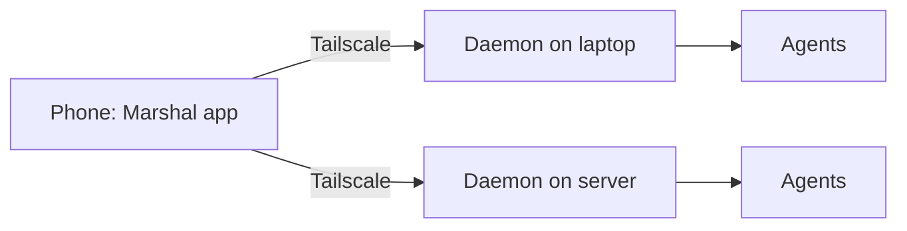

# Mobile

This document explains the Marshal mobile app: what it is, how it connects, what it adds over the web UI, how it looks and behaves, and how we build and ship it.

The mobile app and the web UI are both kept. The web UI works on any device with a browser. The mobile app gives phone users a native, faster, and safer way to control Marshal.

---

## 1. What the mobile app is

- A native Android app (APK for direct install, AAB for the Play Store), built with **Tauri v2 mobile**. An iOS app follows later from the same code.
- **A remote control, not a second Marshal.** The daemon and agents keep running on the user's PC or server. Coding agents cannot run on a phone. The app shows the daemon's state and sends actions to it.
- **The same UI.** The app runs the same SolidJS app as the desktop and web UI, using the phone layout from `ui-rules.md` section 9. There is no separate mobile UI to design or maintain.

### Why Tauri mobile

| Option | Verdict | Reason |
|---|---|---|
| **Tauri v2 mobile** | Chosen | Reuses our SolidJS UI and Tauri knowledge. Small apps. Android now, iOS later. |
| Capacitor | Not chosen | Also wraps the web UI, but adds a second shell tool when Tauri already does the job |
| React Native or Flutter | Not chosen | Means rewriting the whole UI in another framework |
| Web UI only | Kept as well | Works everywhere, but lacks native features |

### Web UI and mobile app side by side

| | Web UI | Mobile app |
|---|---|---|
| Install | None, open in a browser | APK or Play Store |
| Works on | Any device with a browser | Android, iOS later |
| Connection | Tailscale | Tailscale |
| Unlock with fingerprint or face | No | Yes |
| Scan the pairing code | No, type it | Yes, with the camera |
| Camera and share sheet for attachments | Browser file picker only | Yes |
| Open `marshal://` links | No | Yes |
| Several machines | One per browser tab | Machine switcher |
| Push notices | Through Telegram, Discord, or ntfy | Same, plus local notices while the app is open |

---

## 2. How it connects



### 2.1 Tailscale

- For v1, the phone uses the **Tailscale app** to join the user's tailnet. Marshal's app then reaches the daemon at its tailnet address.
- The app checks that Tailscale is running. If not, it says so and offers to open the Tailscale app.
- Building Tailscale into the Marshal app itself is possible later, but it is harder on mobile, so it is not in v1.

### 2.2 Pairing

1. On the desktop app, the user opens Settings, then Profile, then "Pair a device". A pairing code appears as a QR code and as text.
2. On the phone, the user scans the QR code with the app, or types the text code.
3. The daemon issues a device token. The app stores it in the phone's secure storage (Android Keystore, and the iOS Keychain later).
4. The device appears in the profile's paired devices list, where it can be removed at any time. Removing it revokes the token at once.

### 2.3 Several machines

- The app can pair with more than one daemon, for example a laptop and a server.
- A **machine switcher** at the top of the More screen lists paired machines with their status: online, offline, or needs you.
- Needs you counts from every machine show on the Home tab, grouped by machine, then by project.

### 2.4 When the daemon cannot be reached

- The app shows the **last known state**, read-only, with a banner: "Can't reach Office PC. Last updated 5 min ago."
- **Actions are never queued.** Approvals, merges, and messages need a live connection, because acting on old state could be wrong or unsafe. Buttons for actions are disabled while offline, with a short reason.
- The app reconnects on its own when the network returns, and when it comes back to the foreground.

---

## 3. Native features

| Feature | What it does | How |
|---|---|---|
| **App lock** | Unlock with fingerprint, face, or the phone's PIN when opening the app | Tauri biometric plugin |
| **Confirm risky actions** | Optional: ask for fingerprint or face before merging, approving a command, turning on bypass, or raising a cost limit | Tauri biometric plugin, a setting |
| **Scan to pair** | Scan the desktop's pairing QR code | Tauri barcode scanner plugin |
| **Camera and files** | Take a photo or pick a file for a comment attachment | File and camera access |
| **Share to Marshal** | Share a link, text, image, or file from any app into a new card or a comment | A small native share plugin of our own |
| **Deep links** | `marshal://` links from notices, Telegram, Discord, and ntfy open the right card or approval | Tauri deep link plugin |
| **Haptics** | A light tap on approve, merge, and errors | Tauri haptics plugin |
| **Local notices** | Notices while the app is open or recently in use | Tauri notification plugin |

Later, not in v1: a home screen widget with the needs you count, and quick actions on the app icon.

---

## 4. Notifications

Real push notifications on Android go through Google's push service, which needs a server to send them. That would break Marshal's "no cloud needed" rule. So v1 uses options that need no Marshal server:

| Option | How it works | Status |
|---|---|---|
| **Telegram or Discord** | The daemon sends notices to the user's bot chat. Tapping a link opens the Marshal app. | v1, already planned |
| **ntfy** | The daemon publishes notices to the user's ntfy topic, on ntfy's public server or the user's own. The ntfy app shows them. Tapping opens the Marshal app through a deep link. | v1, recommended for local-first users |
| **Local notices** | While the app is open or was used recently, it keeps a live connection and shows notices itself | v1 |
| **Marshal push relay** | An optional small cloud service that sends real push notices through Google and Apple | Later, opt-in only |

Rules:

- The app does not keep a connection open in the background by default, to protect battery life.
- Notice text never includes secrets, code, or full commands. It says what needs attention and links to it.
- Notices follow the same grouping, priorities, and per-event channels as on desktop (`marshal-product-scope.md` section 21).

---

## 5. How it looks and behaves

The app uses the **phone layout** from `ui-rules.md` section 9, with every view and action available. This section adds only what is specific to the app.

### 5.1 Navigation

- **Bottom navigation:** Home, Board, Chats, Agents, More.
- **Top bar:** project name (tap to switch project), notices, and the profile avatar in the top right corner.
- **More:** machine switcher, search, list, timeline, calendar, settings, and help.

### 5.2 First launch

The app's onboarding has four screens, each with Skip:

| Step | Title | Content |
|---|---|---|
| 1 | Welcome to Marshal | Control your agents from your phone. The agents run on your computer. |
| 2 | Connect with Tailscale | Checks that the Tailscale app is installed and connected, with a link to install it |
| 3 | Pair with your computer | Scan the QR code shown in Marshal on your computer, or type the code |
| 4 | Choose how to get notices | Telegram, Discord, or ntfy, each with a "Send test message" button |

After pairing, the tutorial tour from `ui-rules.md` section 12.2 runs on the Home tab, as bottom sheets.

### 5.3 Gestures

- **Swipe left and right** on the board to move between columns.
- **Long press a card** to open its menu, including "Move to".
- **Pull down** on any list to reconnect and refresh.
- **Swipe a notice** to snooze or dismiss it.
- **No swipe to approve, merge, or delete.** Risky actions always need a clear tap on a labeled button, so they never happen by accident.

### 5.4 Screens only in the app

| Screen | Purpose |
|---|---|
| App lock | Fingerprint, face, or PIN before opening |
| Machine switcher | Pick which paired machine to control |
| Scan to pair | Camera view for the pairing QR code |
| Share to Marshal | Choose project and card, or create a new card, for shared content |
| Offline banner | Last known state and why actions are disabled |

### 5.5 Design rules

Everything in `ui-tokens.md` and `ui-rules.md` applies, including sentence case, color only for status, and 44 px touch targets. In addition:

- Respect the phone's safe areas, status bar, and gesture bar.
- Follow the phone's light or dark setting by default.
- Follow the phone's text size setting. Layouts must hold up at larger text sizes.
- Use the phone's own back gesture and back button to go back one screen.

---

## 6. Security

- The device token lives only in secure storage, never in plain files.
- App lock is off by default, and suggested during onboarding. Confirm risky actions is off by default.
- The app talks only to paired daemons over the tailnet. It opens no ports and has no other network access except the Tailscale check and ntfy links.
- Removing a device in the profile revokes its token immediately. The app then shows "This device was removed" and returns to pairing.
- Screenshots of the app are allowed by default. A setting can block them for screens showing code and diffs.

---

## 7. Performance budgets

| Metric | Budget |
|---|---|
| APK download size | Under 25 MB |
| App RAM in use | Under 200 MB |
| Cold start to Home | Under 2 seconds on a mid-range phone |
| Background battery use | None when closed. No background connection by default. |
| Data use | Only state and summaries, except when a card's output or diff is open |

These are targets, checked on a mid-range test phone before every release.

---

## 8. Code structure

The mobile app shares almost all its code with the desktop and web UI.

```
apps/
  web/
    src/
      platform/
        index.ts              Picks the right adapter at start
        web.ts                Browser: file picker, no native features
        desktop.ts            Desktop app: Tauri desktop plugins
        mobile.ts             Mobile app: biometric, scanner, share, haptics, deep links
  mobile/
    package.json              Tauri mobile scripts
    src-tauri/
      Cargo.toml
      tauri.conf.json         App id, deep links, mobile settings
      capabilities/
        mobile.json           Allowed plugins and permissions
      src/
        lib.rs                Mobile entry point
      plugins/
        share-target/         Our small native plugin for "Share to Marshal"
      gen/
        android/              Generated by Tauri. Only edit files noted in development.md.
      icons/
```

- **Views never call native features directly.** They call the `platform` adapter, which uses a native feature when available and a fallback when not. For example, "Attach" opens the camera or files in the app, and the file picker in a browser.
- The mobile app loads the same built UI as the desktop app. It does not embed the daemon.

---

## 9. Development

What you need, in addition to `development.md`:

- Android Studio with the Android SDK and NDK
- JDK 17
- Rust Android targets, installed by `pnpm setup:mobile`
- For iOS later: a Mac with Xcode, and an Apple Developer account

| Command | What it does |
|---|---|
| `pnpm setup:mobile` | Installs Rust Android targets and checks the Android tools |
| `pnpm dev:android` | Runs the app on an emulator or a connected phone, with live reload |
| `pnpm build:android` | Builds a signed APK and AAB for release |
| `pnpm dev:ios` | Runs the app on the iOS simulator (later, Mac only) |

- In development, the app connects to the dev daemon started with `pnpm dev -- --tailnet`, and pairs with the dev pairing code.
- The emulator can also reach the dev daemon on the computer through the emulator's host address, without Tailscale.

---

## 10. Release

- **Direct download:** a signed APK on the release page, for people who install apps directly.
- **Google Play:** a signed AAB.
- **iOS:** App Store, later.
- **Signing keys** live only in CI secrets, like desktop signing keys.
- **Version:** the same version number as the desktop app and daemon. The app warns when the daemon it connects to is on a different major version.
- **Updates:** the Play Store updates Play installs. Direct APK installs get an in-app notice with a link to the new version.

---

## 11. Build plan

These tasks belong to Phase 9 (Remote) in `build-plan.md`.

| ID | What | Done when |
|---|---|---|
| 9.10 | Platform adapter in the web app: web, desktop, and mobile | Views use the adapter, never native calls |
| 9.11 | Tauri mobile project for Android, loading the shared UI | App runs on an emulator and a real phone |
| 9.12 | Pairing by QR scan and code, token in secure storage | A phone pairs, and removing it revokes access |
| 9.13 | Several machines and the machine switcher | One app controls a laptop and a server |
| 9.14 | Offline state: last known state, no queued actions | Actions are disabled offline with a clear reason |
| 9.15 | App lock and confirm risky actions | Both work with fingerprint and PIN |
| 9.16 | Share to Marshal, camera attachments, deep links, haptics | Sharing a link from a browser creates a card |
| 9.17 | ntfy notices with deep links | Tapping an ntfy notice opens the right card |
| 9.18 | Mobile onboarding and the tour as bottom sheets | A new phone user reaches Home, paired, in under two minutes |
| 9.19 | Android release: signed APK and AAB in CI | A test release installs from both |
| 9.20 | iOS build | Later, after the Android app is stable |

---

## 12. Open questions

| Question | Needed by |
|---|---|
| Should the app build Tailscale in later, so users don't need the Tailscale app? | After v1 |
| Do we offer the optional push relay, and who runs it? | After v1 |
| Minimum Android version to support? Suggested: Android 10 and newer. | Task 9.11 |
